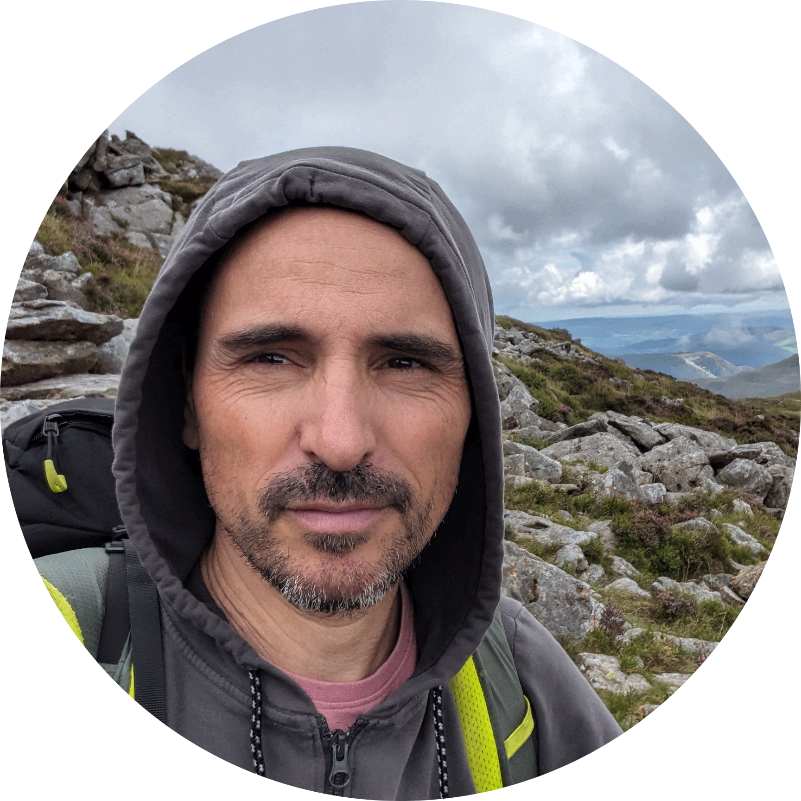

---
show:
    - path
    - navigation
    - toc
---
# About

{: style="height:200px;width:200px"}

I’m an environmental scientist and a GIS analyst currenly working in natural Parks management in Catalonia Nature Parks Network. The last few years I was focused in the implementation of the newest natural park of Catalonia. 

Improving the coexistence between human beings and the nature of which we are a part is my main goal. I love sustainable design and architecture. A few years ago I was fascinated by biomimicry and how it can help us find better ways to relate to nature.  I am currently refocusing my professional career towards biomimicry design.

I love working in a multidisciplinary team, learning together and helping others achieve their goals. In my free time I love to collaborate on citizen science projects, diy, cycling, playing volleyball and hiking. As well as spending quality time with family and friends.

...
