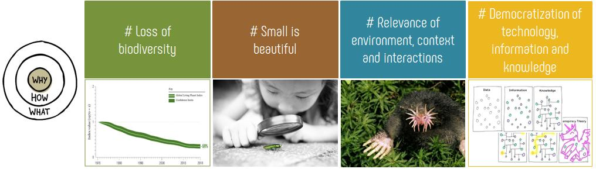
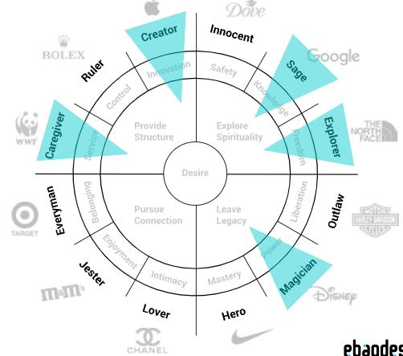

# **About OSBioMoSys**

{width=200}

OSBioMoSys is the acronym for Open-Source Biodiversity Monitoring Systems. 

The similarity of the name with osmosis is not coincidental since the project aims to act as a balancing membrane between biodiversity and technology. It is a bidirectional membrane that transports knowledge, methods and techniques from one side to the other.

<iframe src="https://www.youtube.com/embed/XlEa1QELAEI?si=GPFh1ZRmM6RqFc9U" 
frameborder="0"
width="100%"
height="500"
allowfullscreen="true"
mozallowfullscreen="true"
webkitallowfullscreen="true">
</iframe>

[@OSBioMoSys](https://www.instagram.com/osbiomosys/)

### Our mottos
Designing open-source customizable solutions for the study and conservation of biodiversity

Designing for biodiversity

### Mission, vision and values

***Provide researchers and citizen science with robust and reliable technologies that are open-source and low-cost and that serve to improve knowledge and conservation of biodiversity.***

**Contributions:**
I want to create bridges, artifacts, methodologies and tools so that people who study biodiversity and natural systems can take advantage of some of the so-called new technologies. Also democratize access to the study of biodiversity through citizen science.

**Impacts:**
A better understanding of the world we live in, and especially of the other living beings or entities with which we share the planet. I think that knowledge and understanding will make us act with more respect and love.

**Purpose statement:**
To create bridges, artifacts, methodologies and tools open-source for the study of biodiversity and natural systems using new technologies, so that, we can democratize and make more affordable to researches and citizens to study biodiversity with less intrusive methodologies, with the aim of creating more knowledge, respect  and love for other non-human entities.

### Why?

### OSBioMoSys vision over time

| Now | 5 years | 10 years | 15 years |
| -------- | -------- | -------- | -------- |
| Create the first prototypes and grow and strengthen the associated community   | Have consolidated a solid network that functions independently, creating bridges between different research groups, nature managers and citizen science programs     | The study of biodiversity has become sufficiently democratized to impact collective decisions.    | Citizen science and knowledge of biodiversity are a key point in making political and personal decisions thanks to knowledge, respect and love for other living beings.     |

### Our personality (archetypes)

Follow us on [@OSBioMoSys](https://www.instagram.com/osbiomosys/)