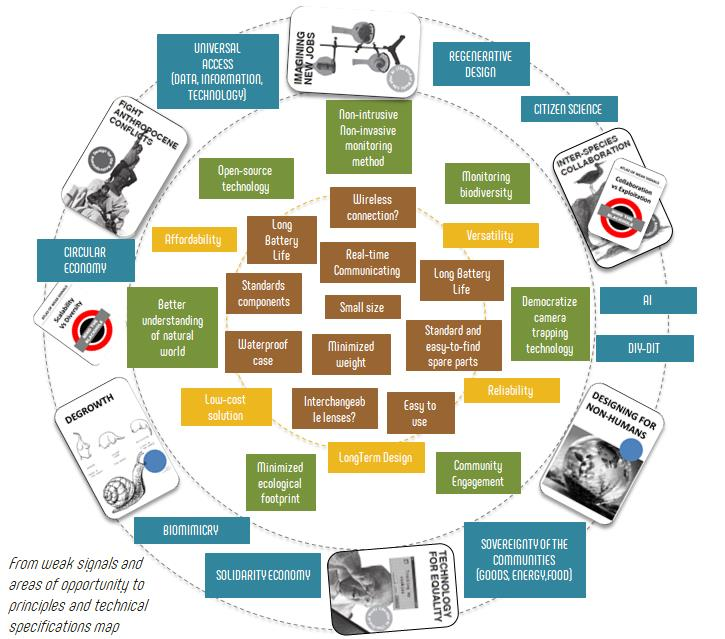
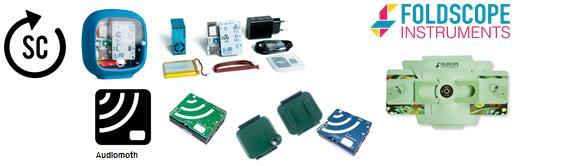
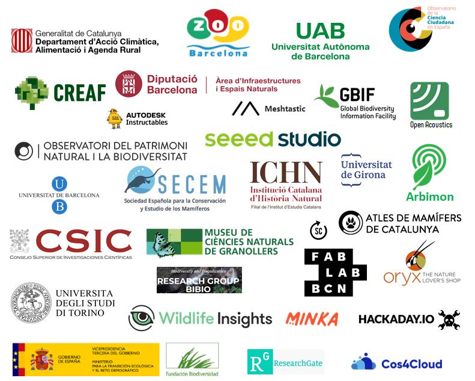
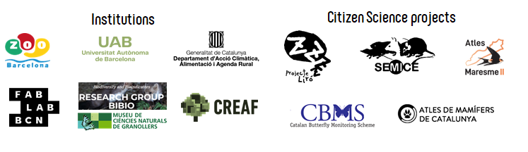
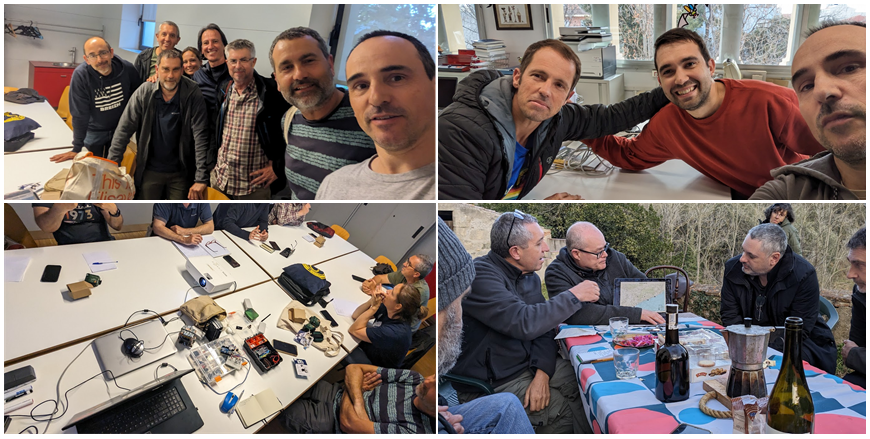
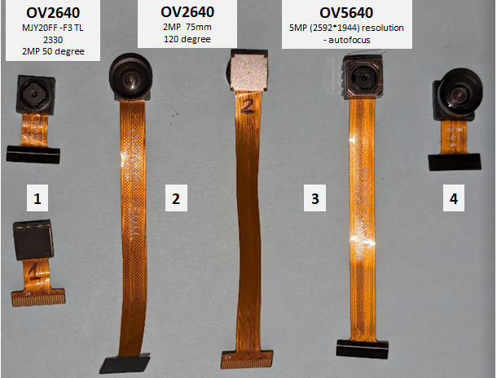
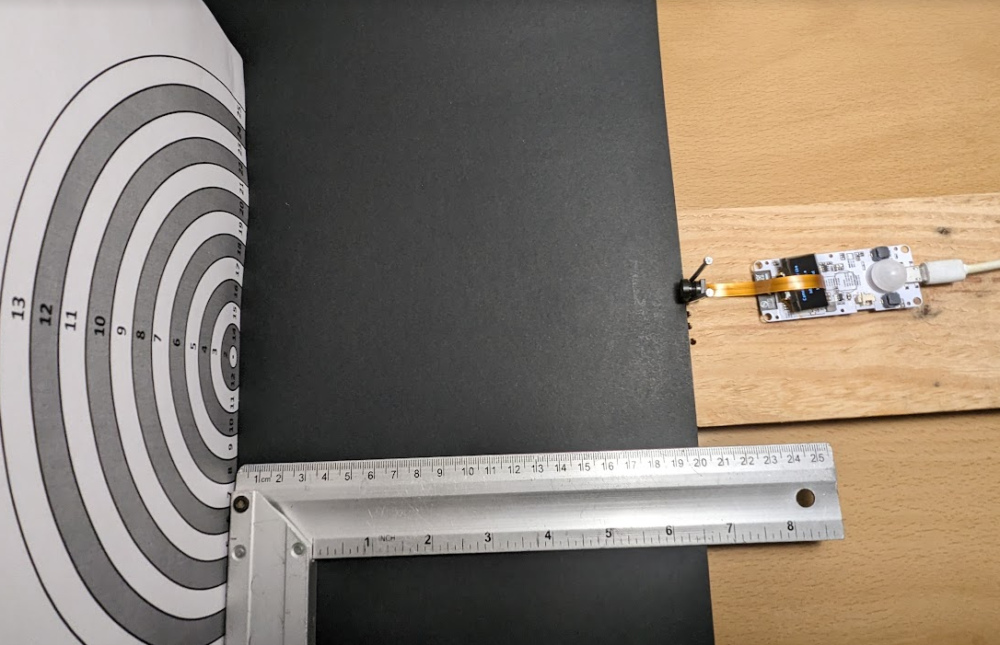
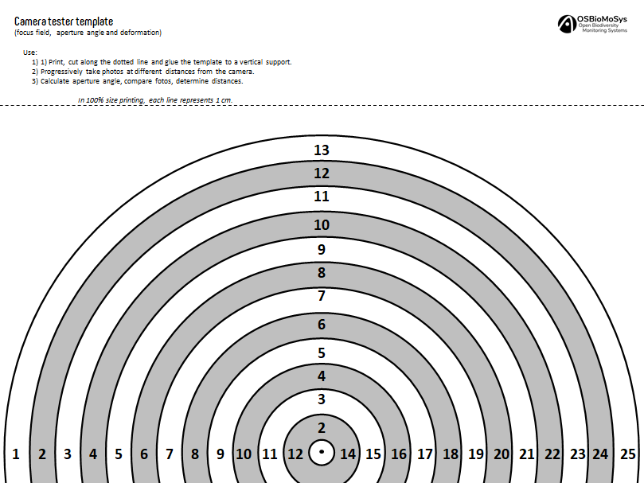
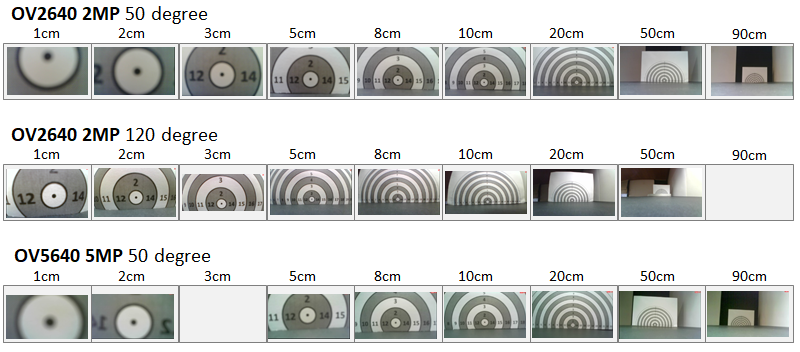
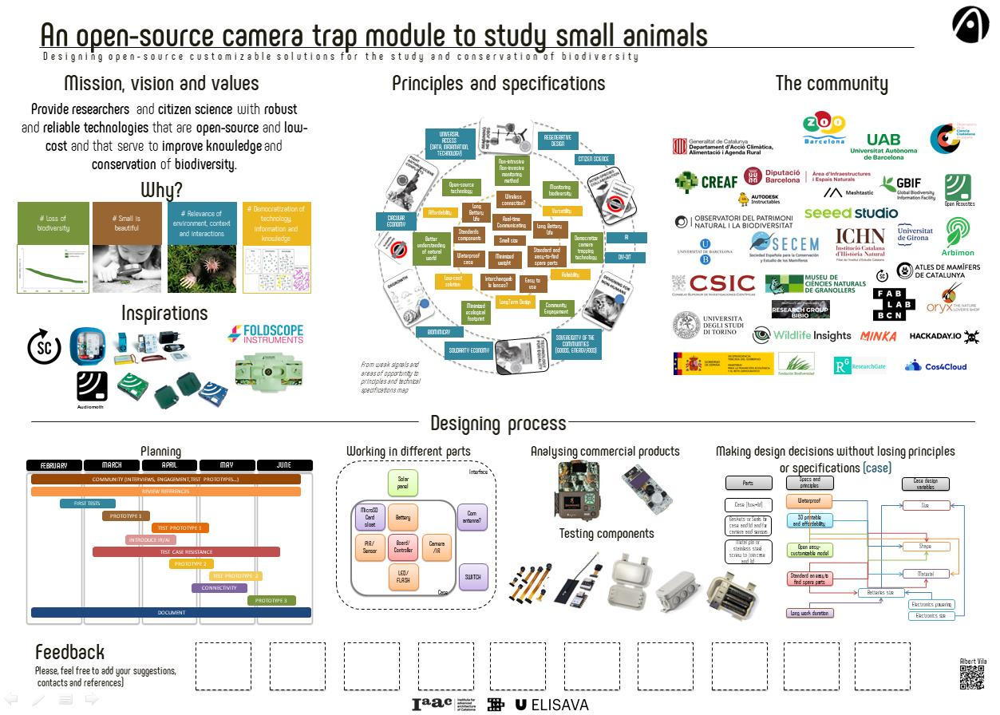

# **OSBioMoSys Projects**

## An open-source camera trail module to study small animals

### Abstract

Open Source Biodiversity Monitoring Systems aims to bridge biodiversity and technology, providing open-source, low-cost, and reliable technologies for researchers and citizen science to enhance biodiversity knowledge and conservation.

1: By Introducting of the FabLab culture and new technological resources to biodiversity researchers, fostering synergies and future collaborations.

2: By prototyping a small, modular trail camera for studying small animals at short distances, using standardized and low-cost components to support large-scale field studies of organisms such micromammals or pollinators.

### Values, principles and specifictions of the project

### Inspirations

### Stakeholders

#### Possible

#### So far

### Steps

#### Engage communities with my project and involve myself with communities.

Much of any intervention is about getting involved. Get involved in both senses, involve others and get involved yourself. That is, until the barriers between oneself and others become so blurred that we do not know where one ends and the others begin. Also about, getting out of my bubble and understand that I am not alone in the world with my ideas. Break the ice. It is important to lose the ridiculous fear of sharing, no one is going to steal or copy our idea and lose the fear of ridicule, no one is going to laugh at our idea.

**What, how and why?**

We have at our disposal a technology that allows us to better understand the world and the entities (living or not) that make it up. What usually happens is that this technology is not always in the hands of those who want to understand the world in order to treat it better, but rather those who seek to obtain economic benefits or social recognition. With this project I want to create bridges, artifacts, methodologies and tools so that people who study biodiversity and natural systems can take advantage of some of the so-called new technologies.

I appeal to the softwired nature of human biology and psychology. That is to say, to that part that can be shaped by social and individual influences, to demand more empathetic behaviors towards the rest of the elements with which we share existence. Although it may not always be like this, I want to keep thinking that to know and understand is to love and respect. For this reason, this project is aimed at empowering people who try to understand the world to protect it is a priority of this project.

During the course of this project, many people have been spoken to. Starting with the thematic reviews and pediatric reviews of the master's degree itself, to meetings with the working group and thematic workshops with researchers and coordinators of citizen science programs. [See acknowledgments section.](../masterProject/MP-05-PeopleAcknowledgments.md) 

#### Understanding commercial trail cameras an other commercial devices

<iframe src="https://www.youtube.com/embed/Bn4BHyr0K_U?si=WTkQIoIbWOFq3Q-m" 
frameborder="0"
width="100%"
height="500"
allowfullscreen="true"
mozallowfullscreen="true"
webkitallowfullscreen="true">
</iframe>

#### Testing components

**The lens**

To study small animals you need a lens that focuses at a short distance. Of all the commercial trail camera models, we have only found one model launched very recently capable of focusing at a distance of 15 cm, designed for small mammals. The only drawback is that its price exceeds $650.

3 lenses were analyzed. Two different 2MP OV2640s, one with a 50 degree aperture (included with the Xiao ESP32S3 sense) and the other with a 120 degree aperture. A higher gamma model also supported by the Xiao ESP32S3 sense was also analyzed, which was OV5640 5MP 50 degree with autofocus but with a higher price.

{width=500}

To compare the results and at the same time determine the parameters of focus, depth of field, aperture and deformity, a template was created. The template moved progressively further away from the lens, taking photos at a certain distance.

{width=500}

[Download the template](../files/CameraTesterTemplate.pdf)

{width=500}

The results:

### Resources

Design dialogs 2 poster

??? quote "Resources used"
    - https://dronebotworkshop.com/xiao-esp32s3-sense/
    - https://wikifab.org/wiki/Getting_Started_with_Xiao_ESP32_S3_Sense
    - [ESP32-CAM_MJPEG2SD](https://github.com/s60sc/ESP32-CAM_MJPEG2SD?tab=readme-ov-file#motion-detection-by-camera)
    - https://randomnerdtutorials.com/guide-for-oled-display-with-arduino/
    - [ESP32-CAM Take Photo with PIR Sketch](https://randomnerdtutorials.com/esp32-cam-pir-motion-detector-photo-capture/)
    - [ESP32-CAM Take Photo and Save to MicroSD Card](https://randomnerdtutorials.com/esp32-cam-take-photo-save-microsd-card/)
    - [Tiny Outdoor Camera By Markus Opitz](https://www.instructables.com/Tiny-Outdoor-Camera/)
    - [Seeed Studio XIAO EXHIBITION](https://wiki.seeedstudio.com/xiao_topic_page/)
    - [Camera Usage in Seeed Studio XIAO ESP32S3 Sense](https://wiki.seeedstudio.com/xiao_esp32s3_camera_usage/#taking-photos-with-the-camera)
    - [File System and XIAO ESP32S3 Sense](https://wiki.seeedstudio.com/xiao_esp32s3_sense_filesystem/)
    - [ESP32 TTGO T-Camera with PIR Sensor and OLED Display Board – Review and Pinout](https://makeradvisor.com/esp32-ttgo-t-camera-pir-sensor-oled/)
    - https://www.instructables.com/Simple-Raspberry-Pi-Camera-Trap-Made-From-a-Food-C/
    - https://www.hackster.io/nootropicdesign/wi-fi-camera-trap-faea46
    - https://www.gearcheckers.com/en/trail-cameras/how-does-trail-camera-work/
    
    
    
    
??? quote "Resources for improvements in the next prototypes"
    - [TinyML Made Easy: Image Classification w/ XIAO ESP32S3 Sense. Exploring Machine Learning on the tiny device of the Seeed XIAO family, the ESP32S3 Sense and SenseCraft-Web-Toolkit](https://www.hackster.io/mjrobot/tinyml-made-easy-image-classification-w-xiao-esp32s3-sense-cb42ae)
    - [ESP32-CAM Video Streaming and Face Recognition with Arduino IDE](https://randomnerdtutorials.com/esp32-cam-video-streaming-face-recognition-arduino-ide/)
    - https://www.instructables.com/Sharing-ESP32S3-CAM-Pictures-on-Telegram/
    - 

   
    

Follow us on [@OSBioMoSys](https://www.instagram.com/osbiomosys/)