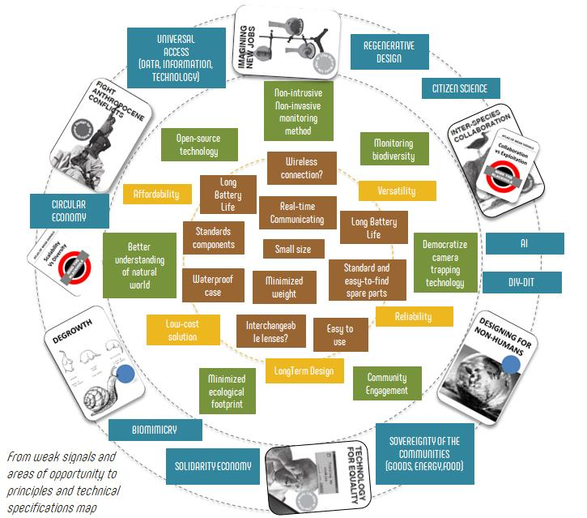
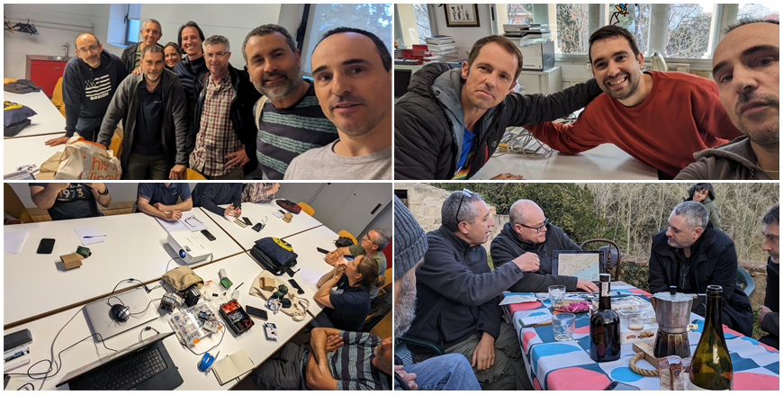

# ** OSBioMoSys Projects**

## An open-source camera trap module to study small animals

### Values, principles and specifictions of the project

### Inspirations

### Stakeholders

### Poster

### Steps

#### Step 1: Engage communities with my project and involve myself with communities.

Much of any intervention is about getting involved. Get involved in both senses, involve others and get involved yourself. That is, until the barriers between oneself and others become so blurred that we do not know where one ends and the others begin. Also about, getting out of my bubble and understand that I am not alone in the world with my ideas. Break the ice. It is important to lose the ridiculous fear of sharing, no one is going to steal or copy our idea and lose the fear of ridicule, no one is going to laugh at our idea.

**What, how and why?**

We have at our disposal a technology that allows us to better understand the world and the entities (living or not) that make it up. What usually happens is that this technology is not always in the hands of those who want to understand the world in order to treat it better, but rather those who seek to obtain economic benefits or social recognition. With this project I want to create bridges, artifacts, methodologies and tools so that people who study biodiversity and natural systems can take advantage of some of the so-called new technologies.

I appeal to the softwired nature of human biology and psychology. That is to say, to that part that can be shaped by social and individual influences, to demand more empathetic behaviors towards the rest of the elements with which we share existence. Although it may not always be like this, I want to keep thinking that to know and understand is to love and respect. For this reason, this project is aimed at empowering people who try to understand the world to protect it is a priority of this project.

#### Step 2: Understanding commertial trail cameras

<iframe src="https://www.youtube.com/embed/Bn4BHyr0K_U?si=WTkQIoIbWOFq3Q-m" 
frameborder="0"
width="100%"
height="500"
allowfullscreen="true"
mozallowfullscreen="true"
webkitallowfullscreen="true">
</iframe>

Follow us on [@OSBioMoSys](https://www.instagram.com/osbiomosys/)