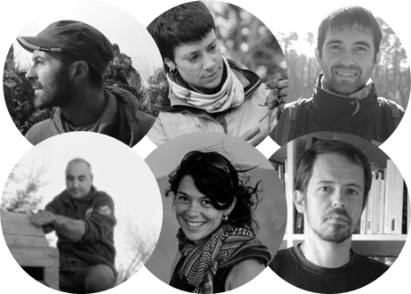
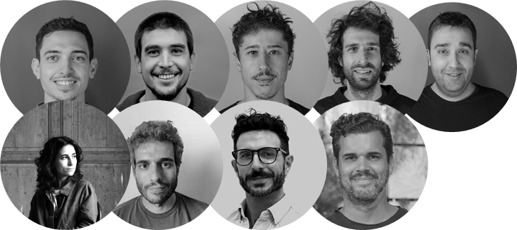
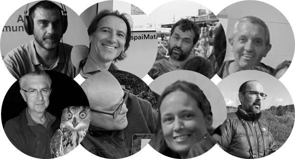
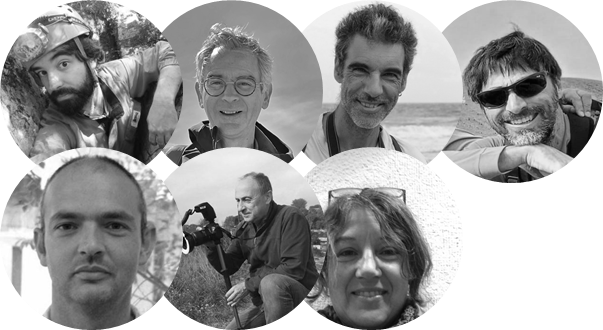

# **People and acknowledgments**

In this section I want to thank all the people who have listened and contributed in some way to the project. To the people who have dedicated part of their time to participate in the working group, the thematic reviews or the thematic micro-workshops. I really appreciate your advice, your feedback and your support. I feel like this has just begun, you have given me a definite push to exploit my creativity and ability to make connections and bridges between the worlds I carry inside. Preservation, research and love for nature and fascination for the human ability to create and share.

Below is a representation, but not all, of the people who have contributed.

## OSBioMoSys Tiny Camera Trail Working Group

- **Salvador Salvador**. Mustelid researcher (small carnivores). 
- **Lidia Freixes Mora**. Coordinator of the SEMICE and the Dormouse Project.
- **Marc Vilella Antonell**. Support Technician of the SEMICE and Mammals atlas.
- **Josep Xarles**. Programes in situ. Fundació Barcelona Zoo.
- **Anna Planella**. Natural conservation manager. Pirinees wildlife. Generalitat of Catalonia.
- **Carles Flaquer**. Bibio (Biodiversity and bioindicators) research group coordinator.

## Technology and design advice

- **Josep Martí Elias**. Fabrication expert. Fab Lab Barcelona.
- **Adai Surinyac**. Digital fabrication expert. Fab Lab Barcelona.
- **Óscar González**. Sense Making Expert. Fab Lab Barcelona.
- **Guillem Camprodon**. Fab Lab Barcelona executive director.
- **Xavier Domínguez**. Strategic Projects Lead. Fab Lab Barcelona.
- **Jana Tothill Calvo**. Design researcher.
- **Roger Guilemany**. Design researcher and practitioner.
- **Pablo Zuloaga**. Futures designer, creativity, Powar founder.
- **Tomas Diez**. Fab City Foundation Executive Director. 

## Birds monitoring and conservation

- **Joan Pujol**. Biologist, ornithologist.
- **Hugo Framis**. Biologist, ornithologist, raptor specialist.
- **Enric Badosa**. Biologist, ornithologist.
- **Raül Calderon**. Ornithologist.
- **Andreu Carretero Serra**. Ornithologist.
- **Hèctor Andino**. Biologist, ornithologist.
- **Gisela Boba Cartanyà**. Ornithologist
- **Arnau Bonan Barfull**. Biologist, ornithologist. Willdlife consultant.

## Pollinators research, monitoring and conservation 

- **Adrià Miralles**. Researcher and management of invertebrates. Generalitat of Catalonia.
- **Jordi Bosch**. Pollinators reserarcher. CREAF.
- **Constantí Stefanescu**. Scientific coordinator of BiBio and the Catalan Butterfly Monitoring Scheme .
- **Santi Perez**. Environmental Sciencist. Natural Planning. Generalitat of Catalonia.
- **Anselm Rodrigo Dominguez**. Biologist, reserarcher. CREAF, UAB.
- **Narcís Vicens**. Nature conservation manager and solitary bees researcher. Diputació de Girona.
- **Clara Racionero**. Biologist. Endangered plants manager.

Many thanks to all! Moltes gràcies a tots!

Follow us on [@OSBioMoSys](https://www.instagram.com/osbiomosys/)