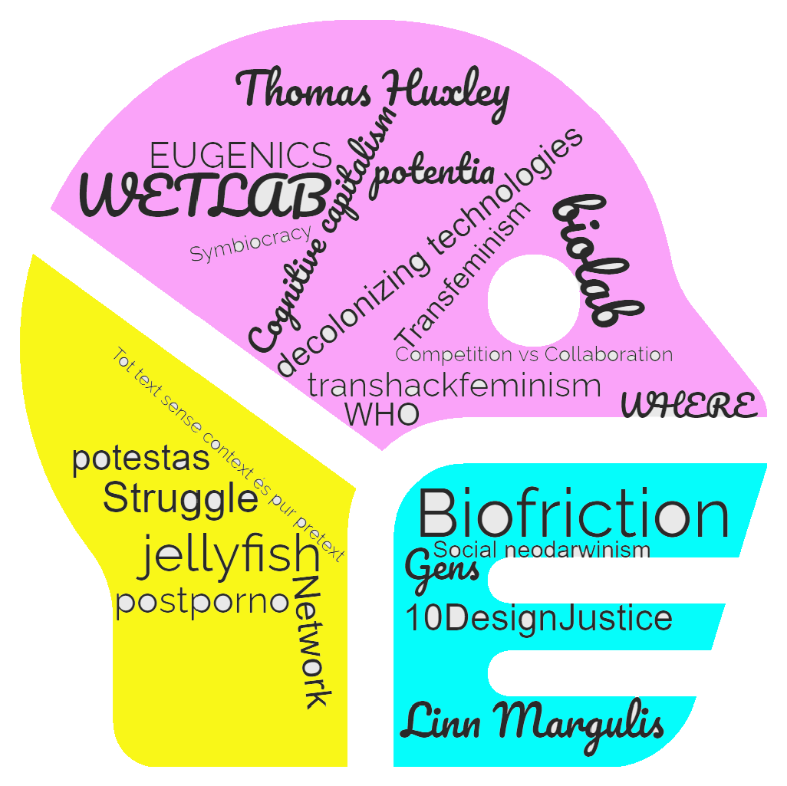
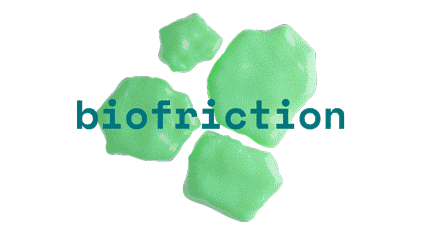

# **Landing**
 

It's been a bit of a bumpy landing for me. Curiously, the landing was not on dry land but on a ship that is leaving with an open, uncertain and exciting destination.

I'm going to have to fight with the helm to try to steer this boat. At the moment it is a little heeled due to old currents but we hope to focus soon and correct course.

???+ Impressions
    Almost everything is new. I quickly look for the first points of reference that give me security. I guess we are all doing the same thing. 
    It won't be difficult to feel at home here. Most people in the IAAC-FABLAB ecosystem seem very friendly and empathetic.

## Master's directors and coordinators

Motivating presentation of the master's directors. They are people
who have done amazing projects and continue to work with
commitment and humility. So many things to learn!

The very constant presence of the coordinator is very reassuring. Thank you Chiara!

[More about their backgrounds](https://mdef.fablabbcn.org/faculty/)

## Classmatess from all over the world!

Map of the countries of origin of classmates. 
Click on the red dots on the map to access the classmate's name, country and MDEF website

<iframe src="https://qgiscloud.com/albertvila/ClassDiversity" width="800" height="500">
</iframe>

## Exploring Poblenou Ecosystem with Chiara and Milena

There is nothing better to immerse yourself in a new area than to listen to the people who live there. To get to know the neighborhood better we have taken a tour to visit some interesting and transformative projects. I have been following the Biciclot - BiciHub project for a long time. The others have been an inspiring discovery for me.

-  __La Plataforma__ An old printing press transformed into a contemporary art gallery and production studio. Http://laplataformabcn.com
-  __TransfoLAB BCN__ TransfoLAB BCN is a centre dedicated to the creative ecosystem in Barcelona focused on design, innovation, production and experimentation with waste, circular economy and environmental sustainability. Https://www.transfolabbcn.com/
-  __BiciHub__  An incubator of ideas and alliances for the implementation of sustainable mobility by bicycle through the cooperative model and the social networks. Http://bicihub.barcelona/
-  __Bioma__ ... 

<iframe src="https://www.google.com/maps/d/embed?mid=1awOvkyxilKIILLqmyBntWZtJ_RRQIz8&hl=ca&ehbc=2E312F" width="800" height="480"></iframe>
Click at the icons in the map to see a brief description and the photos of each place we visited.

## Visiting Elisava

Amazing facilities and I don't know how to use most of them...yet!

I feel like it will take me years to learn how to use all the things in here.
This is the cradle of design!

[Discover the spaces of Elisava](https://www.elisava.net/en/spaces/)

??? Atention "We have access to every space but each has it's own rules"
    - Prototype Workshop
        - Bring your own material. Bring doble as you expect to need!!!
        - Bookings and validations are needed to use machines
    - Graphic Workshop
    - Motion Capture – MoCap Room
    - Electronics and Interaction Laboratory
    - Media Lab
    - Library and materials library
    - Student Lounge, Cafeteria and Terraces

## Laura's talk

Impossible to remain indifferent!

{: style="height:400px;width:400px"}

Link:

{: style="height:100px"}

[Biofriction project](https://biofriction.org/) 

## Reflections

Our minds have been shaken by a multitude of things and concepts. Many new ones, others already old friends, others that have metamorphosed since last time... A great week! It is going to be difficult to calm our minds after so much overstimulation!