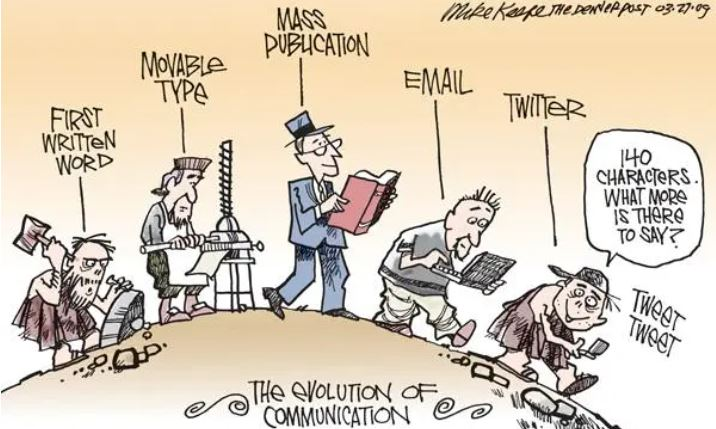

# **Documenting design**

## Documenting design concepts and reflections


The design documentation will be a common thread throughout the program. Design is not understood as the final product but goes beyond that. Special emphasis is placed on documenting the entire design process to provide a good understanding of the context and paths followed. Documentation will also help us to clarify our next steps and convey collaboration.

We have also taken a look at the main elements to take into account when documenting, such as the introduction of the key characters and emotions to give a human touch, the context, the steps to the solution, and the conflicts. As well as the use of a clear plot structure and the incorporation of visual elements.

Humans started documenting long ago. Now we live in the Information society. I hope to know how to walk the fine line between information and over-information!




## Creating this site

### Setup

I'd rather not document that part. I just want to thank Josep, Adai, Oscar from de CodeLab, and my classmate Minnie for their patience and help. 

Luckily, they didn't charge me for the time they spent figuring out what was going on between my machine and Github. 

I hope I can help them in the future.


### Update

The main steps to start updating are:

??? note "In Git Bash"

    === "1. To local repository"
    

        ``` 
        cd C:/MDEF/web
        ```

    === "2. Check status "

        ``` 
        Git status
        ```

    === "3. Git mantra"
        
        ```
        Add - Commit - Push
        ```

    ===  "4. Open VS Code"
        ```
        Code .
        ```


2. Visual Studio Code

    1. Click Toggle Panel Button to see the terminal below

    2. In the terminal start mkdocs serve
    
        ```
        mkdocs serve
        ```

    3. Open file to modify/update

    4. Save files

    5. Add pending changes (+), name the changes

    6. Sync Changes (Push Changes)


***
### Referencies
#### IAAC-FabLAB
1. [How to setup documentation](https://fablabbcn-projects.gitlab.io/learning/educational-docs/mdef/classes/git-mkdocs/)

2. Josep's video to rescue beginners like me <iframe src="https://player.vimeo.com/video/871896323?h=ab71b2e923" width="640" height="360" frameborder="0" allow="autoplay; fullscreen; picture-in-picture" allowfullscreen></iframe>

<!--
<p><a href="https://vimeo.com/871896323">How to set up Git and Mkdocs</a> from <a href="https://vimeo.com/user193936442">Josep Marti</a> on <a href="https://vimeo.com">Vimeo</a>.</p>
-->
#### Classmates suport
1. [Minnie coding support](https://minnie-at-iaac.github.io/term1/02-Documenting-design/Git-problems/)
2. [Oliver coding support](https://oliver-lloyd-mdef.github.io/Oliver-MDEF-Portfolio/Coding%20Support/)

#### External references
1. [The markdown guide by Matt Cone (pdf)](https://dl.icdst.org/pdfs/files3/c79990b0b853932d36ddc117ce2503e3.pdf)
2. [Mkdocs materials](https://squidfunk.github.io/mkdocs-material/)


