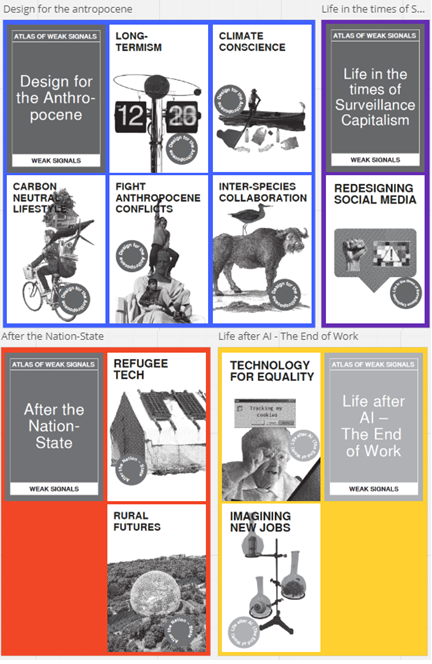
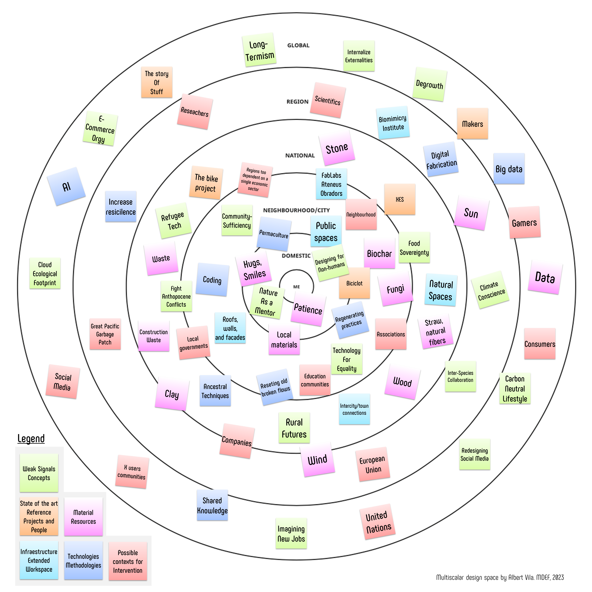
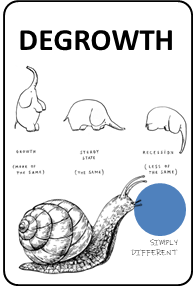
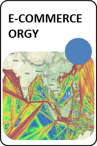
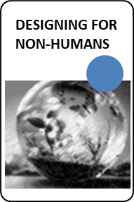
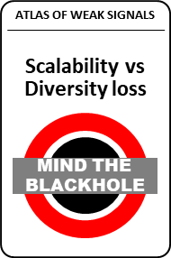
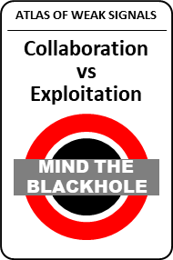
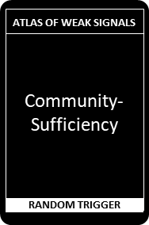
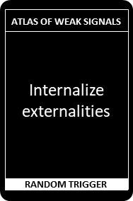

# Design studio: **Atlas of weak signals**

<iframe width="560" height="315" src="https://www.youtube.com/embed/L7yyGwTrT5g?si=bVhKHpXVT36ScYgI" title="YouTube video player" frameborder="0" allow="accelerometer; autoplay; clipboard-write; encrypted-media; gyroscope; picture-in-picture; web-share" allowfullscreen></iframe>

In this seminar, we have worked with **The Atlas of the Weak Signals (AOWS)** a toolkit designed by Mariana Quintero. Using an amazing deck of cards, we tried to understand the weak signals (the trends before the trends) and sketch future scenarios from them, adding areas of opportunity and random trigger cards. This tool has helped us set up our own design space.

[More about AOWS](https://fablabbcn.org/blog/emergent-ideas/atlas-of-weak-signals#:~:text=The%20Atlas%20of%20the%20Weak,trends%20in%20our%20current%20world.)

After the presentation, to become familiar with the AOWS framework, we first work on a random example with the whole class, and then we practice in smaller groups.

## My own design space

It is not an easy task to choose a few cards from the deck and start designing your own design space. Many of the cards resonate with me and talk about topics that have interested me for a long time. Others, I barely know what they refer to, and I have to look up what they mean.

This is a first attempt to graphically represent my own design space, opening my mind and trying to establish relationships between the elements that compose it.

I have selected the following weak signals to include within my design space:

I am not surprised to see that many of these cards are related to my work background and my previous studies.

### My multiscalar design space
This exercise allows us to locate on a multiscale map the different types of elements that can be part of my design space. Naturally, many of these elements can be placed on different work scales than those represented in the following diagram.

### My design space

<iframe width="768" height="432" src="https://miro.com/app/live-embed/uXjVNbrp8MI=/?moveToViewport=2855,-1801,7910,6731&embedId=396872365003" frameborder="0" scrolling="no" allow="fullscreen; clipboard-read; clipboard-write" allowfullscreen></iframe>

## New proposals for the AOWS deck from my design space

In this section, I present some proposals for the AOWS that have emerged as I have been configuring my design space. There are some Weak Signals that could be included as Random Triggers and vice versa. I have also created a new category of cards called "Mind the Blackhole" to introduce important nuances to some of the cards I have used.

| Weak Signal  | Description                          |
| ----------- | ------------------------------------ |
| | Although it is not a new concept, degrowth may probably be the only viable option to stay within planetary boundaries. Degrowth proposes a change in economic objectives and a rational, controlled, and conscious decrease in consumption and production. |
|  | Every day, the storage and transfer of information over the Internet increase. Cloud services are increasing day by day, and this rise is accompanied by an increase in the ecological footprint. This signal is not weak, but its exponential acceleration justifies its inclusion in the Atlas |
|   | The availability of anything anywhere at any time turns commerce into an unprecedented logistical madness with a first-rate ecological impact. |
|   | In order to live together, we have to learn to share and to give without expecting anything in return. Design, although sustainable, normally focuses on humans and their requirements. Maybe the time has come to start designing for other species, even if we don't see what benefit we humans are going to get. Let's not forget that in natural ecosystems, everything is interconnected. |

| Mind the Blackhole | Description                          |
| ----------- | ------------------------------------ |
| | This card is an important reminder for me. I think we must not forget that scalability can cause a loss of local diversity. |
|  | What do we understand by collaboration between species? This card is a warning to be alert that what may seem like collaboration to us can be full-blown exploitation. We must ask ourselves what benefit the parties obtain from this collaboration. |

| Random trigger | Description                          |
| ----------- | ------------------------------------ |
| | This card is an important reminder for me. I think we must not forget that scalability can cause a loss of local diversity. |
| | What do we understand by collaboration between species? This card is a warning to be alert that what may seem like collaboration to us can be full-blown exploitation. We must ask ourselves what benefit the parties obtain from this collaboration. |

## Reflections
 
The design space is a changing thing. Every project we work on, every new learning we acquire, every success, and every failure can modify this space. My design space is organized in constellations. The constellations are set by concepts, elements, feelings, or things that do not easily change over time, elements that have been living with me for a long time. These constellations are made up of small galaxies of elements related to each other. At the same time, there are relationships and influences between these elements that surpass the constellations. I think that the design space is something 'alive', something to go to regularly to refresh intentions and to modify it with new interests and feelings. In short, Design Space seems to me to be a very good tool in constant evolution that helps us understand and develop ourselves as designers. And it is also a good place to go when we feel a little disoriented or lacking inspiration.

