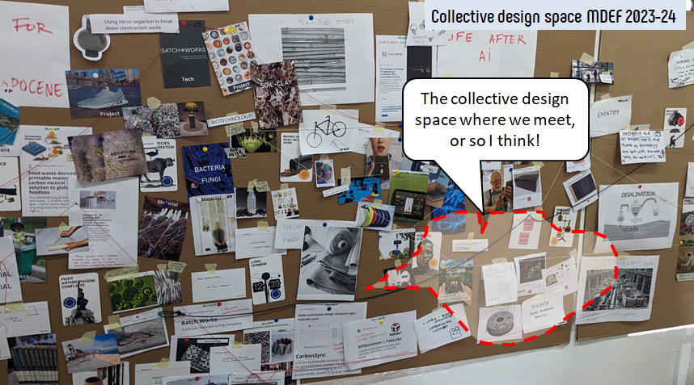
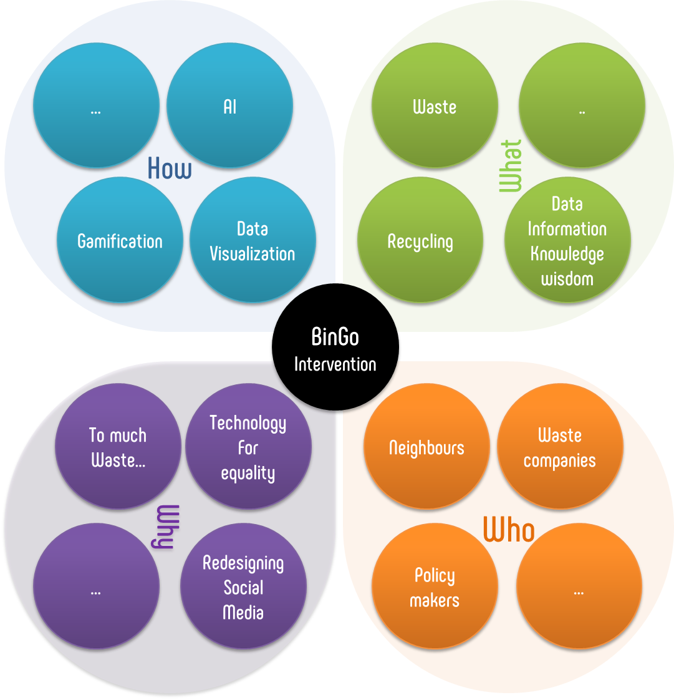
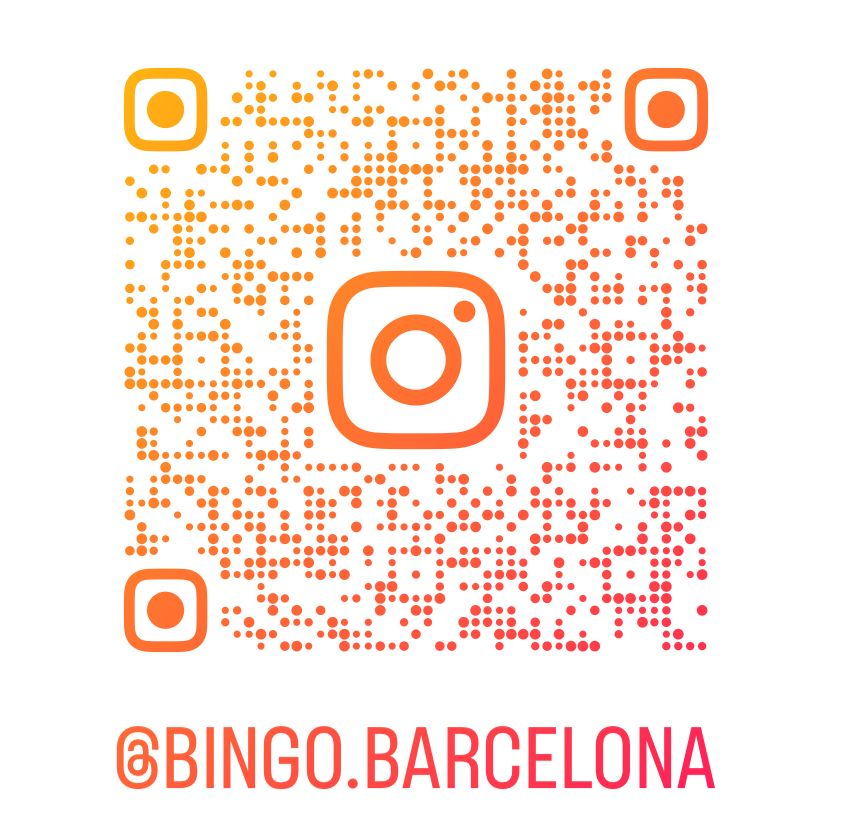
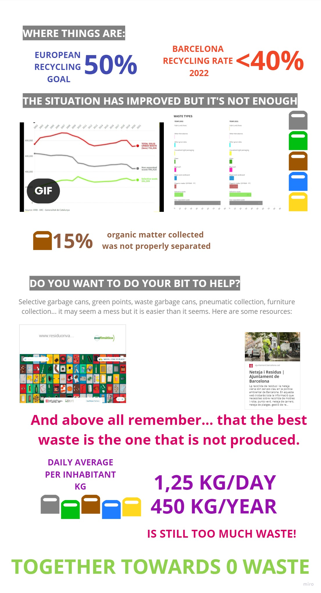
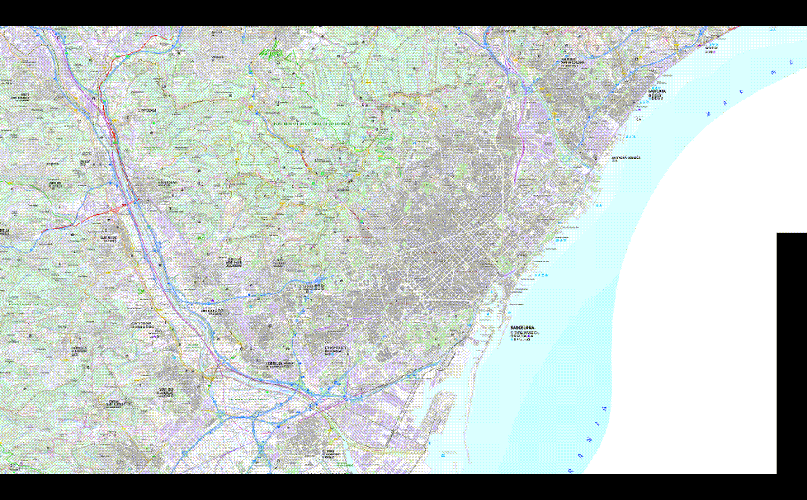
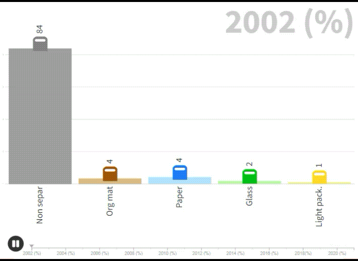

# Design studio: **Intervention 01 > BinGo**

**Team members:**
[Qianyin Du](https://33dudu.github.io/magicreator/),
[Jorge De la Mora](https://jdlm92.github.io/MDEFsite/),
[Emmanuelle Pangilinan](https://minnie-at-iaac.github.io/)
and [Albert Vila Bonfill](https://avilabon.github.io/MDEF_Albert/)

## Introduction
This intervention is about data, waste and people. 

{: style="height:50px;width:50px"}
{: style="height:50px;width:50px"}
{: style="height:50px;width:50px"}
{: style="height:50px;width:50px"}
{: style="height:50px;width:50px"}

This is the collective design space where we meet or so I think!
{width=600}

{width=600}

## Results
### Final video
<iframe width="100%" height="400px" src="https://www.youtube.com/embed/fhhr1BJ_tmA?si=WUGzP55aOYNgaadA" title="YouTube video player" frameborder="0" allow="accelerometer; autoplay; clipboard-write; encrypted-media; gyroscope; picture-in-picture; web-share" allowfullscreen></iframe>

### Instagram campaing
{width=250px}

https://www.instagram.com/bingo.barcelona

### Infographics

Link to Infographics: https://tome.app/jdlm-24d/barcelonas-waste-management-system-clom2go2g0ulqmy7cbr94ra6x

### Maps and graphs
{width=450px}
{width=450px}
{width=450px}

## Reflections

With this modest microintervention, we have tried to understand the system that surrounds waste collection and recycling in the city of Barcelona, and we have made some small contributions at a prototype level to try to influence some of the problems detected.

When trying to understand the system, the idea of bringing information closer to people has arisen spontaneously. We believed that it was important to find the key information to convey to citizens so that they understood the importance of correctly separating waste. From the large amount of public data available, we decided what data could be used to transmit in a simple and understandable way to users, and then we created new experimental channels to try to reach more people. For this goal, we created an infographic, some dynamic graphs and maps, a multilingual account on a social network, and we failed in our attempt to create a bot.

During the process, we have spoken with some of the administrations involved (Barcelona City Council and Waste Agency of Catalonia), with one of the main waste management companies in the city (URBASER) and with some citizens, especially foreigners who have recently arrived in Barcelona. Administrations, managers, and users are some of the main communities involved in the complex issue of waste within a city. It has been a very interesting project that has allowed us to leave our personal bubble to enter other realities.

As we have learned a little more about the complex collection and recycling system within a large city, a lot of ideas have emerged on how to improve these systems with technology. However, the limited time to design the intervention has made us focus on what is possible. We have talked about it, but this intervention has not focused on the basis of everything, which is the reduction of waste.