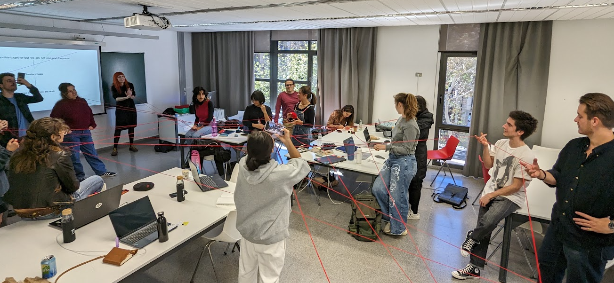

# Design studio: **Narratives storytelling**

Welcome to another conceptual, semantic and dialectical shakeup with Laura, our leading philosopher.

We delved into concepts such as the personal narrative or the collective narrative, the different meanings within the word power (potestas and potentia), wor(l)ding, vibrant matter, materialities... Which have come from the hand of theorists such as Donna Haraway, Spinoza, Jane Bennett...

???+ Quote "Interesting references"
    1. A post: [Wor(l)ding] https://newmaterialism.eu/almanac/w/worlding.html
    2. A film: [Donna Haraway Film: Story Telling for Earthly Survival](https://vimeo.com/ondemand/donnaharaway)
    3. An interview: [Feminist cyborg scholar Donna Haraway: ‘The disorder of our era isn’t necessary’](https://www.theguardian.com/world/2019/jun/20/donna-haraway-interview-cyborg-manifesto-post-truth)
    4. A book: [Vibrant matter, a political ecology of Things. Jane Bennett](https://www.dukeupress.edu/vibrant-matter)

## Activity 1. Choose a figure an write a personal narrative 
###**Slowness**

Today I arrived 45 minutes early to Barcelona. The distance in between the bus stop and the school is only 10 minutes. I chose ***slowness*** rather than going straight as always and taking the opportunity to do something else when I arrived. It was early in the morning, rush hour for school and work.

The difference in speed with respect to the other pedestrians, placed me in a position between static and dynamic, between the buildings and the majority of humans active at that moment, almost *"still life"*.

In their haste, they avoided me as if it were a piece of street furniture. And at that precise moment I realized that my perception had changed. I saw new things that had always been there, textures and details appeared in the materials that made up a path many times traveled. I saw more than just people in people, not just their shape, the colors of their clothes and their shoes. I could listen to my mirror system and feel inside me its anguish, its haste, its motivations, its dreams, its illusions, its ambitions... or at least that's what it seemed to me and it was fantastic.

The ***slowness*** has allowed me, for a few moments, to break or enlarge my bubble, to see beyond, to enhance my senses.

## Activity 2. Write a collective story

???+ Danger "We can not use words as:"
    I, us, our, me, myself, mine, ourselves...

It is funny how an accumilation of choices can lead a group of people to come together. People who a little more then a month ago were strangers have become a community working to create a better future. Little did they know that the present was gonna be the craziest challenge they ever faced.The members of the group come from diverse nationalities and ethnic backgrounds, yet collectively, they share a common experience of navigating through the intricate processes of attaining city citizenship and utilizing it to acquire a commute card amidst the challenges of bureaucratic procedures. From this primordial soup of individuals and cultures, however, some questions arise: what is really the difference between their personal and professional identities? Are they only here to work together? It seems more like these players are trying to transform their personal ideals into concrete action.

The correct answer to the question doesn't exist. It's up to the group to embark on this new adventure and ask even more questions. Whether it's by engaging the newfound tools of the world to act on simple interactions, by analysing the enviroment lived to learn learn and learn or to by simply living in community and add up a new experience of co-living with different cultures, languages, materials, technologies, spaces, species...

The journey of this eclectic assembly it's a profound exploration of self within the tapestry of a new society. As they juggle the demands of their individual lives with the collective needs, each member is crafting a unique narrative, shaped by shared struggles and triumphs. This experience may test their limits, but it also offers an opportunity to redefine their understanding of community and identity in an ever-evolving world. The shared adventure forms a community that celebrates milestones, cares for one another, and evolves into a unique system of mutual learning and support.

Deep conversations about the future, technology, and all of the possibilities that lie ahead are happening everyday, and it's up to the group to use them to shape the next part of the story.It can be easy to forget, amidst the noise and haste of constant learning and unlearning, of different ways of doing, that having fun is the key. Engaging in ways of exploration and conversation that spark joy and curiosity, lies the groups hidden path to exploring the unfamiliar.This seemingly infinite and endless network, forking and merging, could, through the constant drive to challenge and prove assumptions, gather inspiring experiences for individuals who want to put themselves in this perspective of reality. This means also realizing failure during the process, an indispensable facet of the human experience.Acknowledging failure not as a dead-end but as a portal to enlightenment, one discovers the essence of resilience and adaptability, not only in learning from personal blunders but also in gleaning wisdom from the experiences of others. Failure constitutes an integral facet of the evolutionary journey. Embracing risk is essential for community advancement, and failure is an inherent component of such risks. Within the realm of uncertainty, novel discoveries await, even if accompanied by potential fear and exposure. Valuable lessons emerge from failure, offering a pathway to address topics often neglected or considered taboo. Risk-taking presents opportunities for the existence of these transformative moments shared together. In addition to learning to value failure, this group learned the power of the collective. Learning with each other means learning from one another. Individual design spaces were deeply enriched and expanded by sharing thoughts and ideas with classmates, and many assigments would have never been achieved without collaboration.

If in the future one could observe the life paths followed by each of these people from this moment on. And, at the same time one could overlap the paths they would have followed if they had never met in space time.  Maybe, just maybe we would understand a little bit how this experience has shaped their lives. Between the sunrise and the sunset millions questions will shows up to the brain. by answering those question gente used the vision to noticed the informations and solutions. Vision is different in every gente. Nowdays, gente lived with technology. Also, millions creations borned. The new borned babies involved into Gente-Tech Art movement; where the dream starts to come true.

Yet, in the midst of continual learning and unlearning, amidst the various approaches, it's easy to overlook that fun is essential. Participating in exploratory conversations that spark joy and curiosity unveils the group's secret journey to explore the unknown. This seemingly boundless and ever-shifting network of connections, with its twists and turns, might, by consistently challenging assumptions, accumulate enriching experiences for those who want to embrace this outlook on reality.

Moreover, these diverse experiences and shared challenges of the group risk fading into memory. Documentation,is the useful source to capture the essence of their journey, preserving wisdom from failures and collective learning. It serves as a tangible record, enabling reflection, celebration of milestones, and informed shaping of the group's future.

Time will tell how these group of students are going to be changed as professionals and as individual people.But always are going to have the documentation and the learning of the MDEF year This could be an opportunity to explore what it really means to have every opportunity lie ahead. To understand what it means to be one with everything and nothing in the body of a creator. To realise that every miracle once attributed to a god could also be in a group of 22 (sweetie pie) students who all crossed into one reality by making the same decision to be here. 

[Go to the original doc](https://pad.riseup.net/p/TellingNarrative(s)Stories-keep)