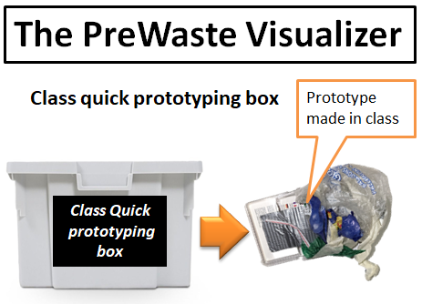
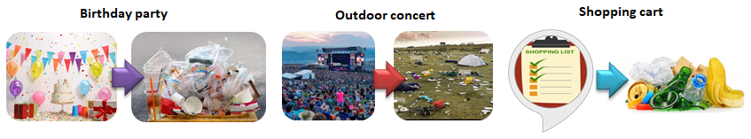

# Design studio: **Roles of prototyping**

## Roles of Prototyping in 1PP Research through Design

{width=500px}

3 Perspectives based on Tomico et al. 
https://www.researchgate.net/publication/307605892_A_Systematic_Analysis_of_Mixed_Perspectives_in_Empathic_Design_Not_One_Perspective_Encompasses_All

#### Reflection:
The combination of the three perspectives seems to be a good formula to enrich design decisions. I think each perspective brings something meaningful to the design. 1PP gives us more sensitivity, empathy towards users and, why not, also legitimacy.

### The Roles

***Reflection:*** To be honest I must say that often when I try to fit a prototype into a role, I have doubts. To understand it a little better I have read the article (https://www.researchgate.net/publication/270511639_Prototypes_and_prototyping_in_design_research) and I have searched for these videos of examples that you can see below.

-   Role 1: The prototype as an experimental component
    <iframe width="560" height="315" src="https://www.youtube.com/embed/N0pFySXLJJA?si=WZhJZxdotUe6zROG" title="YouTube video player" frameborder="0" allow="accelerometer; autoplay; clipboard-write; encrypted-media; gyroscope; picture-in-picture; web-share" allowfullscreen></iframe>
-   Role 2: The prototype as a means of inquiry
    <iframe width="560" height="315" src="https://www.youtube.com/embed/xbQCM3Fmw_s?si=n7QN370H1Yr_oYKv" title="YouTube video player" frameborder="0" allow="accelerometer; autoplay; clipboard-write; encrypted-media; gyroscope; picture-in-picture; web-share" allowfullscreen></iframe>
-   Role 3: The prototype as a research archetype
    <iframe title="vimeo-player" src="https://player.vimeo.com/video/48763713?h=2779531d3a" width="640" height="360" frameborder="0"    allowfullscreen></iframe>
-   Role 4: The process of prototyping as a vehicle for inquiry

### Activity 1. A reflection on the main roles of prototyping and other design activities that you want to use based on the context you are in.

#### Reflection:
My personal experience in recent years has been as a manager of protected natural spaces. In this area, practically all interventions on the ground are like prototypes. We practically never have a finished product. The management is continuous because the users are in constant evolution (change). The natural environment is changing and it es subject to multiple variables and interactions that we cannot totally control. Work with living beings and natural systems implies always using adaptive management. That is to say that we are constantly evaluating results and indicators of our actions to adapt subsequent planning to get closer to the conservation objectives.

We invent conservation actions, we test study methodologies with new techniques, we create coexistence policies that we adapt and protocolize as they give results. I guess everything is closer to roles 1 and 2.

### Activity 2. Changing roles

The exercise consists of creating a prototype from a prototype or project of a colleague but based on another prototyping role.

Minnie's project consists of a human figure made of discarded ballot papers that comes out of the wall and extends its arm towards people passing by the hall. Although it is not conceived as a prototype but rather a provocative art piece, It could be seen as a provotype that has a lot of role 2 and role 4 embedded.

Inspired by Minnie's prototype, I have tried to create a prototype based on role 1. It is a waste previewer, the main idea is a device so that consumers could see all the waste that our purchase will generate stacked up to see if this generates a change in behavior.

Other situations:

