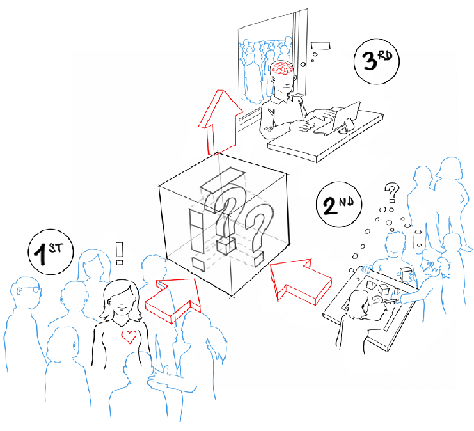
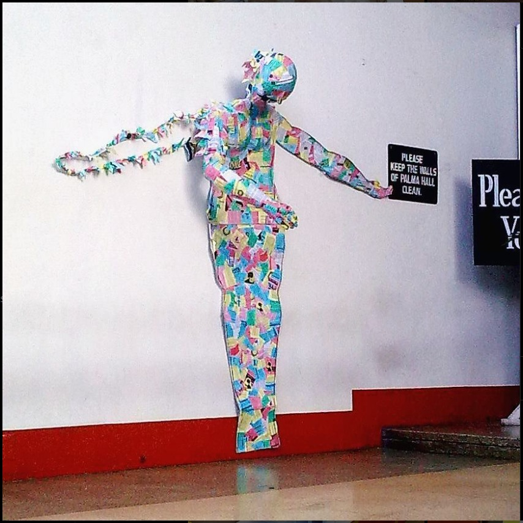

## Roles of Prototyping in 1PP Research through Design

3 Perspectives based on Tomico et al. 
https://www.researchgate.net/publication/307605892_A_Systematic_Analysis_of_Mixed_Perspectives_in_Empathic_Design_Not_One_Perspective_Encompasses_All

***Reflection:*** The combination of the three perspectives seems to be a good formula to enrich design decisions. I think each perspective brings something meaningful to the design. 1PP gives us more sensitivity, empathy towards users and, why not, also legitimacy.

### The Roles

***Reflection:*** To be honest I must say that often when I try to fit a prototype into a role, I have doubts. To understand it a little better I have read the article (https://www.researchgate.net/publication/270511639_Prototypes_and_prototyping_in_design_research) and I have searched for these videos of examples that you can see below.

-   Role 1: The prototype as an experimental component
    <iframe width="560" height="315" src="https://www.youtube.com/embed/N0pFySXLJJA?si=WZhJZxdotUe6zROG" title="YouTube video player" frameborder="0" allow="accelerometer; autoplay; clipboard-write; encrypted-media; gyroscope; picture-in-picture; web-share" allowfullscreen></iframe>
-   Role 2: The prototype as a means of inquiry
    <iframe width="560" height="315" src="https://www.youtube.com/embed/xbQCM3Fmw_s?si=n7QN370H1Yr_oYKv" title="YouTube video player" frameborder="0" allow="accelerometer; autoplay; clipboard-write; encrypted-media; gyroscope; picture-in-picture; web-share" allowfullscreen></iframe>
-   Role 3: The prototype as a research archetype
    <iframe title="vimeo-player" src="https://player.vimeo.com/video/48763713?h=2779531d3a" width="640" height="360" frameborder="0"    allowfullscreen></iframe>
-   Role 4: The process of prototyping as a vehicle for inquiry

### Activity 1

### Activity 2

