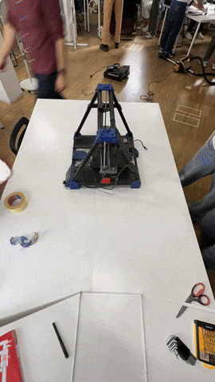
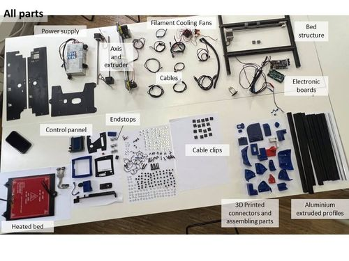
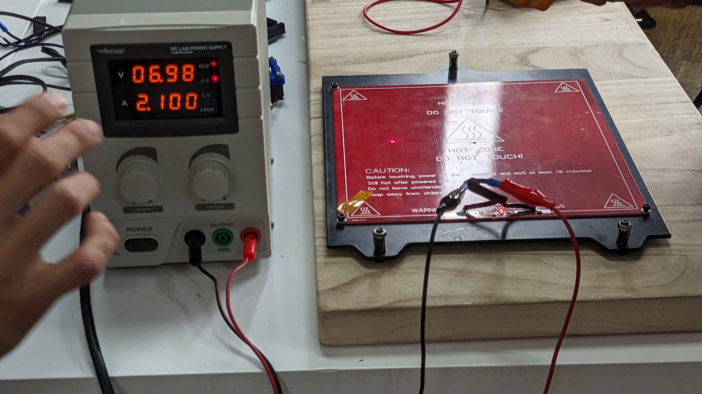

# **Forensic Report:3D Printer**(Group activity)
**Team members:**
[Anna Fedele](https://annafedele.github.io/mdef/), [Dhrishya Ramadass](https://dhrishyaramadass.github.io/mdefwebsite/), [Mihnea Nicolae Patrascu](https://grayson-iaac.github.io/MDEF/), [Nicolò Baldi](https://niente010.github.io/MDEF_website/#welcome), [Qianyin Du](https://33dudu.github.io/magicreator/) and [Albert Vila Bonfill](https://avilabon.github.io/MDEF_Albert/)

| Identity of the reporting agency       | MDEF                           |
|----------------------------------------|--------------------------------|
| Case identifier                        | Forensics of the Obsolescence  |
| Identity of the submitter              | Albert Vila Bonfill/ Anna Fedele/ Dhrishya Ramadass/ Mihnea Nicolae Patrascu/ Nicolo Baldi/ Qianyin Du/
| Date of receipt                        | 17/10/2023                     |
| Date of report                         | 19/10/2023               |
| Identity and signature of the examiner | Albert , Anna, Dhrishya, Mihnea, Nicolo, Qianyin|      			  |
| Image | |

## Examination 

Descriptive list of items submitted for examination, including serial number, brand and model

* **Serial number:** 01 150929 1189
* **Brand:** FUNDACIOCIM
* **Model:** BCN3D+ REPRAP2
* **Year:** 2015
* **Weight:** 11,6 kg
* **Colour:** BLACK/BLUE
* **Made in (assembled):** SPAIN

    <iframe 
        title="3D Printer" 
        width= "100%"
        height="400px"
        frameborder="0" 
        ui-theme="dark"
        preload="0"
        allowfullscreen 
        mozallowfullscreen="true" 
        webkitallowfullscreen="true" 
        allow="autoplay; fullscreen; xr-spatial-tracking" 
        xr-spatial-tracking 
        execution-while-out-of-viewport 
        execution-while-not-rendered 
        web-share 
        src="https://sketchfab.com/models/e502641d13b24bd5b1fdc4618c199533/embed?autostart=1&ui_theme=dark">
    </iframe>

## Forensic Questions

**What does it do?** 
A 3D printer is a device that creates three-dimensional objects by layering material based on a digital design. Using a computer-aided design (CAD) model as a blueprint, the printer adds material layer by layer, whether it's thermoplastic, resin, or metal, to form a solid object. Different printing technologies, such as Fused Deposition Modeling (FDM), Stereolithography (SLA), or Selective Laser Sintering (SLS), dictate the type of material and the layering process, resulting in a tangible product that mirrors the digital design.

**How does it work?** 
The 3D printer works by interpreting a digital 3D model, slicing it into thin horizontal layers using specialized software, and then building the object layer by layer through additive manufacturing. Depending on the technology used, the printer deposits material, such as thermoplastic filament, liquid resin, or metal powder, layer by layer, with each layer fusing to the one below. The material is solidified using various methods like heating, UV curing, or laser sintering, resulting in a three-dimensional object that matches the digital design.

**How it's built?** 
The 3D printer is constructed using a combination of mechanical, electronic, and software components. Mechanically, it features a frame that houses the moving parts, including the print head or extruder, and a build platform. These components are driven by motors, guided by linear rails or rods, ensuring precise movements on the X, Y, and Z axes. Electronically, a main control board processes digital instructions from the slicing software, directing the motors and regulating the temperature of the print head or curing source. Additionally, various sensors monitor conditions like temperature and filament presence, while the software interface allows users to configure settings, load models, and initiate the printing process.

**Why it failed, or it wasn't used anymore?**
The 3D printer still functions, but it's an older, unstable model with low accuracy and print quality.

## Steps taken
1. Cleaned the dust off the printer and brought it to the MDEF room
2. Disassembled using our toolbox

 

3. Separated into three main parts as follows:
- The plate - Horizontal surface that also gets heated and can be moved in all directions and where the plastic is printed on;
- The structural part - The part that supports the entire printing machine;
- The extruder - Contains the motors to print 3D filament;
4. Laid out all parts individually and documented.

## Testing
After the disassembly process, we meticulously examined each individual component. Utilizing a precision lab power supply and a high-resolution multimeter, we conducted comprehensive tests to determine the optimal voltage required for each component’s functionality.

## Results

**How many motors did we find inside?**
Five motors - they are used to move the extruder in the three axis to permit drawing in 3D space.

**Does it contain a computer or microcontroller?**
Yes, an Arduino board and a RAMPS.

**Did you found any sensors?**
Yes, temperature sensors.

## Conclusions

**What did you learn?**

- How a 3D printer is assembled
- How a 3D printer works
- How to power up each component individually
- Fundamental electronics
- How a step motor works

**What surprised you?**

- The number of components, screws and pieces the printer had
- The fact that we can make the extruder work with just 3 components
- How easy and repareable it is
- How much the 3D technology has improved since 2015

[Team Forensic report-web](https://grayson-iaac.github.io/MDEF/week3.html)