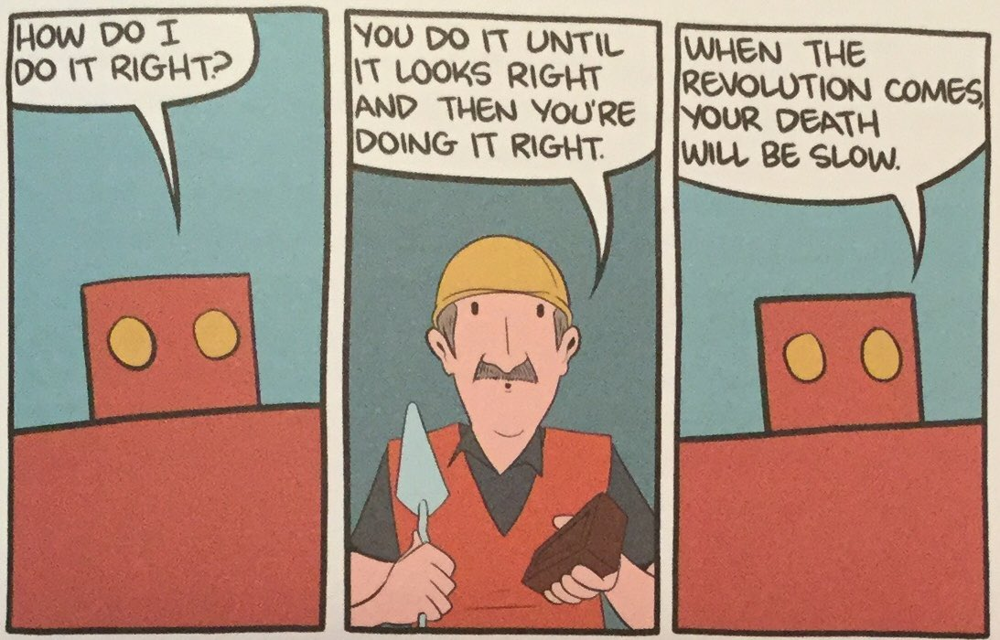

# **The machine paradox**
The Moravec paradox that gives the seminar its name, comes from the paradox that some of the things that are easy for us to do as humans can be very difficult for machines, while some of the things that are difficult for humans they are easy for machines.

{width=450}

This two-week practical seminar consists of two parts. During the first week we carried out the internal analysis of an object rejected for being old or damaged. And in the second week we designed and built a prototype using parts of the analyzed object.

1. [Forensic report](05-ForensicReport.md)
2. [Magic machine prototype](05-TheMagicMachine.md)

## Reflections

This two-week seminar has been very exciting. I enjoyed like a child discovering the intimacies of some of the machines that surround us. Through a [forensic analysis](05-ForensicReport.md) we have seen the components, the materials, the internal design and the operation of the pieces and parts that make them up. Later we verified that the vast majority of the parts worked perfectly which did not save them from going to the trash. 

What world do we live in where it is cheaper to buy a new device than to repair one that has 90% or more of its components in good condition? How we got here? Who receives the consequences of this madness? And from here comes a motivation. This is so absurd we have to fix it!

We have been able to verify that in many cases the company that designs does not manufacture most of the components that make up the devices internally. These components are manufactured here and there by companies that specialize in small internal components.

In our case, the 3D printer, is a very special case as it comes from an open design project. [RepRap](https://en.wikipedia.org/wiki/RepRap) is a project to develop low-cost 3D printers that can print most of their own components. As open designs, all of the designs produced by the project are released under a free software license, the GNU General Public License.
 In this [link](https://reprapbcn.wordpress.com/2013/11/21/workshop-de-navidad-de-bcn3d-en-barcelona/) you can find an interesting news about a RepRapBNC printer assembly workshop that took place in 2013.

**When designing and prototyping something useless leads to a lot of useful learning!**

Once the machines were disassembled and the components checked, we were given the challenge of building a [new machine](05-TheMagicMachine.md) without any commercial purpose, using parts of the original machine. If disassembling an object and testing its parts separately had already been interesting and fun, it has been even more so to build something different inspired by the first one. 

At this stage of the seminar the coordination of the group and the internal roles of the members has also been an interesting learning point. We were asked to divide ourselves by abilities and skills to have balanced groups. I guess my colleagues will agree with me that my contribution to the group has been more multi-purpose, I have been filling gaps wherever they were and helping or supporting my colleagues when they needed it.