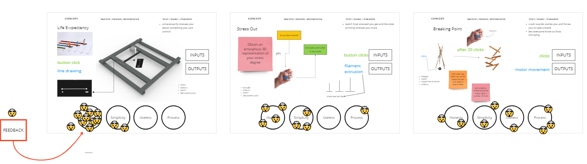

# LifeX - The Life eXpectancy predictor

After brainstorming and presenting 3 proposals, we decided to build the LifeX, a modern version of glass balls. It's a pretty useless machine that draws a line on a bookmark whose distance represents the life expectancy of the person who pressed the button to activate it.


###Work in progress
<iframe width="100%" height="400" src="https://www.youtube.com/embed/vosQQlPurCI?si=1-ip2Jile-H4AyEG" title="YouTube video player" frameborder="0" allow="accelerometer; autoplay; clipboard-write; encrypted-media; gyroscope; picture-in-picture; web-share" allowfullscreen></iframe>

??? Abstract "Life X Code"

    ``` 
        //Servomotor library
        #include <Servo.h>

        // Define stepper motor connections and steps per revolution:
        #define dirPin 2
        #define stepPin 3
        #define stepsPerRevolution 200

        //LCD settings
        #include <Wire.h> 
        #include <LiquidCrystal_I2C.h>
        LiquidCrystal_I2C lcd(0x27, 16, 2);

        //PEN ServoMotor
        Servo penMotor;  //define the servomotor
        int potpin = A1;  //define servomotor pin
        int val;          //variable for servomotor

        const int buttonPin = 4;  // the number of the pushbutton pin
        int buttonState = 0;      // variable for reading the pushbutton status

        const int buttonPin1 = 5;
        int buttonState1 = 0;
        int home = 0;
        int prediction = 0;
        int start = 0;

        long ranValue;

        void penUp(){
        //PEN UP
        delay(1000);
        val = 0;
        val = map(val, 0, 1023, 0, 180);  
        penMotor.write(val);    
        }

        void penDown(){
            //PEN DOWN
            val = 90;
            penMotor.write(val);
        }

        void setup() {

        Serial.begin(9600);
        // Declare pins as output:
        pinMode(stepPin, OUTPUT);
        pinMode(dirPin, OUTPUT);
        pinMode(buttonPin, INPUT);
        penMotor.attach(potpin);
        randomSeed(analogRead(0));

        lcd.begin();
        lcd.backlight();
        }

        void initit() {

        if ((buttonState == HIGH) && (home == 0)) {
            digitalWrite(dirPin, HIGH); 
            Serial.println("Reset...");    

            void penUp();
            prediction = 0;                      

            //Spin the stepper motor 5 revolutions fast:
            for (int i = 0; i < stepsPerRevolution; i++) {
            // These four lines result in 1 step:
            digitalWrite(stepPin, HIGH);
            delayMicroseconds(500);
            digitalWrite(stepPin, LOW);
            delayMicroseconds(500);
            }
        } else if (buttonState == LOW) {
            //Serial.println("Ready!");
            home = 1;
        }
        }

        void loop() {

        // read the state of the pushbutton value:
        buttonState = digitalRead(buttonPin);
        buttonState1 = digitalRead(buttonPin1);

        initit();

        if ((buttonState1 == LOW) && (home == 1)) {

            ranValue = random(0,23);  // 1000*20200
            ranValue = ranValue * 100;

            lcd.clear();
            lcd.setCursor(2,0);
            Serial.println("Predicting...");
            lcd.print("Predicting...");

            if (prediction == 0) {
            digitalWrite(dirPin, LOW);
            void penDown();

            for (int i = 0; i < ranValue; i++) {
                // These four lines result in 1 step:
                digitalWrite(stepPin, HIGH);
                delayMicroseconds(500);
                digitalWrite(stepPin, LOW);
                delayMicroseconds(500);
                prediction = 1;
            }
            //the prediction is done!
            lcd.clear();
            Serial.print("Your Lifex is: ");
            Serial.println(ranValue/23);
            lcd.setCursor(1,0);
            lcd.print("Your Lifex is: ");
            lcd.setCursor(7,1);
            lcd.print((ranValue/23)+10);

            //get back Home
            void penUp();
            delay(5000);
            home = 0;
            //initit();     
            } 
        }
        }
    ```


###Final result
<iframe title="LIFEX MODEL" frameborder="0" allowfullscreen mozallowfullscreen="true" webkitallowfullscreen="true" allow="autoplay; fullscreen; xr-spatial-tracking" xr-spatial-tracking execution-while-out-of-viewport execution-while-not-rendered web-share src="https://sketchfab.com/models/08612964146242d88ae1c344fdd2f36b/embed" width="100%" height="400px"> </iframe>

###Presentation
**Video**
<iframe title="vimeo-player" src="https://player.vimeo.com/video/878611346?h=13229e04f0" width="100%" height="400" frameborder="0"    allowfullscreen></iframe>

**Slideshow**
<iframe style="border: 0px solid rgba(0, 0, 0, 0.1);" width="100%" height="450" src="https://www.figma.com/embed?embed_host=share&url=https%3A%2F%2Fwww.figma.com%2Fproto%2FcLFrMEDN6GybFAvQkN2E2G%2FLifeX-Presentation%3Fpage-id%3D21%253A2%26type%3Ddesign%26node-id%3D22-31%26viewport%3D584%252C397%252C0.15%26t%3De066V1nWbNjhBLNr-1%26scaling%3Dcontain%26mode%3Ddesign" allowfullscreen></iframe>