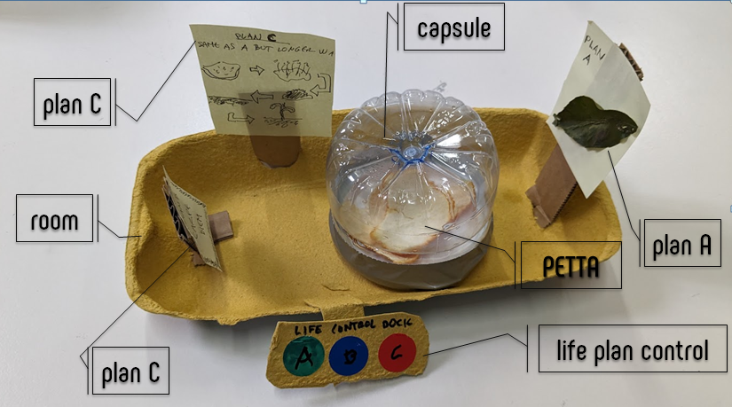
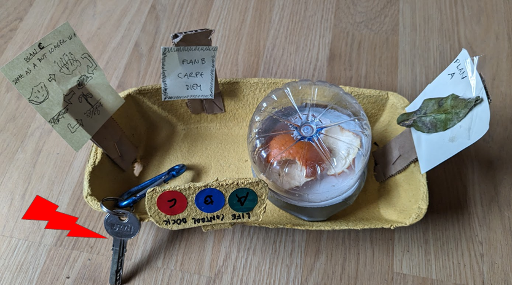

## Activity 1. Magic machines workshop: make a companion

### Public presentation of Petta

This companion is a kind of live being, at least a piece of organic matter already crafted by nature when we met each other. As a designer I just created a protective capsule and a room. In the room, my companion has three posters about the future. It’s Plan A is to become a Tangerine Tree, Plan B is more “Carpe Diem” let’s flow and Plan C is the same as Plan A but with a longer path, with more steps and with a more blurred final destination. There is a device with 3 buttons that allow to change from one plan to another. During the creation I was thinking in acceptance or rather self-acceptance	
It is not a pet. I repeat, it is not a pet!

#### First feelings
I imagine that this companion will evolve, like us, like most of us! I imagine that it will change it’s appearance. I also imagine that I’ll be able to talk to it and ask it how its day went. And in my future predictions I imagine that one day I will get up in the morning and tell it, friend, are you feeling sick? You're turning a little green! Or maybe, I see you somewhat changed, are you leaving your hair long?

### Living Together. Living with Petta diary.

#### Day 1 (30/10/2023)
- 13:00: Birth. I create a new birthday reminder in Google Calendar. It has the same horoscope as me, this cannot be a coincidence!
- 14:00: Capsule, portable room and decoration
- 16:30: Arrival home. I see, horrified, how the trip has destroyed part of the room. Luckily, the capsule has resisted and the companion has arrived unharmed. 
- 17:00 I restore everything and take the opportunity to make some improvements in fixing the posters.
- 17:30 We look for a suitable place to live. Finally we decided to try, provisionally on a shelf in the library.
- 17:45 I observe a slight humidity in the capsule. We will be alert to how it evolves
- 23:30 I've come home and I'm going to see him. I don't know if I should take it to my room. Maybe my family thinks that this master's degree is affecting my reasoning. I better leave it where it is.

#### Day 2 (01/11/2023)
- 8:00: I wake up and my first impulse is to go visit the “Thing”. I control myself. Wait until after breakfast. It's just a class exercise, isn't it?
- 8:30: Working with living elements is dangerous, you can create bonds!
- 10:00: I finally go up to visit it. The capsule condensation remains the same. We need to give it a name so we don't call it “Thing”. I'm thinking about giving it a nice name that everyone likes. In the five minute limit that I have set for this task I am not able to find anything more cool and original than PEETA (from peel and tangerine).
- 12:00: I think that the posters I have made with PEETA’s future plans were actually mine and that I am playing God. I don't know if I want to continue with the exercise. I think about getting rid of PEETA! But how? Now it has a name! Will I abandon him in the forest? Do I separate it by type of waste and recycle it so as not to have a bad conscience? I simply abandoned it and became part of the club of bastards who do not internalize the externalities of their creations. Designers should not avoid responsibility for their creations.
- 12:30 PEETA, Can I ask you something? When the hell are you going to emancipate yourself?
- 13:00 I calm down. I just have to rethink our relationship. As a father I was adopting an overly paternalistic relationship with PEETA. I simply didn't want to spend 2 more years changing diapers. Call me selfish!
- 16:00 I give him a house key so he can choose freely.
- 17:00 PEETA is still at home. I guess PEETA has freely choose to stay. So PEETA let's establish some rules of coexistence…

## Activity 2. First person experience

### Bikes and cars, towards a more empathetic relationship

#### 2.1. Main motivation/idea: Can we do something to improve sustainable mobility?

STATE OF THE ART

- Sustainable mobility is a necessity
- Beyond the cities there are few bike lanes
- Getting to the city by bike is very difficult and dangerous.
- Public transport at rush hour is saturated
- The traditional roads that linked towns and cities have been converted
into roads designed for cars
- Many people are stressed. Almost everyone is in a hurry, we want to
do more things than we can for the time we have.

OPINIONS AND WISHES

My personal opinion is that it makes no sense to create more roads and my wish is
that cars and bicycles learn to share space, how can I help?

MY HYPOTHESIS

- Communication will improve relationships,
- Good vibes, vibrations, feelings are contagious as bad feelings,
- Being kinder helps everyone

... so ...

- A wearable communication device (clothes or helmet) that can give
indications, warnings and also a more empathic communication messages
such as “Thank you! Hello! I’m sorry!“ to the car drivers may help.

TEST IN FIRST-PERSON

If we imagine that this empathic communication device exists, how would I feel
wearing it? How do I feel trying to communicate with car drivers?
Initial idea:
I’m gonna stick a message on my back and chest addressed to the drivers.
Then I will go out for a bike ride on a road without a bike lane that I normally
ride my road bike and I will record a video to see what happens, if anything
happens. The rain and the wind don't allow me!
Second idea:
There is little time left so I will use the daily trip from the bus stop to the
IAAC by bike to do the test so I put a sign saying good morning on the front
that can be read with the rearview mirrors and another one in my backpack
and I start pedaling through the streets of Barcelona. I feel ashamed just to
be posting the messages. It seems like I'm going a little late or maybe it's
Friday but there isn't much traffic.

<iframe src="https://player.vimeo.com/video/882503581?badge=0&amp;autopause=0&amp;quality_selector=1&amp;player_id=0&amp;app_id=58479" frameborder="0" allow="autoplay; fullscreen; picture-in-picture" style="position:absolute;top:0;left:0;width:100%;height:100%;" title="BIKESCARS_AlbertVilaMDEF2023"></iframe>

##Reflections, conclusions and new questions

1. Designing the exploration:
● Looking for the message, I have not been able to find a
universal icon/symbol to say thank you. Why?
● Should I use words, icons or emoticons?
● How visible must the messages be in order to attract attention?

2. I am somewhat shy and I have a family and a reputation to maintain.
Well, it's all excuses, the truth is that it embraces me. This has been a
test of self-improvement. I passed the test!

3. After wearing the message for a while I almost forgot.

4. At the traffic lights I feel ashamed again. Camouflaging a little with a
helmet and sunglasses helps to deal with it.

5. The city is full of strange things and people dressed in all kinds of
clothes. A guy with some messages stuck on his body doesn't stand
out too much.

6. The city is full of inputs such s people, cars, signals, noise,
pedestrians... If I want the message to reach its destination, should the
message be brighter? Maybe some lights?

7. I have seen and recorded on video many traffic violations, especially
for bicycles and pedestrians. Also an accident with an electric scooter
and a pedestrian who crossed without looking. It seems like it wasn't
very serious but the girl on the scooter fell to the ground and she will
be angry all morning. I tried to calm her down but she was full of
adrenaline from shock.

8. It is better not to use the mobile stabilizer to record on the bike. It is
better not switch off the stabilizer to record on the bike. It is better not
to fix the mobile phone to the handlebars of the bike when it is a
simple folding bike.

9. A first-person exploration should be long-term to be more effective,
revealing and transformative.

10. The experimental design of a first-person exploration must be very
well done or have an adaptive design time to adjust the experiment
well and get the most out of it.

11. One of the main conclusions has been that the experience has been
poorly designed by me and I have not been able to test it in ideal
conditions. I would have liked to have more time and I feel that I don't
get much satisfaction from doing things quickly and in a mediocre way
just to meet deadlines. I think I'm more of a long-term challenges.