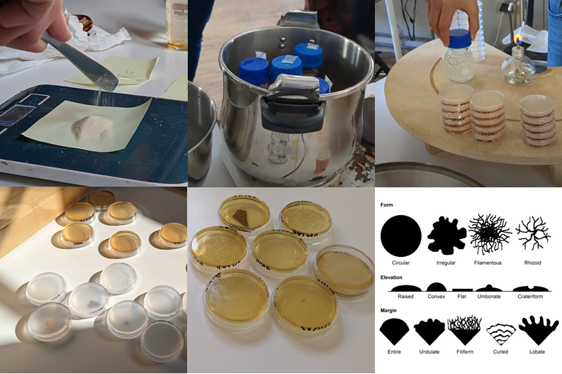
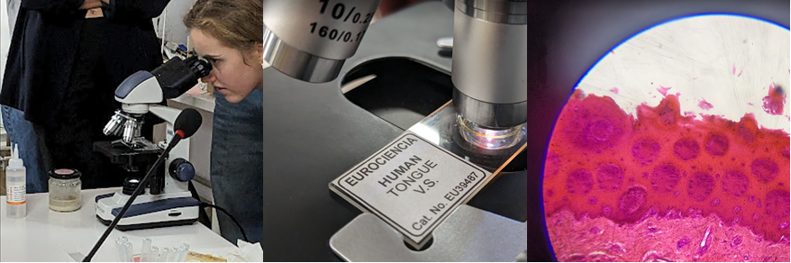
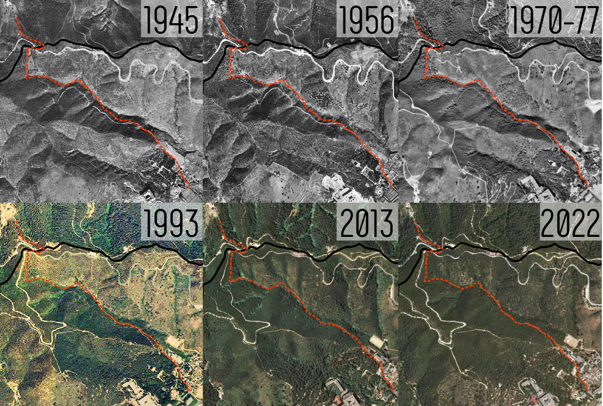
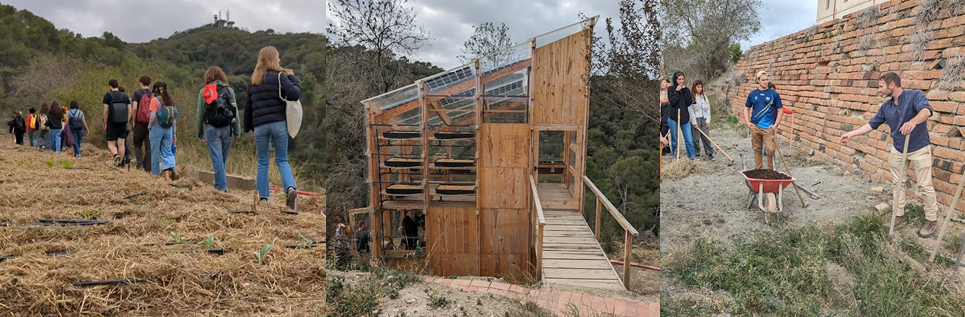
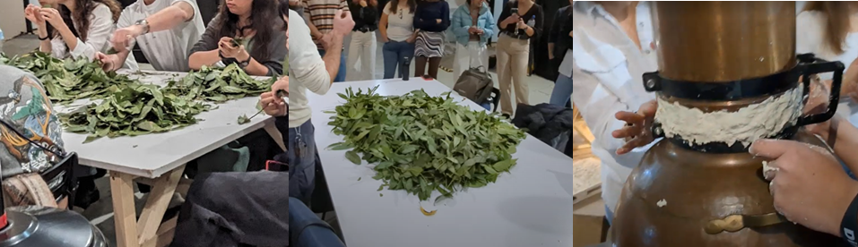
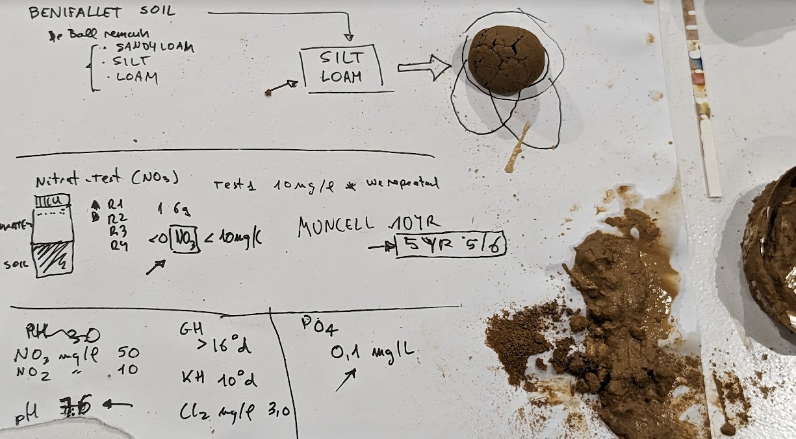
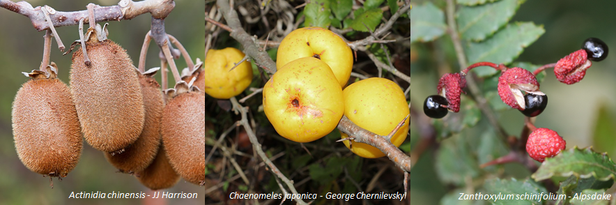

# **Bio and Agri Zero**
## Bio Zero
**Is life a mere piece of information that can self-replicate to adapt to environmental conditions?**

Bio Zero has been a journey at the speed of light through concepts and technologies related to life. We have flown over different branches of biology such as molecular biology, microbiology, cellular biology, genetic engineering... And along the way we saw cells, proteins, amino acids, dna, rna, exons and we learned about CRISP-Cas9 and its use in genetic engineering, we saw bacteria, fungi, protists and we spoke about "LUCA",...

We have been able to practice a little preparing low-cost bacteria cultures in petri dishes with almost homemade resources, approaching an invisible world with microscopes and seeing practical applications such as growing spirulina or kombucha.

In addition, throughout the seminar we were able to reflect on the scientific method, experimental design, the peer-review process for publications, the role of science in general, as well as the funding of scientific research and some open science initiatives.

{Width=800}
???+ danger "Lab rules"
    1. A clean lab is a safe lab
    2. Read the labels
    3. Extra rule: No not eat your experiments

???+ quote "References"
    === "Authors - Scientists"
        - Michael Levin
        - Pamela Silver
        - George Stevens
        - Madhur Anand
        - Linn Margulis
        
    === "Books"
        - Alan Weisman. *The World Without Us*
        - Geoffrey West. *Scale: The Universal Laws of Life, Growth, and Death in Organisms, Cities, and Companies*
        -   Bergey's Manual of Systematic Bacteriology
        
    === "Open Science"
        - Veterinary bacteriology database: http://VetBact.org
        - IGEM: https://igem.org/
        - GlobalCommunity Bio Summit: https://www.biosummit.org/2021
        - Encode: https://www.encodeproject.org

    === "Papers"
        - Academia: https://www.academia.edu/
        - Google Scholar: https://scholar.google.com/
        - News and Views: https://www.nature.com/nature/articles?type=news-and-views

    === "Videos"
         <iframe width="560" height="315" src="https://www.youtube.com/embed/7Hk9jct2ozY?si=-osm8EupLsNP-u5W" title="YouTube video player" frameborder="0" allow="accelerometer; autoplay; clipboard-write; encrypted-media; gyroscope; picture-in-picture; web-share" allowfullscreen></iframe>
         <iframe width="560" height="315" src="https://www.youtube.com/embed/y-uuk4Pr2i8?si=RoIRerKB0bVaWOG6" title="YouTube video player" frameborder="0" allow="accelerometer; autoplay; clipboard-write; encrypted-media; gyroscope; picture-in-picture; web-share" allowfullscreen></iframe>

## Agri Zero

The Agri Zero seminar has been an interesting quick overview of the concepts related to agriculture and other collaterally related topics. 

### Visiting Valldaura Labs
We did a Bioblitz [^1] together from Mundet station to Valldaura Labs. We used [iNaturalist App](https://www.inaturalist.org/) to collect pictures and to identify species thanks to its deep learning-based identification tool built into it.

[^1]:
 A bioblitz is an event that focuses on finding and identifying as many species as possible in a specific area over a short period of time.

Along the way we have been talking about the species and natural communities that inhabit the area, the management of the land and the forest and also the great transformation in land uses that has occurred in this sector of the Collserola mountain.

The abandonment of crops and the progressive renaturalization of the area by forest species is very evident by observing the aerial photos of the last 70 years. The species we found perfectly reflect the history of land use in the area and how the potential vegetation is recovering in those areas with fewer impacts. A large number of exotic species are also appreciated as a result of recent history and proximity to the city.

### Extracting laurel essential oil

### Analyzing soils
Jonathan provided us with some soils from different sources that we were able to analyze in groups. [Nicolo](https://niente010.github.io/MDEF_website/#welcome) and I analyzed a soil from **Benifallet**.

| Parameter | Value      | Analysis   |
|-----------|------------|------------|
| Texture   | Silt Loam  |  Texture   |
| Munsell   | 5YR 5/6    |  Munsell   |
| pH        | 7.6        |pH test|
| NO3       | 50 mg/L    |Nitrate test|
| NO2       | 10 mg/L    |Nitrite test|
| Cl2       | 3 mg/L     |Cl2 test|
| GH        | > 16°d     |     pH     |
| KH        | 10°d       |     pH     |
| PO4       | 0.1 mg/L   |    PO4     |

#### Soil results interpretation
The soil sample from Benifallet presents a "silt loam" texture is composed by 75-85% of silt, 20-50% of sand and 0-25% of clay. The Munsell color value of 5YR corresponds to predominantly yellow and orange colors, it can indicate the presence of certain minerals such as iron. The 5/6 values indicate a moderate organic matter content. pH test indicates a value very close to neutral, just slightly alkaline.
The nutrients tests ( hosphorus and nitrogen) have given values not very high.

### Seeds
Another hands-on exercise has been the seed analysis of a seed collection for agroforestry. Agroforestry is the antithesis of monocultures, it is the simultaneous cultivation of various species taking advantage of the different levels of vegetation (soil, bushes, trees) in the same way that happens in a natural forest ecosystem but with species that provide us with food and raw materials. staggered manner at various times of the year.

| Actinidia chinensis | Chaenomeles japonica |  Zanthoxylum schinifolium|
|-----------|------------|------------|
| Smooth kiwi   | Dwarf quince  |  Szechuan pepper   |
| SKU: SE-100C | SKU: 126   |  SKU: 187B  |
| Not to be confused with the better known and hairy skinned A.deliciosa, this is a smooth skinned climber with large smooth-skinned fruits of excellent flavour. The sap from stems can be used as a glue and the plant for facade insulation. Dioecious; hardy, to -15°C. NB Protect from cats who love to eat the plant!    | A small shrub, reaching 1m (3 ft) high and across. Bright orange flowers are followed by yellow, fragrant, edible fruits 1½ (40 mm) across (best cooked), freely produced. Ground cover and bee plant. Hardy to -23°C.|A very aromatic shrub from China and Japan growing 2 m (6 ft) or more high. The leaves can be used as a flavouring, but the main use is the peppercorn-like red fruit ‘shells’, which are used a spice (peppery and fragrant) – grown commercially as a spice crop in Asia. Grows well in any reasonable soil in sun or light shade; hardy to -20ºC.|
| Stratification[^2]: CS4| Stratification[^2]: CS13|Stratification[^2]: CS13|
| Source: https://www.agroforestry.co.uk/|

[^2]:
Seed stratification: https://www.agroforestry.co.uk/seed-stratification-information/

???+ quote "References"
    - Appropedia: https://www.appropedia.org
    - Practical Action: https://practicalaction.org/
    - Encyclopedia of Life: https://eol.org/
    - The Agroforestry reseach Trust: https://www.agroforestry.co.uk/

## Bio Agri Zero final reflections
These two seminars have been too short for my taste. These are topics that I am passionate about and I can never get enough of them. These are topics of great importance and relevance for my design space and I think they are vital to face the challenges of the Anthropocene.

If we leave aside the excessive speed at which the theory has had to be given, I think that thanks to the experience and professionalism of the teachers, a good balance has been found between theory and practice.

## Deliverable: Microfiberscatcher (a mock GMO)

**What exacly is a GMO (Genetically Modified Organism)?**

According to National Human Reseach intitute[^3], a GMO is a plant, animal or microbe in which one or more changes have been made to the genome, typically using high-tech genetic engineering, in an attempt to alter the characteristics of an organism. Genes can be introduced, enhanced or deleted within a species, across species or even across kingdoms. GMOs may be used for a variety of purposes, such as making human insulin, producing fermented beverages and developing pesticide resistance in crop plants.

**What is the purpose of my GMO?**

Synthetic microfibers have become one of the most important sources of pollution for freshwater systems and the oceans.  They also pollute the atmosphere and soil. Like many microplastics, they can affect the health of many species, including humans. A large proportion of these synthetic fibers are caused by household activities. This project is an attempt to understand this problem, create awareness, adopt existing solutions and design new ones to reduce this problem at household level [^4] [^5] [^6] [^7].

The main purpose is to design an organism capable of trapping microfibers from the environment and accumulating them somewhere where someone can collect them or metabolize them to reduce the pollution they produce. Why not find just a PET-digesting enzime like PETase found in *Ideonella sakaiensis* [^8]? So far there have been various attempts to increase the rate of plastic degradation of these organisms, the risk is that if the activity is no so fast many nanoplastics are generated, which further increase the problem. 

There are several attempts to capture, aggregate or destroy microfibers in water, but I have not found any that try to capture those from the floor and indoor air in homes aside from air filters. This will therefore be the "ecological" niche of the new organism, **the microfibercatcher** that I am designing. I think it is better to prevent these microfibers from reaching aquatic systems, that is, to capture them from the environment and accumulate them so that they can be collected. It goes without saying that the best option would be not to wear synthetic clothing that produces microfibers. 

My thesis is based on the finding that static electricity acts as a dust trap (fibers and hair) producing the typical balls of dust that run around the house. These lints occur in greater abundance in winter when we wear thicker, more fibrous clothes and use heating which dries out the environment causing more static electricity.

**The reseach of static electricity in living beings**

First idea was the static electricity of the cats fur but after a quick research it seems that the cat fur doesnt't produces estatic electricity by itself. It seems that as in the case of cats and other animals, the static electricity in their hair is associated with the type of hair and the behavior of rubbing on surfaces. I don't see it easy to relate it to genetics so this research, for now, has led me to a dead end. 

Not so soon! What if we could find a way to make our pets' hair self-generate static electricity without harming the animals?

{width=400}

[^3]:
https://www.genome.gov/
[^4]:
Jean-Pierre W. Desforges, Moira Galbraith, Neil Dangerfield, Peter S. Ross,
Widespread distribution of microplastics in subsurface seawater in the NE Pacific Ocean, Marine Pollution Bulletin, Volume 79, Issues 1–2, 2014,Pages 94-99,ISSN 0025-326X,https://doi.org/10.1016/j.marpolbul.2013.12.035.
[^5]:
Boucher, J. and Friot D. (2017). Primary Microplastics in the Oceans: A Global Evaluation of Sources. Gland, Switzerland: IUCN. 43pp.
[^6]:
Liu J, Liu Q, An L, Wang M, Yang Q, Zhu B, Ding J, Ye C, Xu Y. Microfiber Pollution in the Earth System. Rev Environ Contam Toxicol. 2022;260(1):13. doi: 10.1007/s44169-022-00015-9. Epub 2022 Dec 6. PMCID: PMC9734713.
[^7]:
https://cen.acs.org/articles/95/i7/Tracing-chemistry-household-dust.html
[^8]:
Yoshida S., Hiraga K., Takehara T., Taniguchi I., Yamaji H., Maeda Y., Toyohara K., Miyamoto K., Kimura Y., and Oda K. (2016). A bacterium that degrades and assimilates poly(ethylene terephthalate). Science 351, 1196-1199.

