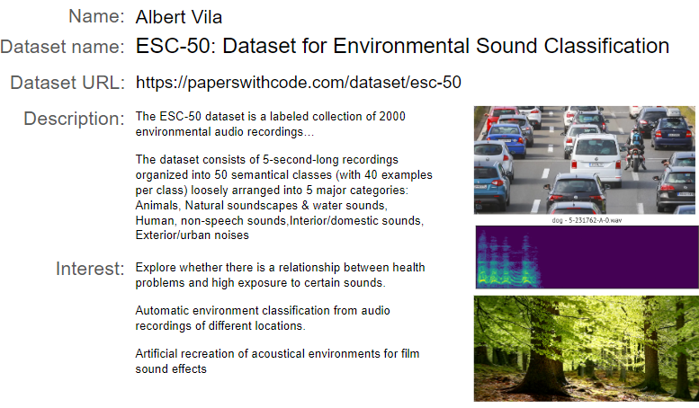

## A visit to IA: Inteligencia Artificial. CCCB

{width=400}

## Finding an interesting dataset

## Designing a project that take advantage of AI technology
Team members: 
[Qianyin Du](https://33dudu.github.io/magicreator/), [Francisca Herrera](https://panchipunchi.github.io/mdef1/) , [Emmanuelle Pangilinan](https://minnie-at-iaac.github.io/) and [Albert Vila Bonfill](https://avilabon.github.io/MDEF_Albert/)

#### Ideating the project with AI Meets Design Toolkit
[AI Meets Design Toolkit](https://aixdesign.co/projects/toolkit)

#### Final presentation
<iframe src="https://docs.google.com/presentation/d/e/2PACX-1vR6GdW0vTNqECZT-Iv-7hwvxbwK7vEknShYsTkUxsT7NuctDQ-g4A7obEABlumq4BygqTOv2ado5hGD/embed?start=false&loop=true&delayms=3000" frameborder="0" width="960" height="569" allowfullscreen="true" mozallowfullscreen="true" webkitallowfullscreen="true"></iframe>

***Personal reflections about the seminar. Is AI the new fentanyl of creativity and self-thinking?***

Before doing the seminar, my knowledge of artificial intelligence was only at the user level. While it is true that AI, in its different forms, is already implemented in many functionalities of the software, websites, apps and objects that we use daily, I must confess that, consciously, I only used it in a very restricted situations in the professional field. Some examples are the identification of plants and animals species, bird song recognition or for the searching for certain patterns in acoustic recordings for the study of some animal species. Although it is true that on some occasions I had chatted with ChatGPT, I must admit that I was only satisfied with their responses when I had no opinion or had very little knowledge about the topic of conversation. For this reason, I find it very useful to summarize or to introduce myself to new topics. When I got to the master's degree, I was surprised by the high level of use and skill with ChatGPT and other AI apps that most of my young classmates had.

For me and for most of the people around me, AI is something that fascinates and scares in equal parts. Thanks to the seminar, the black box that surrounded AI has become a little more gray and translucent, although I still understand very little of what happens inside. I have managed to begin to glimpse elements that make it up, such as neural networks, models, datasets... Now, even with my deep gaps on the subject, I may be able to propose projects that uses and takes advantage of this technology. I am particularly interested in everything related to latent space as a multidimensional space that encodes a meaningful internal representation of externally observed events.

Seeing the acceleration that the use and power of AI currently has, I am raised with ethical questions and questions about the future of humanity that I previously saw as very distant and now I see them around the corner. Humanity is being provided with a new and powerful substance but not the instructios book on how to proceed with it, without knowing the contraindications or side effects. It seems to me that if we don't learn how to self-control and how to use it, AI is going to be ***the fentanyl of our own thinking and creativity***. 

At the same time that I have seen wonderful things, I have also seen people ask to AI questions before trying to answer them themselves, about personal issues that no one knows better than the people asking. I have seen how a question to AI can turn an agreement into a discussion or a new focus of mental scattering. Will we end up mentally zombies? Let's hope not, it won't take long to see how it evolves. In my opinion, AI is hacking the way of working and learning and we must find mechanisms to educate that allow us not to lose our ability to learn and think for ourselves. 

AI is an exciting topic that gives a lot to reflect about, I have not gone into the great advantages in many fields and benefits that bring to us, neither about the bias or the great ecological impact that it causes. I will inevitably continue to reflect on the subject.

