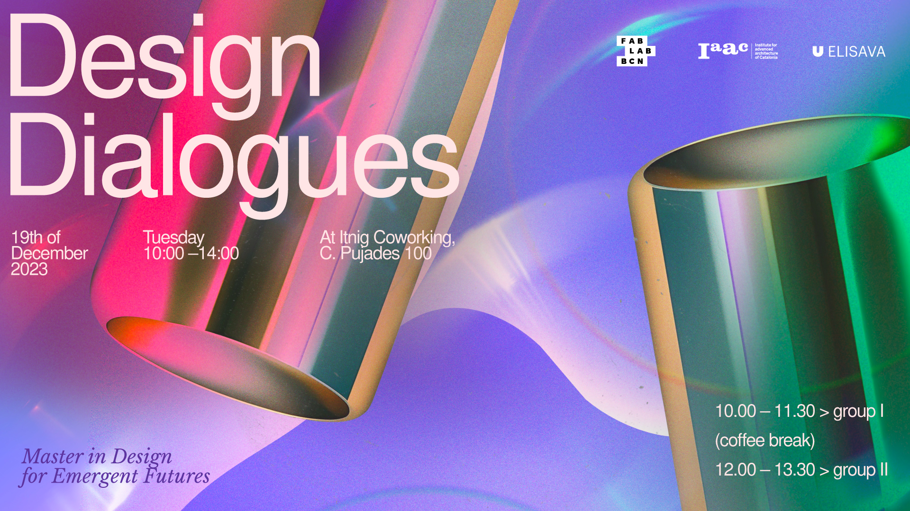
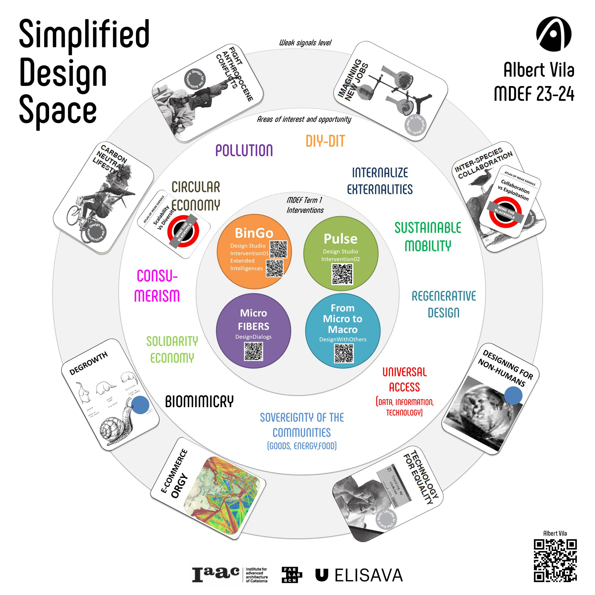
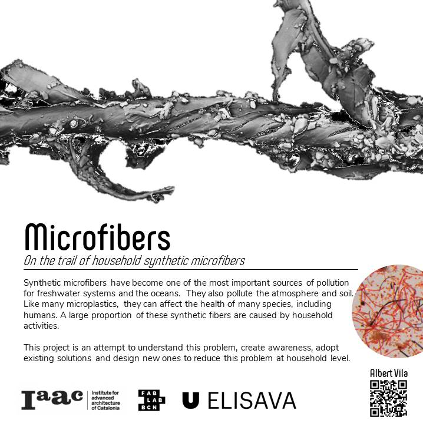
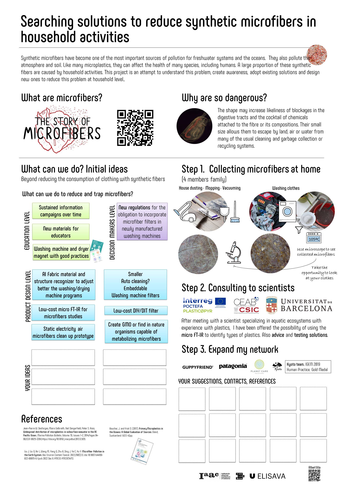
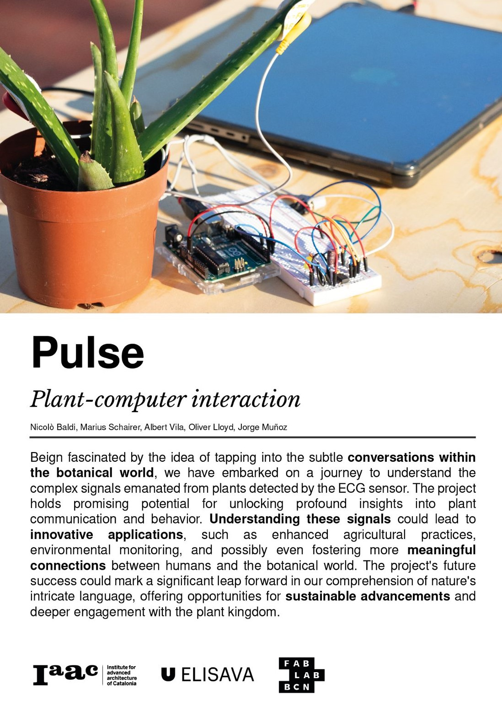
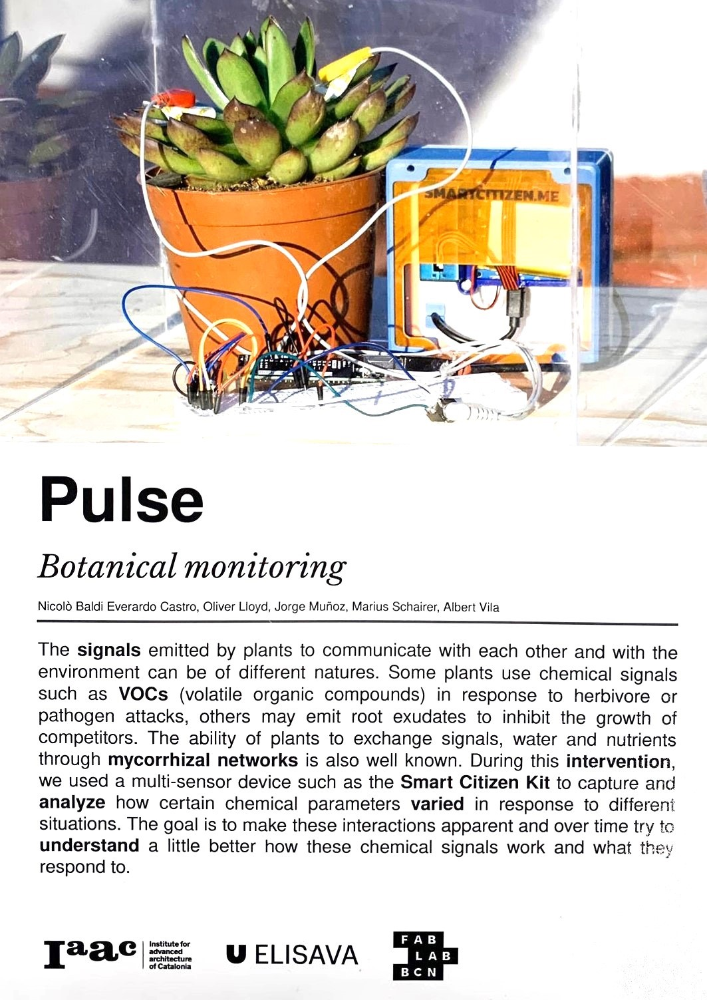
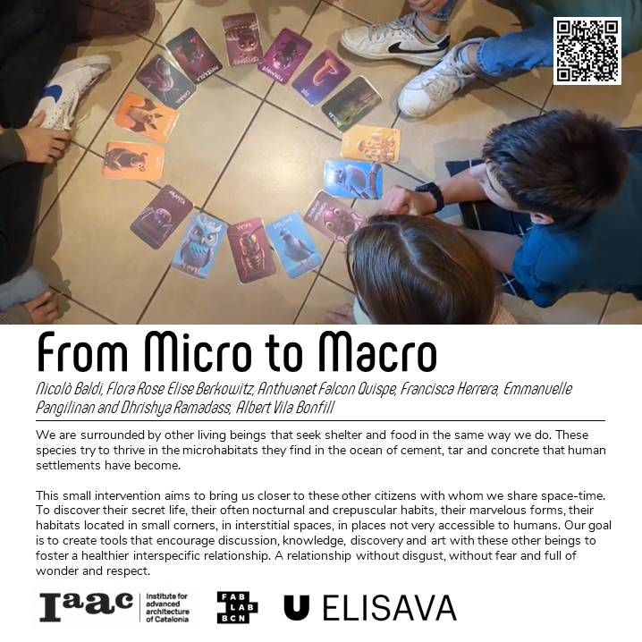

# **Design Dialogs > Term 1**

[Design Dialogs exhibition](https://fablabbcn.org/calendar/design-dialogues-i)

## Simplified Design Space and 1st term Collective Interventions

The figure represents a simplified diagram of the elements of my design space related to the interventions developed during the first term.

## Beyond microfibers contamination

{: style="width:450px"}

I have taken advantage of the showcase that the Design Dialogs space offers us to investigate and share a topic that has been hovering on my mind for a long time, synthetic microfibers.

The problems caused by synthetic microfibers in the oceans have been known for some time by the scientific community, but this knowledge does not yet translated into significant changes at the legislative level to reduce, control or avoid this contaminant.

With the help of a microscope, I have been able to show visitors the microfibers collected at home from different household activities.

I have also been able to confirm that the vast majority of people who have visited my space were not aware of this serious environmental problem.

However, the problem was quickly understood and I received some very interesting suggestions.

### Microfibers poster

### To know more about microfibers

|The story of microfibers | The microfibers problem |
| -------- | -------- | 
| <iframe width="560" height="315" src="https://www.youtube.com/embed/BqkekY5t7KY?si=054aHHHjBu-HIqcV" title="YouTube video player" frameborder="0" allow="accelerometer; autoplay; clipboard-write; encrypted-media; gyroscope; picture-in-picture; web-share" allowfullscreen></iframe>  | <iframe width="560" height="315" src="https://www.youtube.com/embed/83NL-8hZcFE?si=scYvL09PLZ7VcfBB" title="YouTube video player" frameborder="0" allow="accelerometer; autoplay; clipboard-write; encrypted-media; gyroscope; picture-in-picture; web-share" allowfullscreen></iframe>    |

Jean-Pierre W. Desforges, Moira Galbraith, Neil Dangerfield, Peter S. Ross,
Widespread distribution of microplastics in subsurface seawater in the NE Pacific Ocean, Marine Pollution Bulletin, Volume 79, Issues 1–2, 2014,Pages 94-99,ISSN 0025-326X,https://doi.org/10.1016/j.marpolbul.2013.12.035.

Boucher, J. and Friot D. (2017). Primary Microplastics in the Oceans: A Global Evaluation of Sources. Gland, Switzerland: IUCN. 43pp, https://www.iucn.org/resources/publication/primary-microplastics-oceans

Liu J, Liu Q, An L, Wang M, Yang Q, Zhu B, Ding J, Ye C, Xu Y. Microfiber Pollution in the Earth System. Rev Environ Contam Toxicol. 2022;260(1):13. doi: 10.1007/s44169-022-00015-9. Epub 2022 Dec 6. PMCID: PMC9734713, https://www.researchgate.net/publication/366189593_Microfiber_Pollution_in_the_Earth_System

## Pulse
{: style="width:300px"}
{: style="width:300px"}

## From micro to macro
{: style="width:450px"}