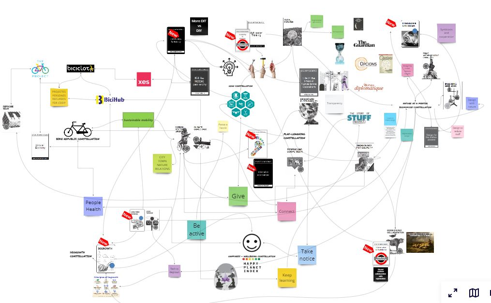

# **Design Studio 02**

## Intro day
With the start of the second term, the time has come to start developing our project through more interventions in the real world. We are also encouraged to grow with the community of practice as well as create our own identity and narrative.

???+ quote "Some pieces of advice to face what is coming"
    - Never do anything alone
    - Document for yourself and others
    - Rethink what ‘perfect’ means to you
    - Rethink what ‘feeling lost’ might really mean
    - Write to assist your thinking, to find your voice
    - Beyond the hype, commit to your values 
    - Let the project flow with its own trajectory

## My design space in January 2024 
{Width=100%}

??? info "Deliverable"
    A 500 word text with a summary of your journey so far, adding the repositioning of yourself and your project. Make explicit new project goals and next steps including a proposal for the 1st intervention of the second trimester (a draft will be discussed during the design reviews the week after).

During the first term and during the winter break I have been readjusting and adding elements to my design space. Surely there are many things missing but the current elements are useful to me and it is easy for me to create simplified design spaces that bring together concepts around a specific idea, project or intervention. Therefore, I see it as something that is being useful to me.

As I have already explained in previous posts or in the first term final delivery, my desing space is organized in constellations or galaxies of highly close and highly connected elements. Although it is not fully reflected in the design space, in this beginning of the second term I feel that the Constellation of Degrowth has come closer to concepts related to technology. I am still struggling to find a comfortable place between lowtech and hightech but I clearly see that it has become a priority for me to see how technology designed with values ​​can help us to degrowth. I also see biomimetics as a driver to be able to design with values. I invite you to visit the constellation of biomimetics, nature as a mentor.

As the first intervention of this quarter, I want to share and compare my final project with the communities of interest and adapt it from the design phase to their requirements, suggestions and needs. On the one hand, I want to share ideas with researchers and directors of citizen science programs to know to what extent my ideas can be useful to them. On the other hand, I want to talk to experts in design, sensorics and digital manufacturing to see if my ideas for the final project are possible in the context of the final master's project and take all the advice and references they can give me.