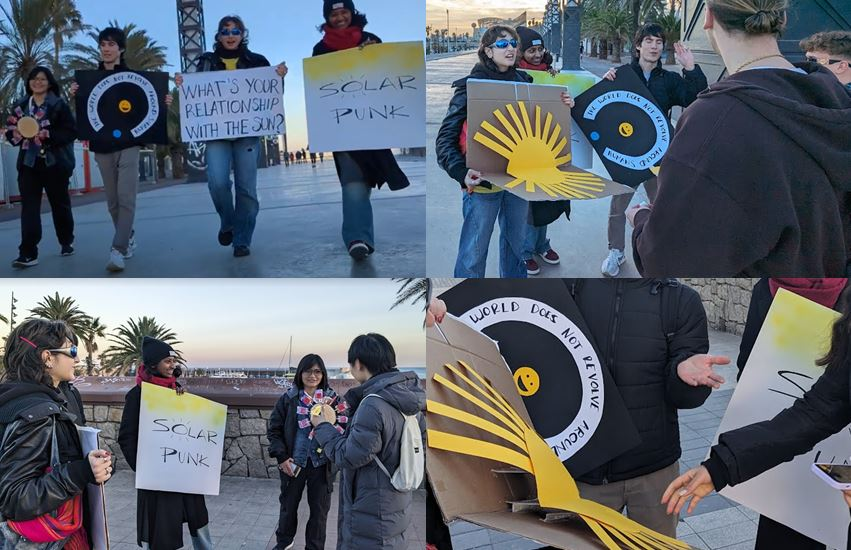

# **Designing in a State of Climate Emergency**

## Intro day

A day of overstimulation with many images and concepts. Fortunately, in the end we saved eco-anxiety with some green shoots and hopeful initiatives and concepts.

## Intervention: Invite people to take climate action

**Team members:**
[Anna Fedele](https://https://annafedele.github.io/mdef/),
[Dhrishya Ramadass](https://dhrishyaramadass.github.io/mdefwebsite/),
[Emmanuelle Pangilinan](https://minnie-at-iaac.github.io/),
[Everardo Castro](https://everardocastro.github.io/mdef1/) and
[Albert Vila Bonfill](https://avilabon.github.io/MDEF_Albert/)

**Topic: Relationship with sun**

Our intention has been to start conversations around people's relationship with the sun. We created a folding banner with a sun inside whose rays contained messages, questions, statements that could spark a conversation about the chosen topic. We also made a couple of banners and a wooden sun with lollipop rays to thank people for the time shared.

Although it may seem violent to start a conversation with a stranger in public and it may seem even more difficult to talk about climate change, it is worth saying that it is possible, without rushing, with a big smile and without making anyone feel guilty.

???+ quote "References"
    - Video with great tips for starting conversations about climate change with people. It is worth saying that these tips, basically empathic communication, are useful for any conversation.
    <iframe width="560" height="315" src="https://www.youtube.com/embed/UHPZw0zbHNE?si=mA3aU6N_Z1VINzr_" title="YouTube video player" frameborder="0" allow="accelerometer; autoplay; clipboard-write; encrypted-media; gyroscope; picture-in-picture; web-share" allowfullscreen></iframe>

## Reflections
There have been no magic design formulas or infallible tricks, not even a decalogue of rules behind the title of this seminar. It has been a course where we have worked at a more inner, more basic level. We have touched and stirred concepts such as our conception of time, our position in space or gratitude. We also flew over the state of the world and the multiple interconnected and synchronous crises (polycrisis) that are taking place in it. We talked about how we've gone from being humans to being users. And also about the interesting shift from human-centered design to a sun-centered design.

It is a challenge to find ways to stop being users and become humans again...

