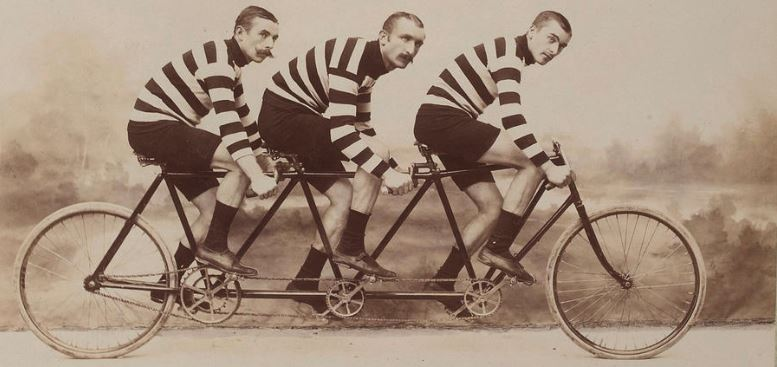

# **Communicating ideas**

## Tandem interview exercice: What, how, why?
Sharing and understanding my partners ideas and future projects. Building together. Finding points in common.

**Tandem group members:**
[Everardo Castro](https://everardocastro.github.io/mdef1/),
[Nicolò Baldi](https://niente010.github.io/MDEF_website/#welcome) and
[Albert Vila Bonfill](https://avilabon.github.io/MDEF_Albert/)

{Width=100%}

To carry out this exercise, the three of us went on an excursion through a beautiful natural area. Spending several hours together walking in an environment different from the class gave us the opportunity to have very interesting and rewarding conversations. We talk about many topics related to each person's life moment and their present and future concerns and hopes. It was a beautiful day with some sensitive, kind and committed people.

<iframe width="100%" height="400" src="https://www.youtube.com/embed/uJcjDwr-P6c?si=U5LkO38Zky57NFUL" title="YouTube video player" frameborder="0" allow="accelerometer; autoplay; clipboard-write; encrypted-media; gyroscope; picture-in-picture; web-share" allowfullscreen></iframe>

## Reflections

Verbalizing is both a way of communicating and mentally structuring one's own ideas. Listening to others is at the same time a way of learning from others and from oneself. Feeling heard but not judged is a wonderful feeling. We have a lot to learn about ourselves and others. Sharing ideas is a good way to grow together.

