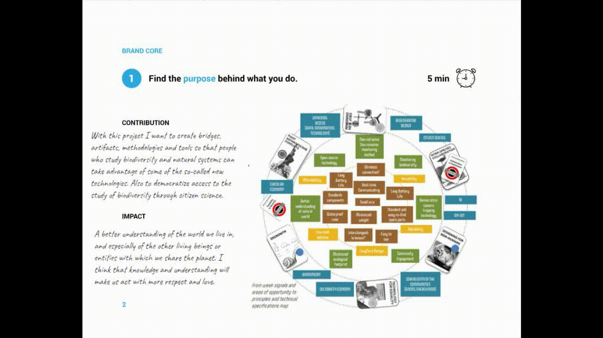
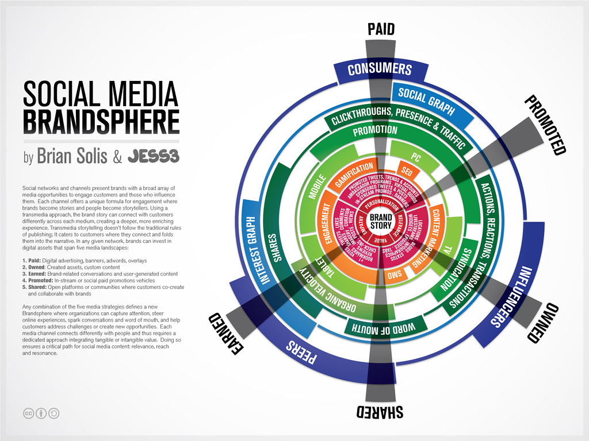

# **Communicating ideas. Notes, references and reflections**

## General reflections

This entire subject is designed so that we are able to effectively communicate our project. Sometimes lack of communication can cause great ideas and projects to end up dying due to lack of good communication and we don't want that to happen to our projects.

From these sessions it has become clear to me that each idea and each project has a story behind it. Although having a brand and products that are truly full of values and meaning is the most essential, we must not forget the importance of knowing how to tell the story or stories behind them. For me, honesty and sincerity are everything, I can be fooled as a consumer but I don't want to fool anyone as a seller. I don't want to disguise a product or brand with something that it isn't to make it more attractive and interesting, I want the product I offer to be attractive and interesting in itself. If what we seek is to be transformative with our work, we must learn to communicate in the most effective way and the most appropriate means to reach different interest groups.

## Session 1: Introduction to communication Models, Storytelling techniques

It seems that telling stories is in the deepest configuration of our minds as one of the most effective “innate” ways of communicating with each other and with ourselves. Telling and listening to stories makes us human. When we listen to a story, many internal brain mechanisms can be activated, stimulating our senses and our motor mechanism.

To explain something to other people in a way that resonates with them, you need tools and context.  Although it seems a very complicated task to those who do not come from the field of communication, it is essential to adjust the narrative that we apply to a story in order to make it suitable for the audience, the level of knowledge they have on the subject and what we want to make people feel or transmit. I will have to work and pay attention to this aspect.
There are some essential elements to take into account in the stories, also some essential questions. There are different narrative structures and tricks to make a good story. From now on I will try to focus more on how I tell the stories and try to be more aware and incorporate different elements, structures and tricks.

## Session 2: Project/Brand personality, arquetypes, tones of voice, feelings…

We have been simultaneously defining the personality and tone of our project and our brand. This can often be a bit confusing, especially if we want to create a brand that will have diverse products/projects aimed at different audiences/clients/communities. However, I think it is a very good exercise to think that each project or product of our brand must fit with the general personality of the brand.

I have become aware of the importance of the brand's voice and the tone of voice that we use in each case as a mirror of the personality, the problem that inspires us and the community to which we address. And that is why the words, images or channels we use are extremely relevant in our communication strategy.

To define the personality of our brand we have worked with archetypes. I see interesting things in several of them and it is difficult for me to define myself in any specific one. I feel like a mix of sage, creator, magician, explorer and caregiver. I will continue to think about it, perhaps over time one of the archetypes will be accentuated above the others. Time will tell.

Regarding feelings, what I want to convey to my stakeholders is tranquility and confidence. Let them see that I understand their problem, idea or project, let them feel heard and at the same time listen to me, let them join my enthusiasm, let them be encouraged to embark on a new adventure together. May they have the confidence that even if we begin a new path, they will feel that they are in the right hands.

## Session 3: Transmedia storytelling

The idea is to try to unify and enhance intangible values and, over time, communicate through them.

The importance of the media is also highlighted. "The medium is the message." Marshall McLuhan. The central idea of this statement is that the medium through which a message is communicated has a significant impact on how that message is perceived and understood. I should think more about it.

During the session we have clarified the concepts of cross-media, multi-media and trans-media. The concept of trans-media is new to me and it is about explaining a story through many different media or platforms in which each one plays a different role. It is not the same story adapted to different media, but rather each medium brings its own nuances to the story keeping audience actively involved..

Right now, due to my lack of fluency in some media, it feels like a full-time job for me to communicate through so many different mediums. For this reason, it will be essential to choose well in which medias I perform best and which are the best medias to reach my stakeholders because I will surely need help from communication professionals. 

??? quote "References"
    - [The golden circle (What, how, why) by Simon Sinek](https://www.ted.com/talks/simon_sinek_how_great_leaders_inspire_action?language=en) 
    - [Designing an organization purpose statement with IDEO tool](https://www.ideo.com/journal/design-an-organizations-purpose-statement-with-this-tool)
    - [The lucky iron fish project](https://www.youtube.com/watch?v=XoYUmexNhfI)
    - [Transmedia storytelling](https://www.youtube.com/watch?v=5IFnSp2ilcQ)
