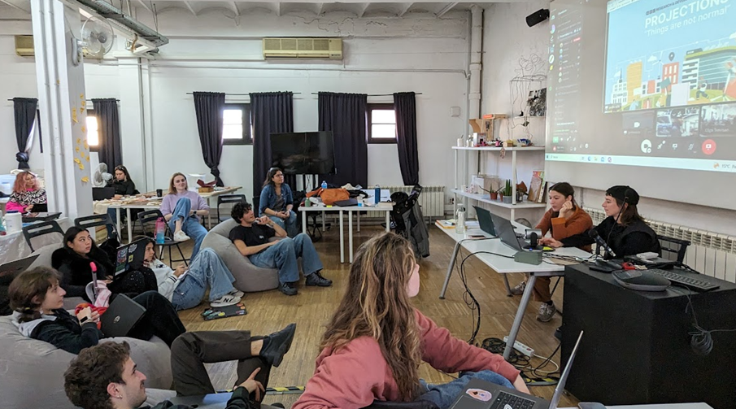

# **Designing with Collective Intelligence:**
## Fair Future(s): Designing with Collective Intelligence event | Dafne+ International Creative Jam

Experimental seminar carried out in collaboration with SODA (School of Digital Arts) of Manchester within the framework of the European project Dafne+. There were 4 intense days with different theoretical talks, many workshops and group work.

We explored technologies, methodologies and estrategies for create trustworthy and fair communities that pursue shared goals and honest methods within the digital world.

??? quote "Glossary of terms"
    - Blockchain
    - NFTs
    - DAOs
    - Smart contracts

??? quote "References and tools"
    - [Dafne+](https://dafneplus.eu/)
    - SODA (School of Digital Arts, Manchester Metropolitan University): https://www.schoolofdigitalarts.mmu.ac.uk/
    - Discord: https://discord.com/

## Collective exercice: Dodo

**Team members exercice:**
[Flora Rose Elise Berkowitz](https://floraroseberkowitz.github.io/),
[Vania Belen Bisbal Villacorta](https://vania-bisbal.github.io/repo-website/),
[Everardo Castro](https://everardocastro.github.io/mdef1/), 
[Qianyin Du](https://33dudu.github.io/magicreator/),
[Anthuanet Falcon Quispe](https://anthuanetf.github.io/MDEF/),
[Anna Fedele](https://https://annafedele.github.io/mdef/)
[Ana Lozano](https://annnalozano.github.io/PaginaWeb/) and
[Albert Vila Bonfill](https://avilabon.github.io/MDEF_Albert/)

The challenge we adressed was the loss of biodiversity and the lack of legal rights for non-human entities.

## Reflections

- Many concepts emerged during these days, some new to me and others not so new but in which I personally had not yet delved too deeply. With this seminar I have broken the ice with some concepts that will help me deal with the challenges of a fairer digital world.However, I feel that I still need to explore more in them to feel comfortable and use them regularly. In this sense, I think it has been a good start.

- I believe that for individual and collective mental health, at least for mine, it is essential to be able to find in the digital world ways to cooperate, trust and transform together, in a "similar way" to what we do in the physical world with our neighbors and colleagues.

- The digital society has more and more weight in our lives. This is why these methods, mechanisms and tools are so essential. I think it would be very important to bring this knowledge to schools to teach these "Socio-digital Skills" from an early age while teaching other skills to develop in the digital world.

**Feedback regarding the seminar format:**
- My evaluation of the seminar is very good. I think the organizers must be congratulated for their courage and also for their ability to find quick solutions when technical conditions did not help communication. I also think that the work proposed in Miro board was very well designed and worked well in the vast majority of cases.

- The theoretical talks were at some times, not all, too fast or simplified for me, especially when it came to concepts with a lot of theory behind them as blockchain, NFTs or DAOs. This require more time for those uninitiated in these concepts like me.

- My proposal for another seminar is that this theory be given beforehand with a certain amount of time so that the seminar talks are more quick reminders of concepts than theory about these concepts.
