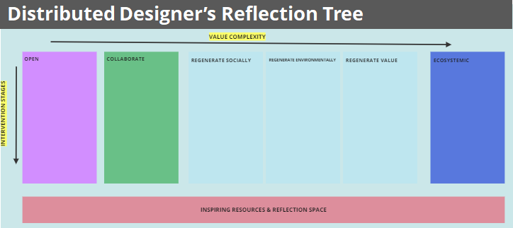

# **Future Talks**

## Designing with Values. Distributed design. 
***By Jessica Guy and Olga Trevisan***

### Distributed Design
***A new approach to design which utilises global connectivity to move data, instead of products.***

Distributed Design (DD) is collaborative design and fabrication in which tasks, knowledge and resources are distributed among different people or groups of people. It is a decentralized model that allows greater participation and diversity in the design process, as well as flexibility in production since it allows manufacturing locally by adapting designs to local resources. DD fosters open innovation and promotes a sense of community among people, leading to the development of more inclusive, sustainable and impactful designs. This shared resources allows not only to share ideas but iterate on designs and collectively create products or solutions. 

During the session we worked on the Distributed Designer's Reflection Tree! This tool accompanies you to assess at each stage of the project, how it adjusts to the main values ​​of distributed design.

The main values of DD are:

- Open
- Collaborative
- Regenerative:
    - Regenerative socially
    - Regenerative environmentally 
    - Regenerative value
- Ecosystemic

??? note "Distributed Designer's Tree Instructions for use"
    - Scope & Objective: The goal of the Reflection tree is to help you to evaluate a selected project so you can understand your project's impact in relation to the Distributed Design Platform values. By reflecting on the values, you can identify your project's alignment with Distributed Design; the impact you're already creating in your project; and begin to identify what you might like to improve on in the short, mid- and longterm. Responses to the Reflection Tree will also help us as a platform provide better resources to support you on your journey to creating a project that is open, collaborative, regenerative, and ecosystemic. It's important to note that not every project embraces all the values-- sometimes that depends on the project goal. The objective is not to get "perfect scores" but to be honest with yourself and approach the Reflection Tree with a playful attitude.
    - The Reflection Tree has three main features: the Distributed Design Platform values; a space for resources and reflections; and a summary evaluation space. The values move from basic to more complex approaches. Meanwhile, the intervention stages are divided into the design phase, production phase, lifecycle and end of life phase and, lastly, wider or spill over effects. Also, the last phase relates to your intervention's overall impact and your capacity to apply systemic design. In practice, we know that you likely will never move through these stages in a unilateral direction, but will go back and forth between them, i.e. between the design and production phase while you test your prototype.
    -Directions:

        1. Start at the top left-hand corner of the tree at the "design" phase in the "Open" value. Read the affirmation and think about how true it is for your project. ('Project' means the intervention you apply the tree to-- this may be a service, product, business, methodology, etc. You are not evaluating yourself as a designer.)Record your score to the right of the affirmation (i.e. 0 is that the affirmation isn't true at all for your intervention while 5 is that the affirmation is completely true for your intervention).
        2. Continue vertically down the value to the next intervention stage.
        3. At the end of each value, total your score from each intervention phase and follow the point evaluation to the "stop," "yield," and "go" bubbles. Use the green sticky notes to comment on what you're currently doing well and the yellow sticky notes to comment on where you might improve.
        4. Take time to explore the resources included and reflect on how you can continue to grow in your relationship to the selected Distributed Design Platform Value. You may find that you're not ready to consider the next value and that's ok!
        5. Once you've gone through the values, total your scores and chart them onto the spider chart to get a picture of your project's relationship to the Distributed Design Platform values. 
  

???+ quote "References"
    - Distributed Design Platform: https://distributeddesign.eu/
    - [Exercice Miro Board](https://miro.com/app/board/uXjVN8fPjco=/?share_link_id=42589250457)
    - [Presentation](https://docs.google.com/presentation/d/1SjQwxnpqStMUyV-Hmlxpf7av_1jEGhGP6BjCiwAG9sc/edit#slide=id.g2afbb3df9f0_1_343)

### Reflections

I loved the DD Reflection Tree tool, it is very useful to see to what extent the design process conforms to the DD. For me it is a good way to design with values, whether they come from the philosophy associated with DD or the other values ​​that we have in our design space or that are given by the community involved in a specific design intervention. I feel fully identified with the values ​​of distributed design, so I'm going to check my design space to see what name I've included them in there and to add it if any are missing.
