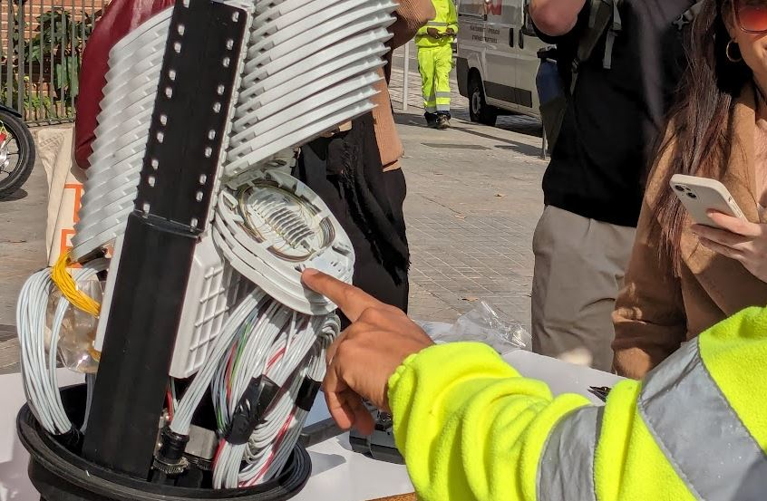
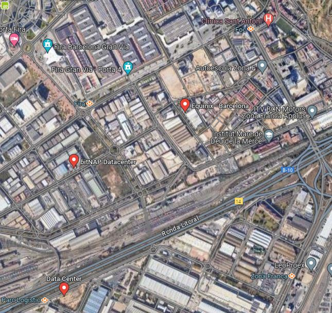
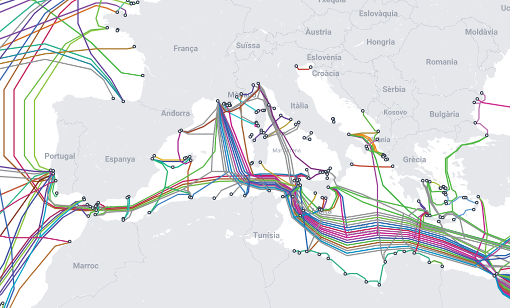
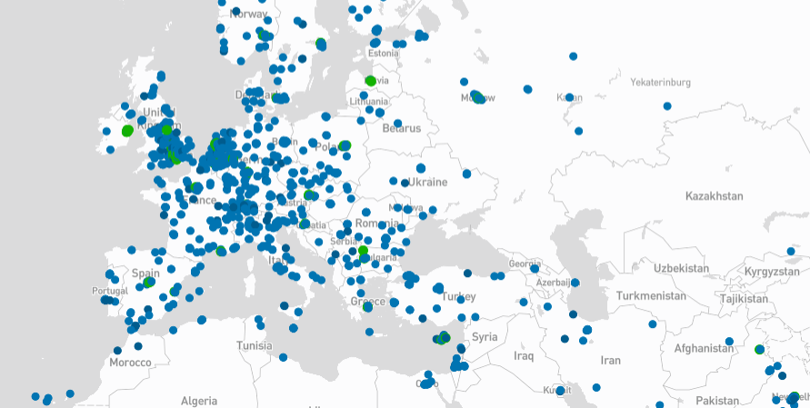

# **Fair Futures**
## Internet tour (Mario Santamaria)
***By Mario Santamaria***

### Session summary

The unknown internet infrastructure and its effects
Do we really know how the internet works? Do we know what's beyond our screen when we surf the web? How does the data move to be able to access any information in an instant even if it is on the other side of the world?

{Width=100%}

The Internet tour guided by Mario Santamaria took place in one of the key areas for internet connectivity in Barcelona and Catalonia. The tour was entirely through the Zona Franca in the Sants-Montjuic district. We passed near the Catnix (internet neutral point in Catalonia) and followed part of some of the most important internet cables in the country. This allowed us to discover how several data centers have emerged in this area in recent years.

{Width=100%}

???+ quote "References"
    - Sumarine Cable Map: https://www.submarinecablemap.com/ and https://submarine-cable-map-2023.telegeography.com/
    {Width=100%}
    - Data Center Map: https://www.datacentermap.com/
    {Width=100%}
    - What is a neutral point Video: 
    <iframe width="100%" height="400" src="https://www.youtube.com/embed/7oa80cSU1Rg?si=5ozk79DkKCYhIjyl" title="YouTube video player" frameborder="0" allow="accelerometer; autoplay; clipboard-write; encrypted-media; gyroscope; picture-in-picture; web-share" allowfullscreen></iframe>
    - Catnix: https://www.catnix.net/en/where-to-connect/

### Reflections
A very interesting and necessary tour for those who think that the internet, the cloud and artificial intelligence is something ethereal, without substance that does not pollute and that has a minimal impact on the physical world. The Internet is physical and is transforming our landscape, the price of land and the use of energy. The unknown internet infrastructure is quite the opposite. With this tour we were able to see the large cables that pass through Barcelona and which carry information for the city itself, for Catalonia and for the world. We passed near the neutral point of Catalonia and visited different data centers to help us understand what the internet entails beyond our browsers.

