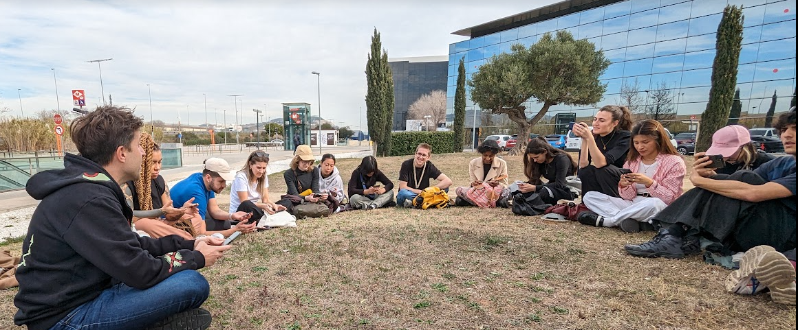

# **Fair Futures**

## Radical Situatedness. Flows, Knowledge and Infrastructures.
***By Bani Brusadin***

### Session summary
{Width=100%}

After the Internet Tour we had a nice outdoor talk given by Bani Brusadin. In this talk, Bani has offered us a bunch of concepts and terminology to talk about the new phenomena, relations, entities and realities associated with the internet and artificial intelligence. We have scratched at these concepts to look for the complexity and opportunity that lies on the surface itself and behind it. Some of the concepts are the vast automaton, syntetic minds, infrascapes of cognition...

???+ quote "References"
    - Syntetic minds potcast:
    <iframe width="100%" height="400" src="https://www.youtube.com/embed/WNq_0E5NcWw?si=my9KUAAlRdYT9vFA" title="YouTube video player" frameborder="0" allow="accelerometer; autoplay; clipboard-write; encrypted-media; gyroscope; picture-in-picture; web-share" allowfullscreen></iframe>
    - American Technological Sublime, a book By David E. Nye: https://mitpress.mit.edu/9780262640343/american-technological-sublime/

### Reflections

The most common thing is that we see these multiscalar complex intelligence systems as something large and incomprehensible , a monster made up of large infrastructures, data, power games, political and geopolitical interests where we have little or nothing to say. The talk has opened up a window of opportunity for me to fight from, from a position of not being able to play with the different ways of extending the meanings, of building other stories, taking advantage of the characteristics of the system and its fails and incompatibilities, taking advantage of the that happens inside but also on the skin of this vast automaton.

