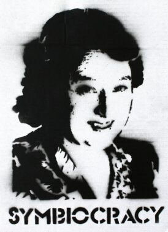

# **Future Talks**

## Designing with Values. Distributed design. 
***By Jessica Guy and Olga Trevisan***

{Width=400}
### Session summary
### Reflections

## Networks of Co-Responsability. Hangar's WebLab
***By Ce Quimera and Laura Benitez***

### Session summary

Hangar's Wetlab in Barcelona is an installation focused on the research, creation and production of artistic projects that incorporate biological technologies and experiments in synthetic biology. This laboratory provides a space equipped with specialized instruments and equipment for experimentation in biology, allowing artists and researchers to explore the intersections between art, science and biotechnology.

Hangar's Wetlab offers creators the ability to conduct research and develop projects that could range from manipulating bacteria and living cells to using molecular biology and bioinformatics techniques. This facility aims to foster interdisciplinary collaboration and innovation in the arts and sciences, opening up new avenues of creative expression and exploration.

???+ quote "References"
    - Hangar: https://hangar.org/es/
    - Hangar wetlab: https://hangar.org/en/wetlab/
    - Quimera Rosa: https://quimerarosa.net/
    - Project Trans*Plant: https://quimerarosa.net/transplant/
    - Project Biofriction: https://biofriction.org/
    - Microcosmos. Lynn Margulis

### Reflections
- The weblab is a fascinating mix between an alternative scientific laboratory, a self-managed cooperative, an artists' workshop and a fablab that leaves no one indifferent.
- I have been impressed by first-person experiments mixing art and medical or biological experimentation like the Trans*Plant project. 
- I think art should be everywhere and in everything we do (science, technology, design, creation, storytelling). It is a "language" that goes beyond words and images that helps us evoke or convey what conventional forms of communication cannot.
- Symbiosis [^1] and symbiocracy [^2] are terms that go straight to my design space.

[^1]:
Lynn Margulis, was a evolutionary biologist. She theorized, among many other contributions, about the importance of Symbiosis. Margulis emphasized the importance of symbiosis and cooperation between different organisms in evolution and ecology. He argued that symbiosis, rather than competition, has been the main engine of diversification and adaptation to the history of life on Earth.

[^2]:
The term has been used in different contexts and by different authors to refer to systems of government based on symbiosis or mutual cooperation. In WetLab of Hangar was used to guide the creation of an open protocol for the use of the wetlab.

## Internet tour (Mario Santamaria)
***By Mario Santamaria***

### Session summary

{Width=100%}

### Reflections
A very interesting and necessary tour for those who think that the internet, the cloud and artificial intelligence is something ethereal, without substance that does not pollute and that has a minimal impact on the physical world. The Internet is physical and is transforming our landscape, the price of land and the use of energy. Quite the opposite, with this tour we were able to see the large cables that pass through Barcelona and which carry information for the city itself, for Catalonia and for the world. We passed near the neutral point of Catalonia and visited different data centers.

## Radical Situatedness. Flows, Knowledge and Infrastructures.
***By Bani Brusadin***

{Width=400}
### Session summary
### Reflections

??? Note "Deliverables"
    - At the end of this trimester we ask you to update who you are and what makes you unique (identity) and your personal “vision” of your future as a professional. 
    - The Thesis Draft will include space to reflect on your Vision and Identity and how that evolved this term.
    - For this section we ask you all to reflect on how applicable and useful the knowledge presented by each of the guests is in your practice/project. Please do a self-reflective paragraph long post on each of the talks.

