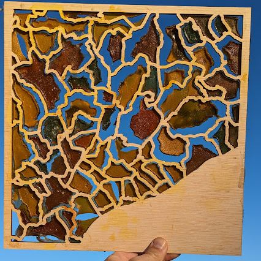
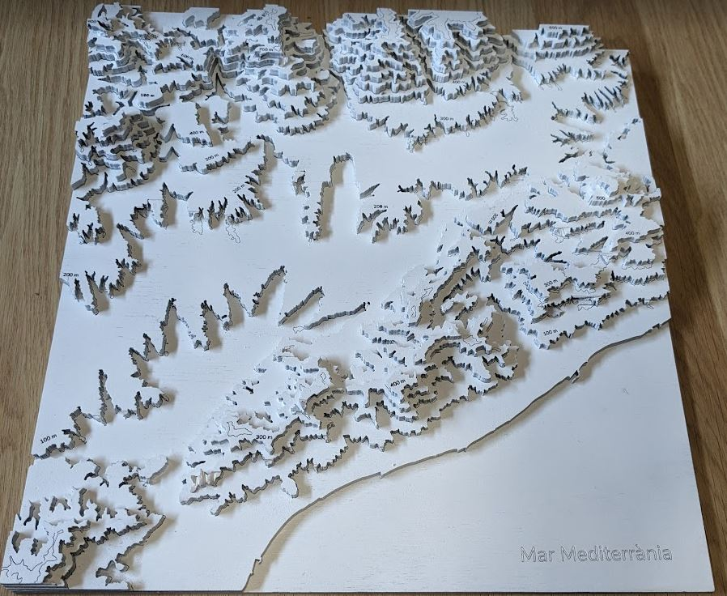

# **Digital Prototyping For Design: 2D Fabrication, Parametric Design, Biomaterials**

## Representing geographic information with laser cutter and biomaterials.
Team members: Albert Vila

There are several sites where you can select a zone and create a 3D model of terrain. These site are very fast and useful if you feel ok with the information they provide to you. I you want to add more geographic information to the model you should use a geographic information software.

Tutorial:
1) Download Digital Elevations Model (DEM)
2) Generate contours
3) Clean and prepare in an vector design software
4) Laser cut

??? quote "3D Map references"
  - Contour: https://contourmapcreator.urgr8.ch/
  - Maps 3D: https://maps3d.io/
  
  

Due to my background working with geographic information I feel more confortable controlling  all the layers of information.

???+ info "Biomaterials recipes"
  - 01. Alginate
  - 02. Gelatine
  - 03. Agar agar
  - 04. Gelatine foam
  - 05. Biosilicone
  - 06. Mix biosilicone with agar
    

??? quote "Biomaterials interesting projects"
  - Materiom: https://materiom.org
{width=400px}

### Reflection (Facts, feelings, findings and future)

- To be more consistent with these experiments I have decided not to use plastics to create bioplastics. This has sometimes not been the best option because some of the bioplastic formulas stuck to the wood.

- I must confess that although I still have a lot to learn about laser cutting, I feel comfortable working with it. Being used to working with 2D vector GIS or design programs has made it easier for me to do several tests without spending a lot of time creating the drawing files. On this occasion I have only worked with plywood, I would like to try other materials and techniques in the future. 

??? Note Delivery task 1
    - Reflection: The four F’s of active reviewing
         - Facts: An objective account of what happened
         - Feelings: The emotional reactions to the situation
         - Findings: The concrete learning that you can take away from the situation
         - Future: Structuring your learning such that you can use it in the future
    - Pictures
    - References
    - Fabrication files

#### Pictures, References, Fabrication files

