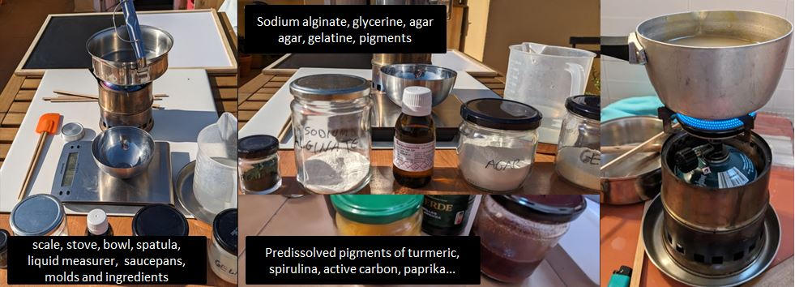
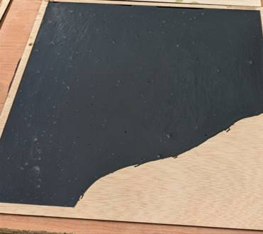
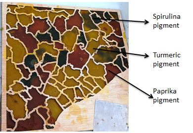
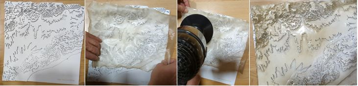
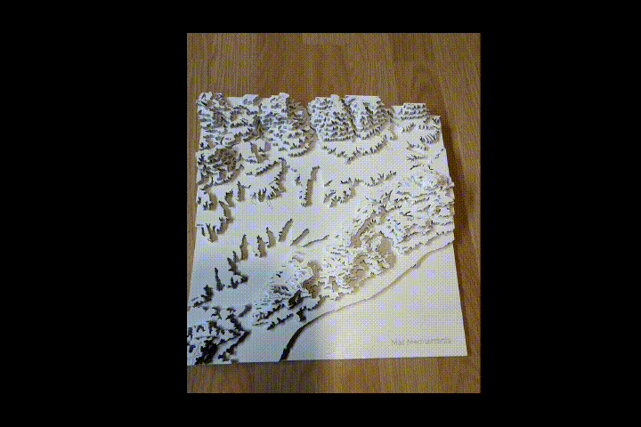

# **Digital Prototyping For Design: 2D Fabrication, Parametric Design, Biomaterials**

## Representing geographic information with laser cutter and biomaterials.
Team members: Albert Vila

To put into practice the techniques of 2D fabrication and preparation of bio-materials, I have decided to create a 3D map model of the territory and try to add information to the model with bio-materials.

### Creating the 3D Map and other plywood molds


There are several sites where you can select a zone and create a 3D model of terrain. These sites are very fast and useful if you feel ok with the information they provide to you. If you want to add more geographic information to the model you should use a geographic information software. Due to my background working with geographic information I feel more confortable controlling all the layers of data so I used QGIS for the first steps of preparing the file for laser cutting.

???+ quote "3D Map steps"
    1. Download a Digital Elevations Model (DEM) of desired area. [Global DEM Data Sources](https://gisgeography.com/free-global-dem-data-sources/)
    2. Make a clip with the mask of our work area to adjust the output
    3. Create the contour lines. The final output scale of the 3D map and the thickness of the material must be taken into account to control the height factor. With values ​​between 1.5 and 2.5 of exaggeration with respect to the planimetry, it usually looks good.
    4. Add more information as toponyms or elevations.
    5. Export as a vector
    6. Clean and prepare in an vector design software (For example Inkscape or Illustrator)
        
        [Download file](../../files/3DMap_layout_ready4laser.ai)
    7. Export and send to the Laser Machine software and cut. After some tests, the laser parameters used for 4,5 mm thickness plywood were: 6.00 of power with 1.5 to mark and 55 of power with 1.5 of speed to cut.
        
    8. Assemble following the marked lines and glue the plywood pieces.
        {width=400}

We also cut a map of the same area with the municipal boundaries, we made the boundary lines thicker to be able to use it as a mold for the bio-materials.


### Preparing biomaterial recipes



Bio-materials composition:


  
???+ quote "Biomaterial recipes used in this project"

    === "Gelatine normal"
        ```
        - Water                 240 ml
        - Gelatine              48 g
        - Glycerol              24 g
        ```

    === "Biosilicone"
        ```
        - Water                 240 ml
        - Gelatine              48 g
        - Glycerol              48 g
        ```

    === "Agar agar normal"
        ``` 
        - Water                 300 ml
        - Agar agar             10 g
        - Glycerol              16 g
        ```   
    === "Mix agar-gelatine"
        ``` 
        - Water                 diluent       240 ml
        - Gelatine powder       polymer       24 g
        - Agar agar             polymer       10g          
        - Glycerol                            24 ml
        ```
    === "Others recipes"
        Alginate
        ```
        - Water                 200 ml
        - Sodium alginate       4 g
        - Glycerol              8 g

        Calcium chloride solution:
        - Calcium chloride      10 g
        - Water                 100 ml
        ```
        Gelatine foam
        ``` 
        - Water                 150 ml
        - Gelatine              12 g
        - Glycerol              12 g
        - Dish washing soap     1 spoon
        ```

### Transfering geographic information to the Biomaterials

#### First tests

| Gelatine normal spirulina | Mix agar-gelatine spirulina | Mix agar-gelatine active carbon |
| --- | --- | --- |
| {Width=200} | {Width=200} | {Width=200} |
| Not mixed with and electric mixer and removed too soon out of the mold | Mixed with electric mixer. It cracked when taken out of the mold | Very flexible and resistant, the best of three|

#### Agar-agar normal with predissolved pigments



Reduction in size due to drying shrinkage


#### Transferring the relief of the 3D model to a piece of biosilicone

To do this transfer it was necessary to apply heat with a hair dryer to mold it


{width=100%}


???+ quote "References"
  
    === "3D Mapping"
        - Contour: https://contourmapcreator.urgr8.ch/
        - Maps 3D: https://maps3d.io/
        - Using QGIS and a laser cutter to make 3D contour models: https://www.youtube.com/watch?v=Nj4QwNk0BQI

    === "Biomaterials"
        - Bioplastic Cook Book: https://issuu.com/nat_arc/docs/bioplastic_cook_book_3
        - What is a bio-material: https://fablabbcn.org/blog/emergent-ideas/biomaterials-101
        - Materiom: https://materiom.org

  


### Reflections (Facts, feelings, findings and future)

- To be more consistent with these experiments I have decided not to use plastics to create bioplastics. This has sometimes not been the best option because some of the bioplastic formulas stuck to the wood. Sometimes following a cause can present certain drawbacks!

- To create the templates/molds I used 4mm plywood that I cut with the laser. The boards had a bit of curvature and it was difficult in the central part to keep the piece completely flat. There are materials that, despite good storage efforts, deform due to humidity and changes in environmental temperature.

- I must confess that although I still have a lot to learn about laser cutting, I feel comfortable working with it. Being used to working with 2D vector GIS or design programs has made it easier for me to do several tests without spending a lot of time creating the drawing files. On this occasion I have only worked with plywood, I would like to try other materials and techniques in the future. 

- Regarding biomaterials, the size reduction as the materials dry is something difficult to control but must be taken into account.

- It is an advantage and saving of material to be able to recover it and melt it again to create new shapes.


