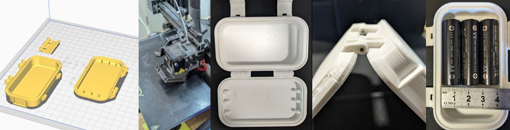
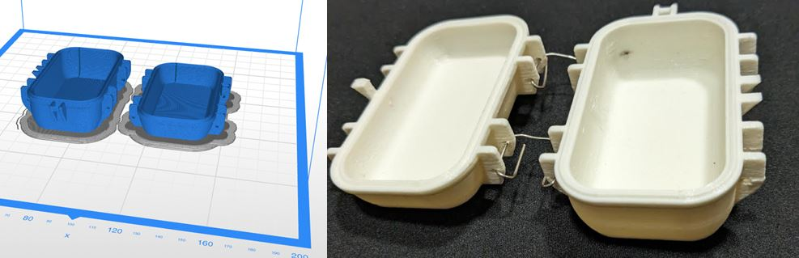
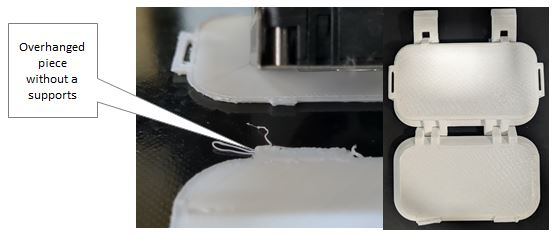
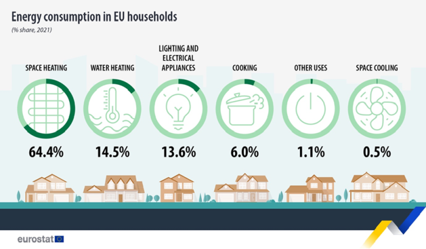
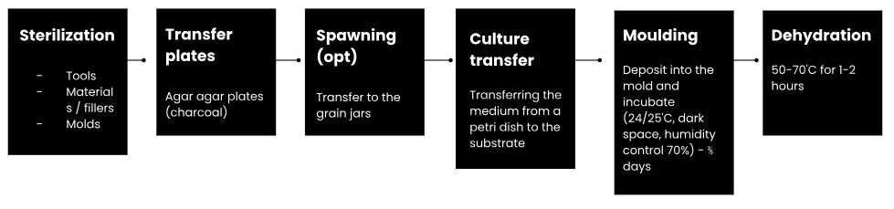
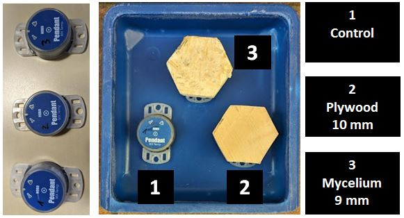
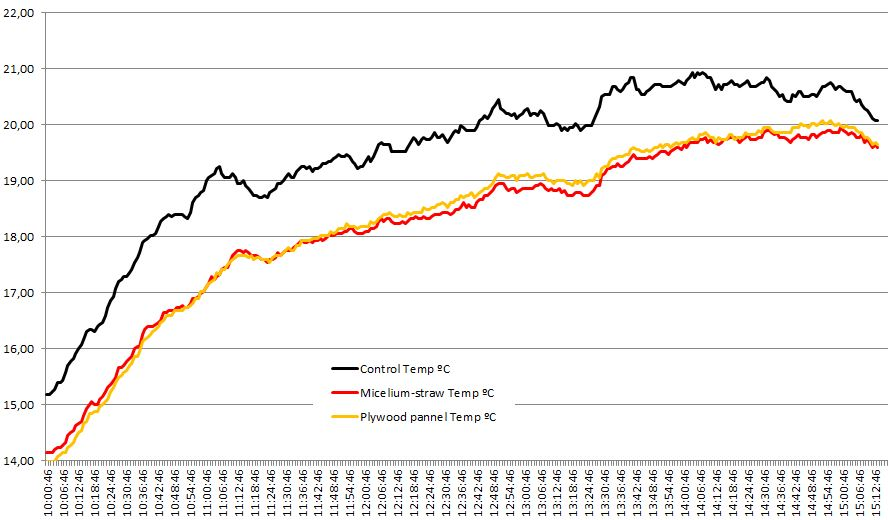

# **Digital Prototyping For Design: 3D Printing, Bio-Grow Materials and Paste Printing**

## 3D rugged cases for the final project (3D printing)

I have taken advantage of the module to 3D print some boxes that I intend to use in the prototypes of my final project.

To do this, I have adapted rugged case models to the measurements I need.

[Download the original model created by Thingiverse user ProgressTH](../../files/Water%20Resistant%20Case%20V2%20-%204555276.zip)

I have basically used PLA but I have also made a box with ABS. It will be very important that these boxes are waterproof and weather resistant. To do this, you will have to close them using a type of O-ring. At this time, two samples of these materials (PLA, ABS) have been left outside to compare their durability and degradation.

[Download the original model created by Thingiverse user zx82net](../../files/customizable-rugged-waterproof-box20190121-2900-190m3e9.zip)

If making mistakes many times is the way to learn, maybe I have learned something. My attempts at printing objects make a good glossary of mistakes.

## Mycelium as an insulating material (bio-grow materials)
According to Eurostat, in 2021, households represented 27% of final energy consumption, or 18.6% of gross inland energy consumption, in the EU. The main use of energy by households in the EU in 2021 was for heating their homes (64.4% of final energy consumption in the residential sector), with renewables accounting for more than a quarter (27%) of EU households space heating consumption. [EUROSTAT](https://ec.europa.eu/eurostat/statistics-explained/index.php?title=Energy_consumption_in_households)

The main insulators currently used are: Fiberglass, Mineral wool (rock and slag wool), Cellulose, Natural fibers  (cotton, sheep's wool, straw, hemp), Polystyrene, Polyisocyanurate, Polyurethane, Perlite, Cementitious foam, Phenolic foam, Insulation facings. Better insulation of homes can greatly reduce this consumption. For this reason we wanted to test the insulating capacity of mycelium composites.Better insulation of homes can greatly reduce this consumption.

The experiment carried out at home consisted of placing 3 temperature dataloggers in the environment for a few hours, starting with the same temperature for all three. One of them has been covered with 10 mm thick plywood, the other has been covered with the mycelium and straw panel 9 mm thick and the third has been left uncovered as a control.

With this simple experiment I explored the potential of mycelium (Ganoderma sp.) with straw as a thermal insulator.

The mycelium recipe ingredients: Distilled water, mycelium grow kit (Ganoderma sp.), Sculpture mix, Flour, Guar gum, Straw and alcohol to sterilize.

After 5 hours outside without direct sunlight, it is observed that the temperature curve reached by the thermometer with the mycelium is slightly lower than that of the thermometer with the plywood and more than one degree on average lower than that of the thermometer without anything on top.

??? quote "Micelium references"
    1. Biohm: https://www.biohm.co.uk
    2. BioGrown: http://www.grown.bio/
    3. Fabricademy tutorials: https://class.textile-academy.org/tutorials/#materials-grown-mycelium
    4. Bolets de soca: https://www.boletsdesoca.com/
    5. Myco-culture: https://fabricademy.fabcloud.io/shemakes/handbook/1.-learning-paths/discovery-path/WORKSHOPS/Biofabrication/Mycelium%20Biocomposites/

## Reflections

- We have seen many techniques during this module, I feel that I have lacked time to experiment with many of them.
- If making mistakes many times is the way to learn, maybe I have learned something. My attempts at printing objects make a good glossary of mistakes.
- Regarding the mycelium as insulation material, in the absence of many more experiments and formulations and evaluations on the scalability of the product, the experiment encourages us to think that mycelium can be a local solution to replace certain insulation materials with a greater ecological footprint.
- Speculating on the subject, I think that if we find a way to sterilize and inject material inoculated with fungi into the gaps and chambers of thermally inefficient buildings and, then find a way to stop the growth of the mycelium, perhaps we could create an insulation injected that is distributed more homogeneously within these spaces.
