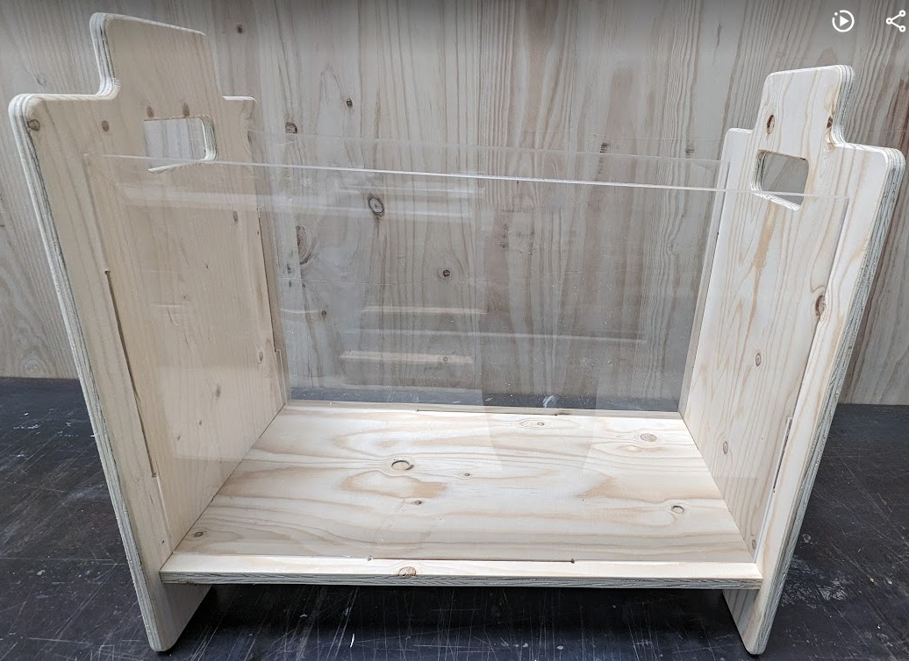
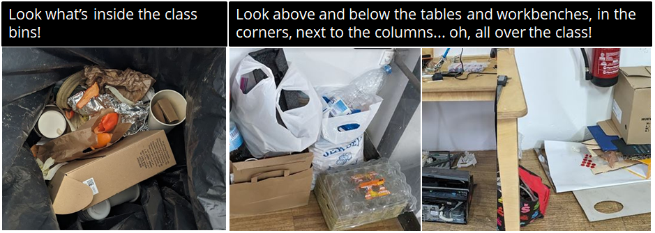
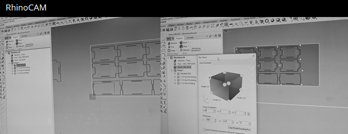
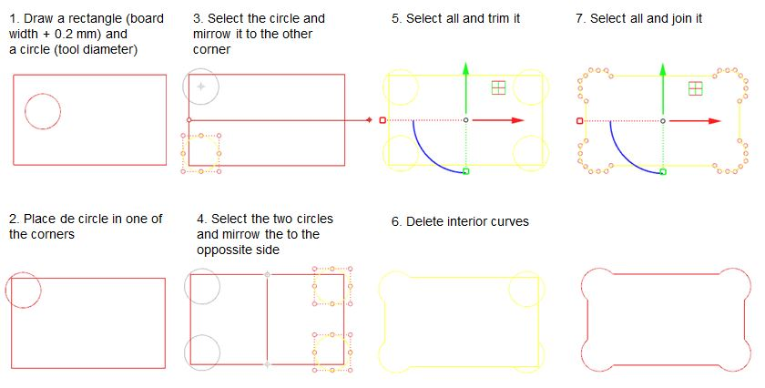

# **Digital Prototyping For Design: CNC Milling, 3D Scanning, Moulding and Casting**

{width=400px}

## Design of a piece of furniture for the MDEF class

**Team members:**
[Anthuanet Falcon Quispe](https://anthuanetf.github.io/MDEF/),
[Dhrishya Ramadass](https://dhrishyaramadass.github.io/mdefwebsite/) and
[Albert Vila Bonfill](https://avilabon.github.io/MDEF_Albert/)

{width=400px}

### First steps

**Why?**

The necessity of elements to improve the selective collection of waste and the storage of reusable materials of the class it is an undeniable reality 

After sharing ideas and finding inspiration, we created the first model with Rhino.

### Adapting the first design to the machine

Once the first design has been created, the sheet must be adapted to the physical and working characteristics of the machine and the material we will use. At this point in the process, it is necessary to redraw well the joints of the wooden pieces, redraw the corners, adapt and order the layers according to the size of the cutting bits that we will use at each moment, prepare a first layer to fix the board.

???+ quote "Steps to create Dog-t-bones with Rhino"
    - Draw the rectangle of the shape with the width of the board.
    - Command Circle
    - Click in the center of the circle.
    - Cmd Radius of the circle depending on the size of the container. In our case it is 3mm because the container we are going to use has 6 mm in diameter.
    - Adjust the position of the circle to allow the 6mm tool room to move from the circle to the larger socket.
    - Use Mirrow command to draw circles on the other corners
    - Select all, use Trim command i borre las tramos no necesarios
    - Use join to create a single shape
    

**Fabrication file:** [Download the CNC ready file](../../files/Stackable_modular_boxes_CAMmod3.3dm)

## 3D Scanning a piece of nature
