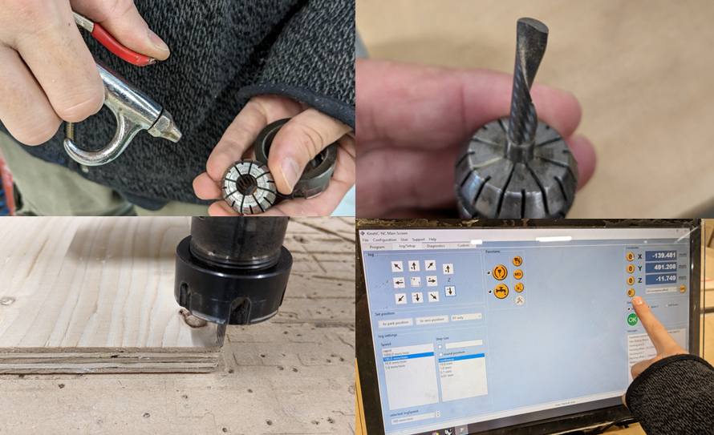
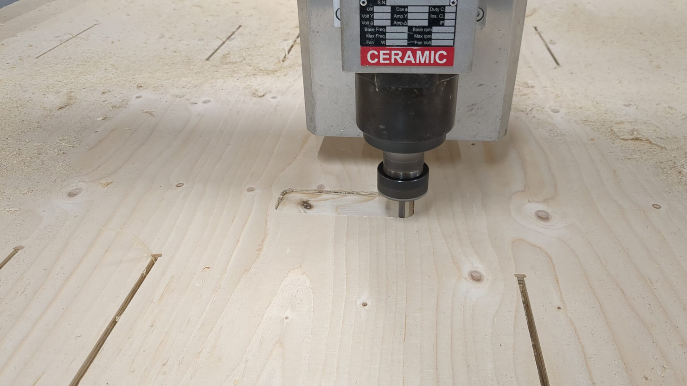
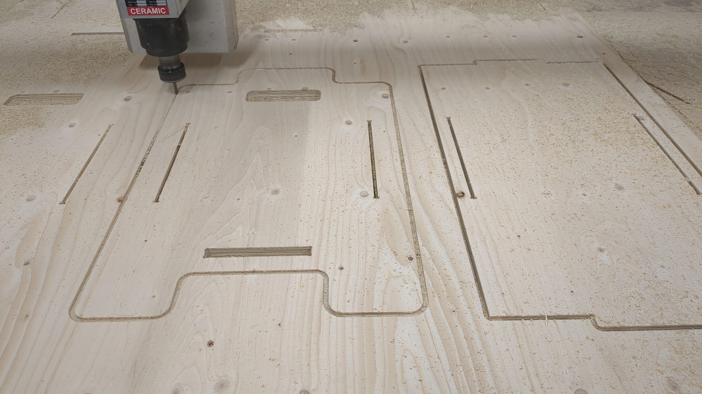
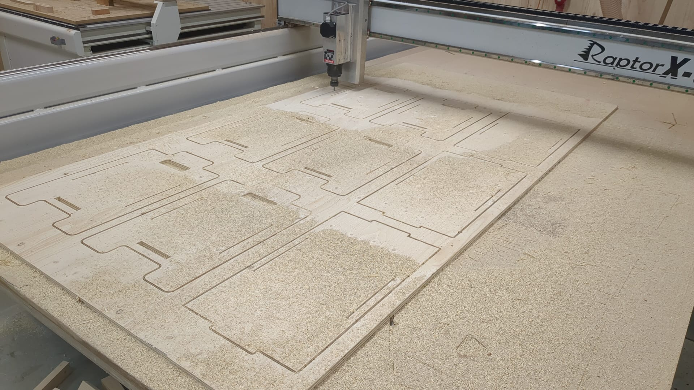
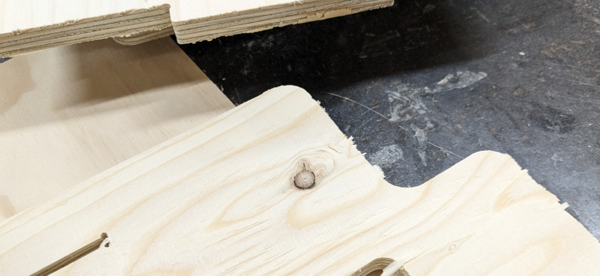
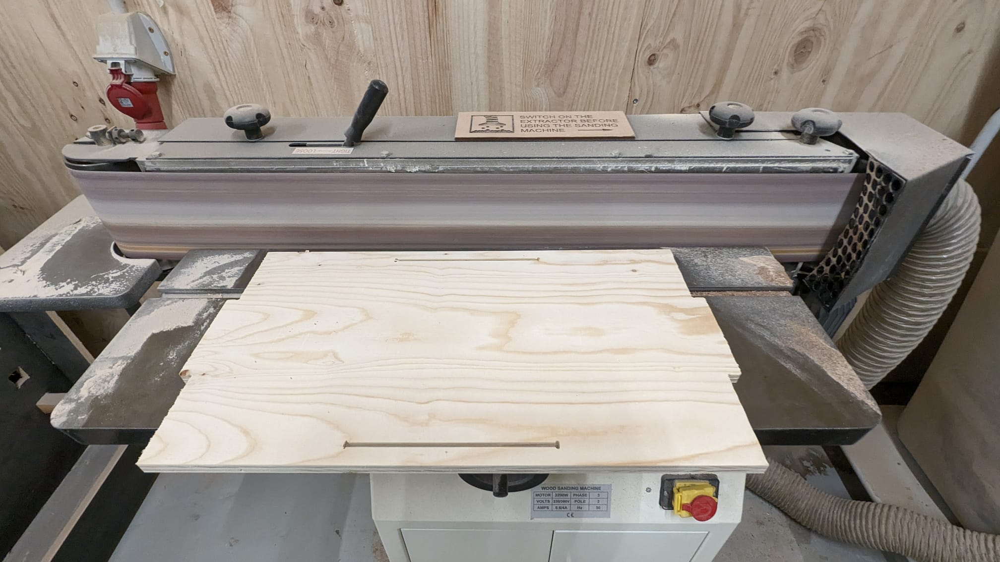
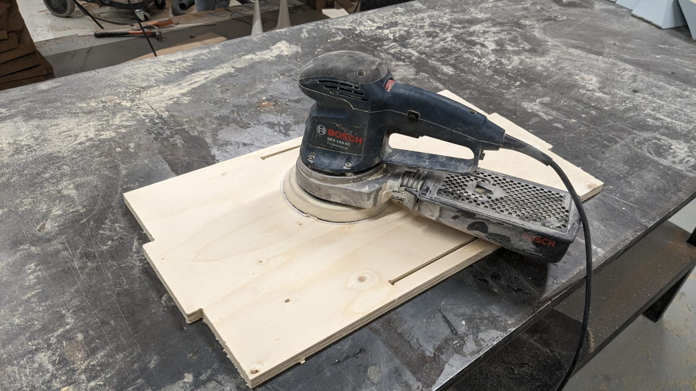

# **Digital Prototyping For Design: CNC Milling, 3D Scanning, Moulding and Casting**

{width=400px}

## Design of a piece of furniture for the MDEF class

**Team members:**
[Anthuanet Falcon Quispe](https://anthuanetf.github.io/MDEF/),
[Dhrishya Ramadass](https://dhrishyaramadass.github.io/mdefwebsite/) and
[Albert Vila Bonfill](https://avilabon.github.io/MDEF_Albert/)

{width=400px}

### Step 1: Design

**Why?**

The necessity of elements to improve the selective collection of waste and the storage of reusable materials of the class it is an undeniable reality.

After sharing ideas and finding inspiration, we created the first model of a stackable box with Rhino.

### Step 2: Adapting the first design to the machine

Adapting our design to the physical and working characteristics of the machine and material was our next step. At this point in the process, we redrew the joints of the wooden pieces well, we redrew the corners, we adapted and ordered the layers according to the size of the cutting bits to be used at each moment, and we prepared a first layer to screw the board to the machine.

The thickness of the plywood board was 15 mm and the bins to be used to mill were 5 and 6 mm.

???+ quote "Steps to create Dog-t-bones with Rhino"
    - Draw the rectangle of the shape with the width of the board.
    - Command Circle
    - Click in the center of the circle.
    - Cmd Radius of the circle depending on the size of the container. In our case it is 3mm because the container we are going to use has 6 mm in diameter.
    - Adjust the position of the circle to allow the 6mm tool room to move from the circle to the larger socket.
    - Use Mirrow command to draw circles on the other corners
    - Select all, use Trim command i borre las tramos no necesarios
    - Use join to create a single shape
    

### Step 3: CNC milling machine operation

Being aware of the machine while it is working is a safety requirement. It is important to calculate the time and take into account that some operations are not as fast as they may seem. 

Fixing the material well to the bed, changing the bin or recalibrating the coordinates (x,y,z) are some of the basic things to do before starting to cut or shape the pieces.

A laser cutter was also used to cut the acrylin front and back pieces of the box. For these pieces you can use also 5 mm thickness plywood board.

### Post-processing

Before the cut or shaped pieces can be assembled, the wood must be post-processed, which basically consists of milling the edges and sanding.

**Fabrication files:**

  - [Download the CNC milling machine file](../../files/Stackable_modular_boxes_CAMmod3.3dm)

  - [Download laser cut file](../../files/Laser%20Acrylic%20v3.3dm)

### Some reflections

- The CNC milling machine opens up many possibilities for prototyping but also for production.
It takes time to become familiar with the machine and know how to adapt the designs to its mode of operation.
- We are talking about powerful machines that can be dangerous if safety regulations are not respected.
- Milling takes time, it is not as immediate as the laser cutter to which I was more accustomed.
- We must keep in mind that post-processing can also be a time-consuming task.

## Bonus project: 3D Scanning a piece of nature

During the research trip I had the opportunity to practice 3D scanning, which was also explained in this digital prototyping for design module. This was the result.

