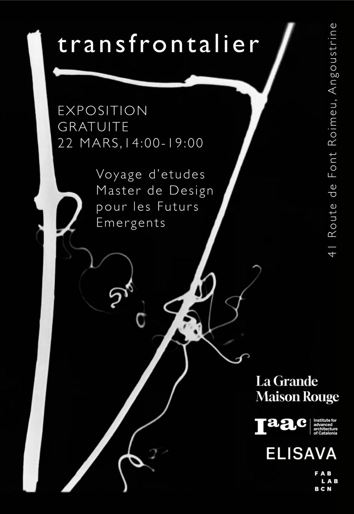

# **Research Trip**

The end of winter and beginning of spring in the countryside is something simply spectacular. Spring, that wonderful, perfectly adapted synchronized dance that has been designed by trial and error over millions of years.

The landscape is made up of many layers of elements intertwined with each other. Some of these layers of elements, surely very few, can be perceived by our limited senses. Although our sense of sight is very dominant and greatly influences our perception, there are other senses and more personal elements that are put into action to configure our perception of the environment. During the days of the research trip I decided to experiment, among other things, with the acoustic component of the landscape. Taking advantage of recording devices that have been provided to us, I have taken recordings of different landscapes and elements to later analyze them and play with them. With this I have tried to be more aware of the amazing acoustic landscape that spring offers us in the countryside.

{width=500 px; align=center}

??? Quote "References"
    - Lorem ipsum dolor sit amet: https://camera.dottod.net/
    

## Reflections

Lorem ipsum dolor sit amet, consectetur adipiscing elit, sed do eiusmod tempor incididunt ut labore et dolore magna aliqua. Ut enim ad minim veniam, quis nostrud exercitation ullamco laboris nisi ut aliquip ex ea commodo consequat. Duis aute irure dolor in reprehenderit in voluptate velit esse cillum dolore eu fugiat nulla pariatur. Excepteur sint occaecat cupidatat non proident, sunt in culpa qui officia deserunt mollit anim id est laborum.