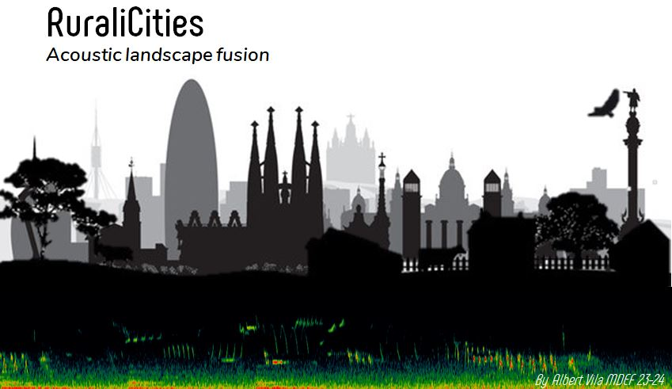
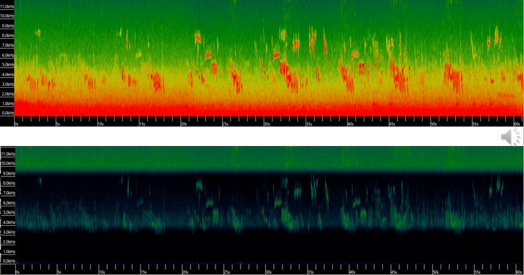
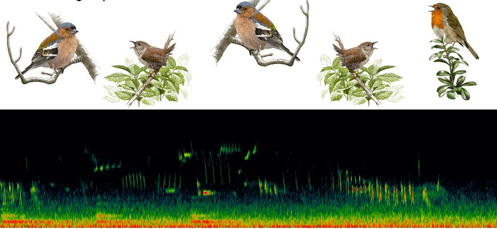
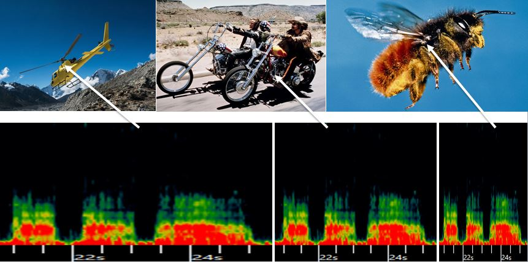

# **Research Trip**

The end of winter and beginning of spring in the countryside is something simply spectacular. Spring, that wonderful, perfectly adapted synchronized dance that has been designed by trial and error over millions of years.

{width=300 px; align=center}

## RuraliCities, an acoustic landscape fusion

The landscape is made up of many layers of elements intertwined with each other. Some of these layers of elements, surely very few, can be perceived by our limited senses. Although our sense of sight is very dominant and greatly influences our perception, there are other senses and more personal elements that are put into action to configure our perception of the environment. During the days of the research trip I decided to experiment, among other things, with the acoustic component of the landscape. Taking advantage of recording devices that have been provided to us, I have taken recordings of different landscapes and elements to later analyze them and play with them. With this I have tried to be more aware of the amazing acoustic landscape that spring offers us in the countryside.

**1)Mixing elements from different landscapes**

Angustrine acoustic spring landcape mixed with daily city sounds:

[Acoustic landscape fusion](../sounds/T2_RT_Fusion1.mp3)

**2) The importance of the background** 
In the recordings taken in Angoustrine, the sound of the river was the predominant background sound as is traffic in most cities.

[Original recording](../sounds/T2_RT__riu.mp3)

[Original recording without bachground sound](../sounds/T2_RT_senseriu.mp3)

You can appreciate the importance of the background sound matrix in the composition of the soundscape and how, by reducing this background sound, the overall loses a large part of its texture.

[Changing the river background sound to a city background sound](../sounds/T2_RT_bgchange.mp3)

**3) Searching for patterns. The bird songs**

A visual time/frequency representation of sound helps us visualize and recognize patterns in bird songs and other elements of the environment.

By taking a pattern, in this case the sound of a bee's wings, and expanding the time to listen to it 16 or 8 times slower, we would associate that same sound with a radically different element such as a helicopter or a motorcycle. . This makes me reflect on how other animals must process sounds and how their acoustic landscape changes compared to ours.

[The same bee sound at different speeds](../sounds/T2_RT_3velocitat.mp3)

## Reflections

I return home with many conclusions and good experiences from this study trip. One of the most significant is undoubtedly the strengthening of personal relationships within the class group. As well as with the mentors and guides that we have had during this week. 

Some of the most important things I take with me are the first contacts with things like the analogue development of photographs, the 3D scanner or the pottery wheel. Things I had always wanted to try but hadn't found the time.