# Design studio: **Atlas of weak signals 2**

In this workshop we have worked with a multi-stage framework to define, as a group, new sets of signals and elements for the **Atlas of Weak Signals (AOWS)** toolkit originally designed by Mariana Quintero.

Team members: 
[Flora Rose Elise Berkowitz](https://floraroseberkowitz.github.io/), 
[Emmanuel Pangilinan](https://minnie-at-iaac.github.io/)
[Dhrishya Ramadass](https://dhrishyaramadass.github.io/mdefwebsite/) and
[Albert Vila](https://avilabon.github.io/MDEF_Albert/)

???+ quote "References"
    - [Miro board of the workshop](https://miro.com/app/board/uXjVKdjPEuY=/)
    - [More about AOWS](https://fablabbcn.org/blog/emergent-ideas/atlas-of-weak-signals#:~:text=The%20Atlas%20of%20the%20Weak,trends%20in%20our%20current%20world.)

## The Brainstorm
BARCELONA, 3 April 2024, 3rd floor of a dusty building, 3rd terms of our master, we are in a drought (back and forward of weather in these days, sun and rain, and sun again), uncertainty of a WW3, sunny morning, more silence (no constructions!!), election year in many countries, just came back from the research trip, love between each other, concerns about humanity aid and how it relates with the refugee, school shooting, earthquake, hostage situation in the Netherlands and assassination of elective candidates in Mexico

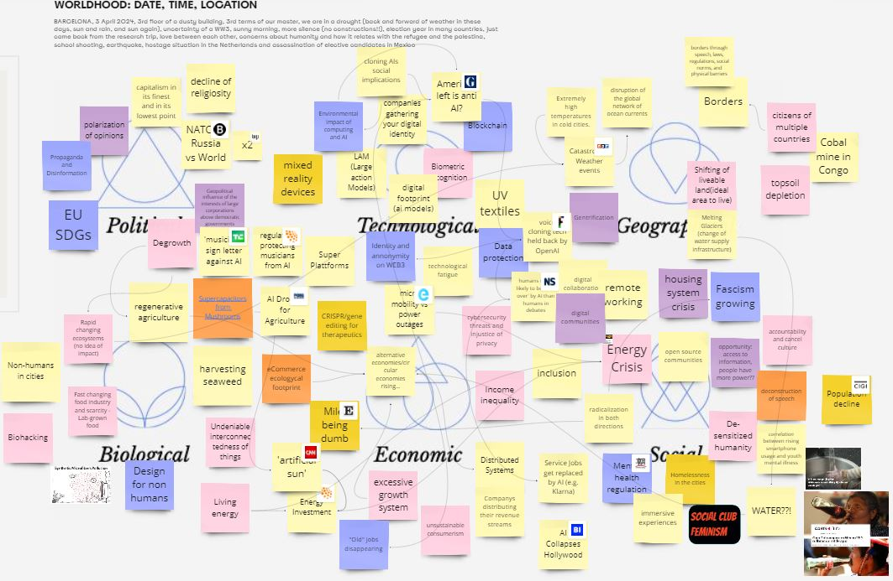

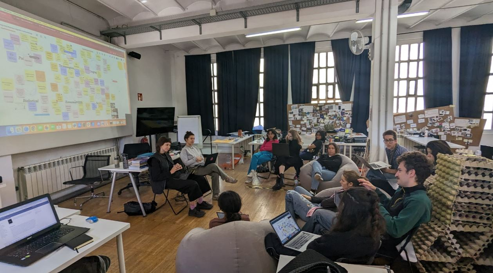

## Horizon scanning the theme selected
The phenomenon we're exploring encompasses the intricate web of interconnections among biological entities, human societies, and the environment. It reflects a state of disconnection from these interconnected systems, resulting in a cascade of consequences such as systemic post colonialist attitudes, displacement, fragmented identities, and unsustainable practices like uncontrolled growth, forced innovation, and competition.

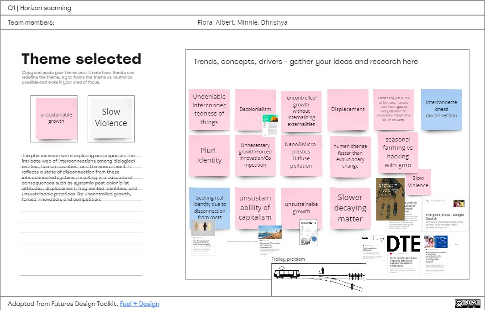

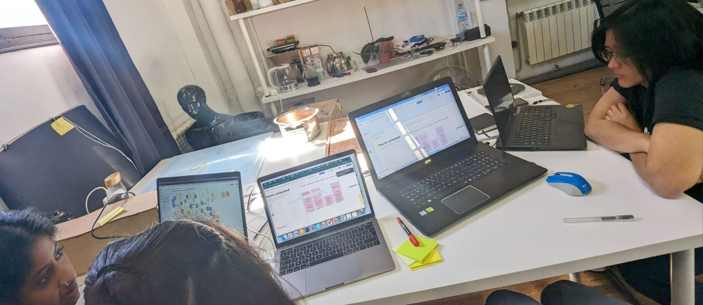

## Framing signals
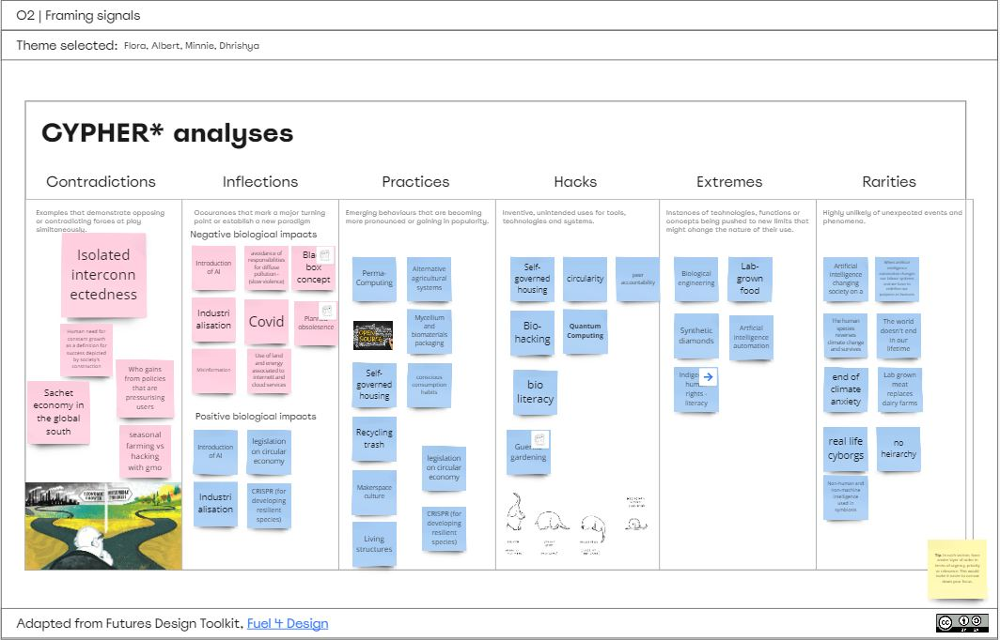

## Prototypes of our theme and connected weak signals

### Theme: Undeniable Interconnection
Alternative  "mock" title: The unbeareble connection of everything
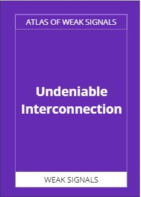

| Weak Signal  | Description                          |
| ----------- | ------------------------------------ |
|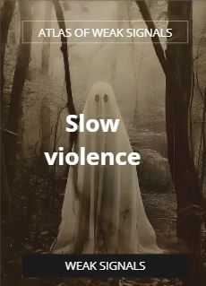 | This term encapsulates the idea of environmental threats such as climate change, toxic drift, deforestation, and oil spills causing gradual and often unnoticed harm to ecosystems and vulnerable communities. Just as Nixon's concept of "slow violence" highlights the lethality of these environmental crises that are often overlooked by society, "Invisible Degradation" emphasizes the subtle yet destructive impact of environmental degradation on both natural systems and marginalized populations. This weak signal underscores the need for increased awareness and action to address long-term environmental threats that may not attract immediate attention but have profound consequences over time. |
| 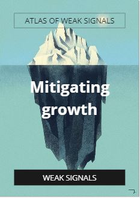 | This captures the essence of unsustainable growth, highlighting the pursuit of progress or development in areas that prioritize short-term economic gains or political objectives over long-term sustainability. This approach often leads to environmental degradation, exploitation of resources, social inequalities, and harm to both human and non-human communities. |
| 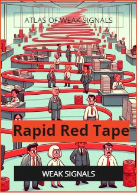  | Refers to excessive or unnecessary regulations, processes, and administrative procedures that can hinder efficiency, innovation, and citizen engagement. Red tape often leads to frustration, bureaucracy, and a sense of disempowerment among individuals and businesses dealing with government agencies or large organizations. |
| 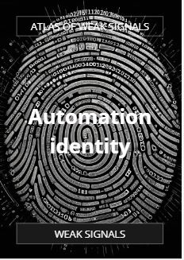  | This term encapsulates the idea of individuals and societies grappling with shifting dynamics in the labor market due to AI automation, prompting a reconsideration of what it means to be human and finding new avenues for personal and collective fulfillment. |

## Sharing

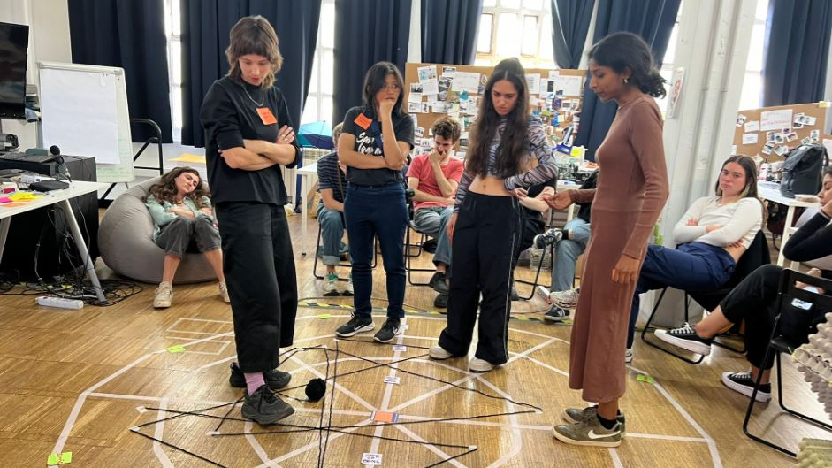

## Reflections
 
I think it has been a great collective exercise. We have put collective intelligence to work to overcome personal visions and we have managed, in record time, to generate some very interesting proposals to update the AOWS. It is very gratifying to see how the result of intelligence and collective work is, in most cases, much better than the sum of the parts.

On a more personal level, comment that I need more time to think, mature and digest all these elements. In fact, I think that the **acceleration or the loss of slowness in many modern processes**in the broad sense may be one of the cards to add to the new deck. People are looking more and more for those spaces for slowness and reconnection with oneself and with natural rhythms. I think that the creation of those spaces/times for transition is essential.

I must admit that although too fast for my cognitive metabolism, I am happy to have taken the workshop as it has allowed me to sharpen my senses and broaden my vision towards new weak signals.