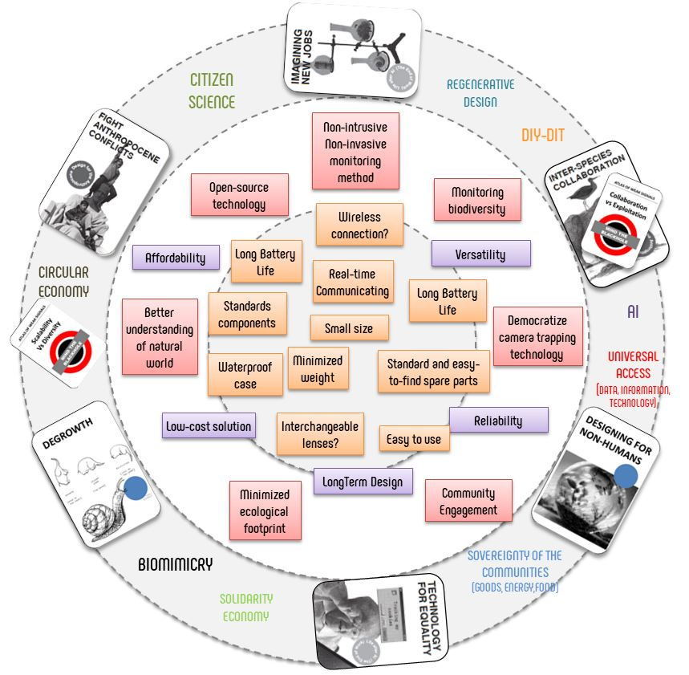

# Design studio: **Reflection on the translation of the personal design space to a specific project**

This reflection is more an observation of the movement, the change of focus and specific weight, as well as the dynamics that different elements have had within my design space during the last months. 

A new dimension is created in the space/time of my desing space where certain elements share a momentum where their orbits converge and join other elements around an idea, a project, an opportunity. Temporarily, consciously or unconsciously, they provide context, nuance and a way of proceeding on the path of design and execution that takes us towards the materialization of ideas.

I tried to pull the weak signals and some of the concepts of the design space throughout the master's thesis project. Along the way I have been observing how certain design decisions can put some of these things in crisis and I have tried to take measures to control it. Often, you have to be a little malleable, in order to be able to move forward.

Representation of the design space elements with the project specifications:

