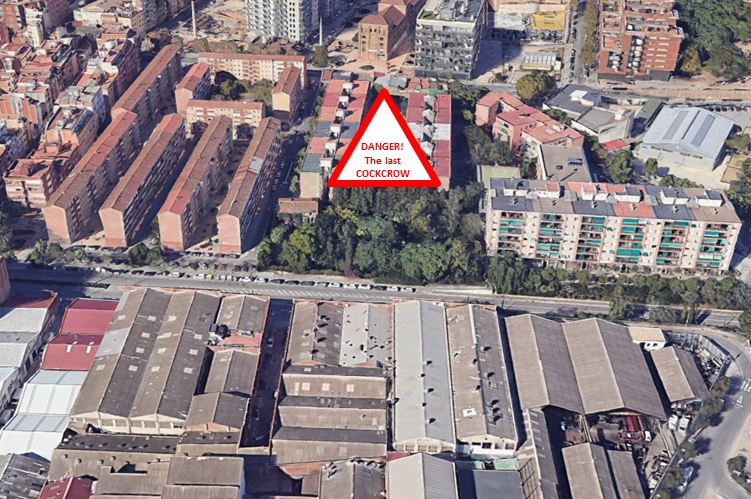
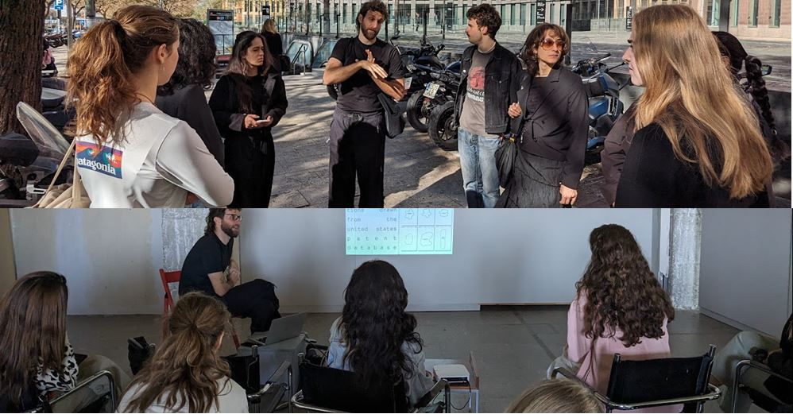

# **Future Talks 03**

## A walk through the cultural district of l'Hospitalet and Experiencing Materials with Saul Baeza(DOES)  

### L'Hospitalet and the Cultural District

In the hidden places, under the skin of society, new species, unexpected connections and symbiosis are constantly emerging. Strange things at first but maybe things that will be common in the future or, maybe not, maybe they will remain hidden in the memory of those who experienced them, silenced because society has not known where to fit them.

The cultural district of l'Hospitalet is one of these places. A hot spot where artists, creators, designers converge and where, luckily, it hasn't been completely perverted into a cool place yet.

- [L'H Districte Cultural](https://districtecultural.l-h.cat/)

### The last cockcrow of l'Hospitalet urban area

As in a movie, a small private property full of vegetation and domestic animals resists, imperturbable, the passage and weight of time. An urban anomaly, like a pain in the ass, surrounded by infrastructure, an old-fashioned way of living that does not fit with the rest. A visual and acoustic aesthetic that transports us to a way of living more typical of the small towns of the last century. A rarity that little by little is acquiring the admiration and respect of some of the neighbors who see it as an oasis in the desert of cement, concrete and tar. Long live the crow of the rooster!

### Bellvitge

Before all this was fields, and before marshes and before... the sea!

History of how we fill with concrete and lose the most fertile areas of the country to make homes for the workers who have to work in the big factories who have ended up leaving for other cheaper countries. Fast growth and slow death?

Interesting story of a neighborhood built at full speed to accommodate immigrant workers. Taking part in the neighborhood struggle to dignify the neighborhood and provide it with basic services and reduce poverty. A neighborhood that, even though they are no longer so, still carries the reputation of a dangerous and conflictual neighborhood.

- [Understanding Bellvitge](https://www.youtube.com/watch?v=RjRtCGhDqLA)

### Saul Baeza

Saul gave us a brief and interesting presentation about some of the projects he has been involved in in recent years. Saul is a multifaceted creative, researcher, designer and curator who works on various experimentation projects on materials, technology and identity. 

What is does: "DOES is a design and consultancy practice exploring the potentials of digital and functional identities in different scales and media. Combining design, research, academic, curatorial and editorial activities, our interests lie in developing concepts that involve materials and technologies with body and mind"  Https://www.does-work.com/

???+ quote "References"
    - [DOES](https://www.does-work.com/)
    - [L'H Districte Cultural](https://districtecultural.l-h.cat/)
    - Vision by: https://visions-by.com/

### Reflections

The artist's experimentation opens doors to new scenarios of fusion of technology, biology and identity. He offers us different perspectives, unexpected uses and hybrid identities, as well as new ways to hack technologies that could initially have been designed with completely different intentions.

