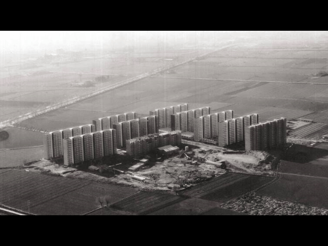

# **Future Talks 03**

## A walk through the cultural district of l'H and Experiencing Materials with Saul Baeza(DOES)  

### L'Hospitalet and the Cultural District

Weird things happen under the skin of society, things that will be the surface of the future or will remain hidden and forgotten. The cultural district, a hot spot of interconnections where the arts and design merge.

### Bellvitge

Before all this was fields, and before marshes and before sea

- [Understanding Bellvitge](https://www.youtube.com/watch?v=RjRtCGhDqLA)

### Saul works

???+ quote "References"
    - [DOES](https://www.does-work.com/)
    - [L'H Districte Cultura](https://districtecultural.l-h.cat/)
    - Vision by: https://visions-by.com/

### Reflections

{width=400px}

