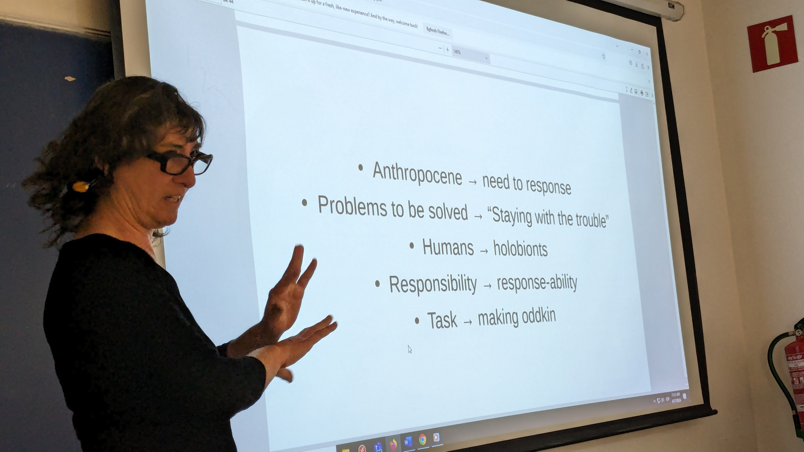

# **Future Talks 03**

## A flight through visions, approaches and proposals of Donna Haraway with Helen Torres

### The talk: Engage in speculative thinking to decolonize the future

Helen Torres guides us on a conceptual walk through Donna Haraway's terminology. Helen's knowledge of Donna's works and concepts is broad and very deep. Helen has been the translator of some of her recent writings. This extensive knowledge is noticeable in the way she recreates the meanings and nuances of each concept that she introduces to us.

### The exercice: 

To carry out the exercise we start from a real conflict of interests around a project to expand a museum in the city of Barcelona to, after identifying the actors, give a voice to each of them, practicing active and respectful listening to discover, among all, possible solutions that appear during the process.

I participated representing the group of boys and girls in the neighborhood. These were the arguments shared at the dialogue table: 

    We haven't understood most of the things you're talking about, but we're okay with it as long as you don't forget to build a car-free play place where our parents feel like we're safe.

    - Because there aren't many places to play in our neighborhood.
    - Our parents don't want us to spend a lot of time in front of screens but at home we get bored.
    - We like to play outside when we leave school.
    - We would like a playground made of large logs and with a log cabin on a tree. And also a fountain. Would a free extension to Tibidabo be too much? Also a place where playing ball is allowed.
    - We must not forget some benches for our parents or some place where they can stay with their friends or also a place where our parents can work so that we can stay longer playing and they do not get nervous.
    - A candy store or ice cream shop would also be nice, but not for our parents, so a place to buy some parent-friendly food, but not too much, would be great.
    - Maybe if there was a quiet place to play we wouldn't have to do so many extracurricular activities.

Other actors of the process were the politicians, the museum directors, the architects, the neighbours, the skaters and the plants and animals.

???+ quote "References"
    - [Helen Torres CCCB Sheet](https://www.cccb.org/en/participants/file/helen-torres/228022)
    - [Staying with the trouble: conversation between Donna Haraway and Helen Torres](https://districtecultural.l-h.cat/)
 

### Reflections

- Regarding the exercice, when we add more actors to conflicts and combine them, open up without confronting, more inclusive and symbiotic solutions appear. Embrace unexpected collaborations as a way to find solutions that are more holistic or that can potentially benefit more actors.

