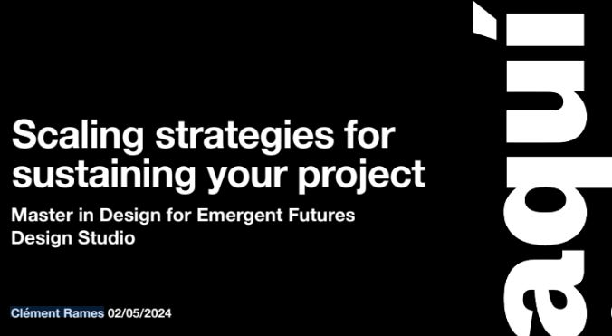
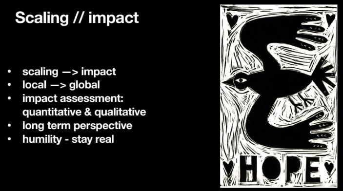

# **Future Talks 03**

## AQUÍ - Collective urban practices for resilient communities and cities

### The talk: Scaling strategies for sustaining your project by Clément Rames

To begin, I would like to mention that I was not able to attend the talk in person. However, I have prepared this post based on the presentation of slides, the materials from the website "AQUÍ" and the comments and feedback from classmates.

Clement described his journey from completing his master's studies to becoming a cooperative worker with the co-governance that this entails. The part of the talk about the scaling up process was very interesting according to the comments of the attendees.

???+ quote "References"
    - Aqui coop. Https://www.aqui-coop.org/
    - SlowLab. Https://www.slowlab.org/es/

### The exercices of how to scale our own project, the 5W’s of scaling: 

**Why**
- Reducing biodiversity loss is one of the greatest challenges of the Anthropocene and one of the United Nations Sustainable Development Goals.
- The smaller an organism is, the less we know about it.
- The study and monitoring of biodiversity is not a very attractive market for technology companies. Many times it requires customized solutions.

**What**
Providin researchers and citizen science with robust and reliable technologies that are open-source and low-cost and that serve to improve knowledge and conservation of biodiversity.

**Who**
An open community/es composed of multidisciplinary teams with knowledge of various fields

**Where**
From Catalonia initially but with a network of national and international partners with which to grow together and spread our solutions and methods.

**When**
Starting next July! I'm kidding! I don't know, I imagine that when some of the small and modest initial projects are consolidated and we see that they may be of interest to more groups, it will be time to consider scaling up.

### Reflections

- Glimpsing possible future paths after MDEF for us as professionals and also for our projects through real examples seems like a good idea to me. In some ways this process has already been implemented through the master with some of the seminars that have been carried out by students from past editions.

- Reflecting about how to scale our projects it is something we're going to have to think about especially when the master's degree ends. For me, scaling up is something that is both necessary to be more transformative with your practices, exciting and perverse from my point of view. Scaling up with control without entering a maelstrom of uncontrolled growth is something that is always a challenge. I have seen many projects fall or lose their essence due to growing too quickly. Access to grants, European funds or other kind of financial support can be something very positive but at the same time dangerous if it is not controlled. For this reason, reflecting on whether or not it is necessary to scale and reflecting on how to scale is, for me, something fundamental to take into account at the beginning of projects.

