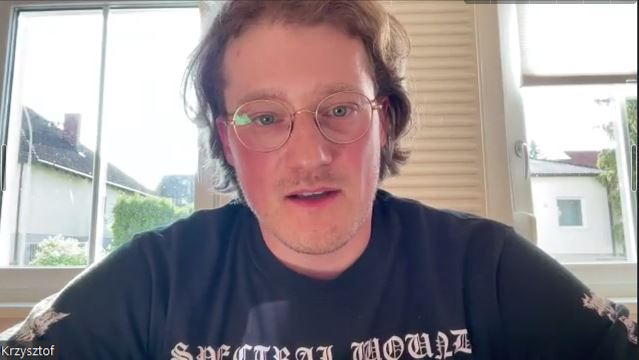
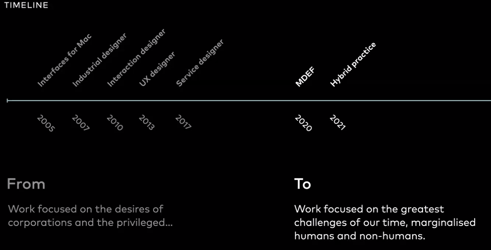
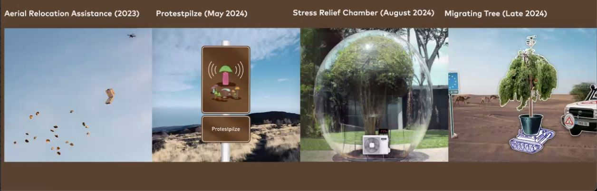

# **Future Talks 03**

## KRZYSZTOF WRONSKI

### The talk: a walk through Krzysztof Timeline

Krzysztof has offered us an honest and inspiring presentation from an MDEF ex-student who shares his experience of how MDEF has influenced his path and how everything has evolved since.

With a short introduction to give some context, he tells us how throughout his life he has allowed his curiosity to flow, which has led him to live in different places in the world until arriving in Copenhagen where he currently lives. This path has led him to work on different projects, or it has been the projects that have led him to travel this path? I don't know very well.

For him, the journey begins with the computers and tools he had at the age of 7 with a Mac and until the age of 17 doing graphic design for apps for macOS with Photoshop. He studied industrial design to go from digital to physical design. Then work on interaction design and ux before going through MDEF.

For him, the journey begins with the computers and tools he had at the age of 7 with a Mac and until the age of 17 doing graphic design for apps for macOS with Photoshop. He studied industrial design to go from digital to physical design. He then works in interaction design, ux and service design before going through MDEF.

After MDEF his profile becomes more hybrid. He is now in a kind of intersection between various disciplines such as technology, art, design and nature. In Krzsztof's own words, his work is currently trying to focus more on the great challenges of our time, marginalized humans and non-humans. Finally, he told us a little about some of his recent projects, such as the Present Averse practice, Tree-based design or some of the "dialogue-provoking" interventions he has been or is working on.

??? quote "References"
    - WRONA. http://thewronski.com/

### Some random reflections

- Everyone starts somewhere, goes somewhere, everything and everyone is something and will be something later.

- I take with me his vision of transitions, his relaxed and joyful tone at the same time, his doubts and honesty.

- One of the things that interested me the most was how it developed after the MDEF with a more hybrid profile.