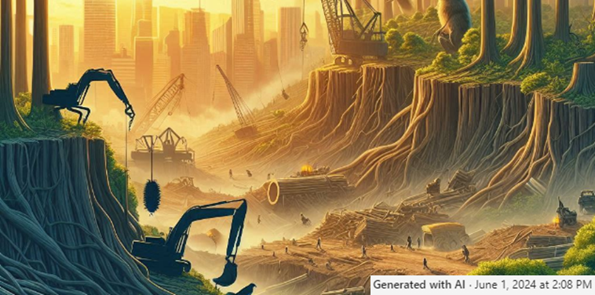

# **Critical transfeminist design**

*"Transfeminism is a part of what is known as new feminisms. It expands the subjects considered within feminism to include others who are also oppressed by cisheteropatriarchy, who are not necessarily cisgender women. Transfeminism understands the concept of gender as a social construction used to oppress and exclude...*

Many concepts were covered and many things were stirred inside me during this seminar. At times, it can be paralyzing to think how many actions and attitudes we do without realizing it but which have deep abusive and  oppressive implications on other entities, people, groups or societies that relegate them to powerless and marginate positions. The social baggage that we all carry as a standard rucksack, regardless of the society we come from, has implicit consequences, roles, power systems, inequalities, which we must be taken into account when we design so as not to perpetuate these inequalities. Critical movements as **transfeminism** help us bring these situations to the surface.  

We didn't talk about it explicitly in theory class, but I see part of the same forms of oppression in the ways some societies treat natural systems as mere resources and nature in general as something we have to tame and control.

??? quote "Some authors, works and references which I would like to explore better in the future"
    - Daniela Ortiz. Https://www.daniela-ortiz.com/nn-15-518
    - Gender Trouble. Judith Butler, 1990.
    - Gayatri Chakravorty Spivak
    - Contrasexual manifesto. Paul B. Preciado, 2002.
    - Selected Subaltern Studies. Edited by Ranajit Guha and Gayatri Chakravorty Spivak, 1988.
    - Alienation and Freedom. Frantz Fanon, 2018.