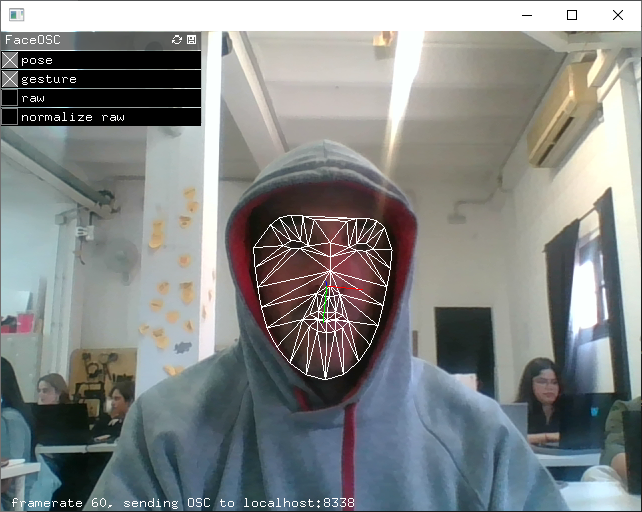

# **Digital Prototyping For Design: Prototyping for interaction**

{width=300px}

In this seminar we had the opportunity to test different open source tools such as Wekinator (real-time machine learning), code tools such as Processing or real-time communication protocols as OSC.



We were also able to build a wearable textile sensor from scratch. With the help of a development board with connectivity, in this case Barduino, we saw how the data taken by the sensor could be sent in real time over the Internet through a Wi-Fi network (in this case internal) for processing and graphical and audio representation. or for training your own artificial intelligence model.


##Exercices

With conductive and semiconductive fabrics we build a sensor for the finger. After checking its resistivity, we built a simple circuit to be able to send the data through the ESP32 and an internal Wi-Fi, to the computer where we played with different representation and machine learning training possibilities with Wekinator i Processing.


??? code "The code"
        ```
        /*---------------------------------------------------------------------------------------------

        Open Sound Control (OSC) library for the ESP8266/ESP32

        Example for sending messages from the ESP8266/ESP32 to a remote computer
        The example is sending "hello, osc." to the address "/test".

        This example code is in the public domain.

        --------------------------------------------------------------------------------------------- */

        /*
        OSC Library documentation: https://github.com/CNMAT/OSC/tree/master
        This example has been adapted by Citlali Hernández, for MDEF Class 2024, Barcelona.
        */

        #if defined(ESP8266)
        #include <ESP8266WiFi.h>
        #else
        #include <WiFi.h>
        #endif
        #include <WiFiUdp.h>
        #include <OSCMessage.h>

        const int sensorPin = 1;
        float sensorValue;
        float mapValue;

        char ssid[] = "whiteRabbit";              // your network SSID (name)
        char pass[] = "goodlife";  // your network password

        WiFiUDP Udp;  // A UDP instance to let us send and receive packets over UDP
        //192.168.1.137
        //const IPAddress outIp(10,40,10,105);        // remote IP of your computer
        const IPAddress outIp(192, 168, 8, 182);
        const unsigned int outPort = 9999;    // remote port to receive OSC ()
        const unsigned int localPort = 8888;  // local port to listen for OSC packets (actually not used for sending)

        void setup() {
        Serial.begin(115200);

        // Connect to WiFi network
        Serial.println();
        Serial.println();
        Serial.print("Connecting to ");
        Serial.println(ssid);
        WiFi.begin(ssid, pass);

        while (WiFi.status() != WL_CONNECTED) {
            delay(500);
            Serial.print(".");
        }
        Serial.println("");

        Serial.println("WiFi connected");
        Serial.println("IP address: ");
        Serial.println(WiFi.localIP());

        Serial.println("Starting UDP");
        Udp.begin(localPort);
        Serial.print("Local port: ");
        #ifdef ESP32
        Serial.println(localPort);
        #else
        Serial.println(Udp.localPort());
        #endif
        }

        void loop() {
        presSensor();
        sendingOSC();
        }

        void sendingOSC() {
        OSCMessage msg("/testalbant");  // The ID of the OSC Message
        // msg.add("hello, osc!"); // Test hello message
        msg.add(sensorValue); // Send sensor value
        Udp.beginPacket(outIp, outPort);
        msg.send(Udp);
        Udp.endPacket();
        msg.empty();
        delay(150);  //500 works ok
        }

        void presSensor() {
        sensorValue = analogRead(sensorPin);
        mapValue = (map(sensorValue, 100, 4000, 0, 1000) / 1000.0);
        mapValue = constrain(mapValue, 0, 1);
        Serial.println(mapValue);
        }
        //
        ```

### Reflections

- Short and productive seminar, in my opinion, very interesting and that provides us with more resources for our future projects.

- Building the diy sensor ourselves increased our understanding of how it works.

- I really liked the possibility of working on these topics exclusively with open source softwares. I feel like I need a little more time to play with these softwares. I hope to have the possibility in future projects.

- I really want to continue experimenting with topics of interaction, processing and representation. I see that they open up a lot of very interesting possibilities from an artistic point of view but also from a product design point of view.


???+ quote "Tools and references"
    - [**Wekinator** is an open source real-time software tool that allows users to create interactive systems based on machine learning without programming.](http://www.wekinator.org/)
    - [**Processing** is an open source programming language and development environment designed to facilitate the creation of graphics, animations and interactions, especially used in digital art, graphic design and educational projects.](https://processing.org/)
    - [Turbulente repository](https://github.com/TURBULENTE/prototypingInteractions)
    - [Atlas of emotions](https://atlasofemotions.org/)

